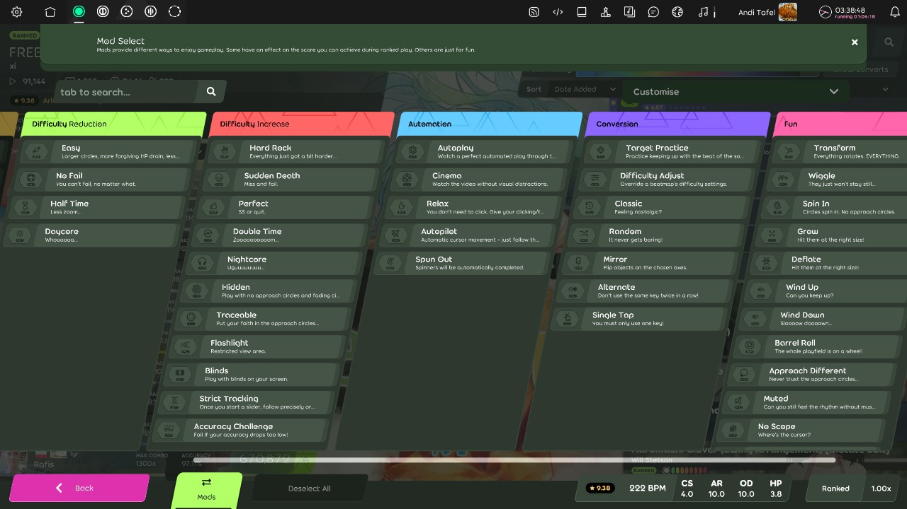

# Game modifier (lazer)

::: alert-note
**Note:** For the osu!(stable) version of this article, see [Game modifier](/wiki/Gameplay/Game_modifier)
:::

::: alert-note
**Note:** For other uses of "mod", see [Mod (disambiguation)](/wiki/Disambiguation/Mod)
:::

**Game modifiers**, or **mods**, are separated into six categories: `Difficulty Reduction`, `Difficulty Increase`, `Automation`, `Conversion`, `Fun` and `System`. Some of them can reduce or increase the score multiplier. When multiple mods are used simultaneously, their respective multipliers will be multiplied together (e.g. `1.06x * 1.12x = 1.1872x`). Mods from the `System` category are applied automatically when necessary.

## List of mods

Next to each of the mods listed below the icons of their compatible ![][osu!] ![][osu!taiko] ![][osu!catch] ![][osu!mania] [game modes](/wiki/Game_mode) are displayed.

### Difficulty Reduction

- [Easy (EZ)](/wiki/Gameplay/Game_modifier_(lazer)/Easy_(lazer)) ![][osu!] ![][osu!taiko] ![][osu!catch] ![][osu!mania]
- [No Fail (NF)](/wiki/Gameplay/Game_modifier_(lazer)/No_Fail_(lazer)) ![][osu!] ![][osu!taiko] ![][osu!catch] ![][osu!mania]
- [Half Time (HT)](/wiki/Gameplay/Game_modifier_(lazer)/Half_Time_(lazer)) ![][osu!] ![][osu!taiko] ![][osu!catch] ![][osu!mania]
- [Daycore (DC)](/wiki/Gameplay/Game_modifier_(lazer)/Daycore) ![][osu!] ![][osu!taiko] ![][osu!catch] ![][osu!mania]
- [Simplified Rhythm (SR)](/wiki/Gameplay/Game_modifier_(lazer)/Simplified_Rhythm) ![][osu!taiko]
- [No Release (NR)](/wiki/Gameplay/Game_modifier_(lazer)/No_Release) ![][osu!mania]

### Difficulty Increase

- [Hard Rock (HR)](/wiki/Gameplay/Game_modifier_(lazer)/Hard_Rock_(lazer)) ![][osu!] ![][osu!taiko] ![][osu!catch] ![][osu!mania]
- [Sudden Death (SD)](/wiki/Gameplay/Game_modifier_(lazer)/Sudden_Death_(lazer)) ![][osu!] ![][osu!taiko] ![][osu!catch] ![][osu!mania]
- [Perfect (PF)](/wiki/Gameplay/Game_modifier_(lazer)/Perfect_(lazer)) ![][osu!] ![][osu!taiko] ![][osu!catch] ![][osu!mania]
- [Double Time (DT)](/wiki/Gameplay/Game_modifier_(lazer)/Double_Time_(lazer)) ![][osu!] ![][osu!taiko] ![][osu!catch] ![][osu!mania]
- [Nightcore (NC)](/wiki/Gameplay/Game_modifier_(lazer)/Nightcore_(lazer)) ![][osu!] ![][osu!taiko] ![][osu!catch] ![][osu!mania]
- [Fade In (FI)](/wiki/Gameplay/Game_modifier_(lazer)/Fade_In_(lazer)) ![][osu!mania]
- [Hidden (HD)](/wiki/Gameplay/Game_modifier_(lazer)/Hidden_(lazer)) ![][osu!] ![][osu!taiko] ![][osu!catch] ![][osu!mania]
- [Traceable (TC)](/wiki/Gameplay/Game_modifier_(lazer)/Traceable) ![][osu!]
- [Cover (CO)](/wiki/Gameplay/Game_modifier_(lazer)/Cover) ![][osu!mania]
- [Flashlight (FL)](/wiki/Gameplay/Game_modifier_(lazer)/Flashlight_(lazer)) ![][osu!] ![][osu!taiko] ![][osu!catch] ![][osu!mania]
- [Blinds (BL)](/wiki/Gameplay/Game_modifier_(lazer)/Blinds) ![][osu!]
- [Strict Tracking (ST)](/wiki/Gameplay/Game_modifier_(lazer)/Strict_Tracking) ![][osu!]
- [Accuracy Challenge (AC)](/wiki/Gameplay/Game_modifier_(lazer)/Accuracy_Challenge) ![][osu!] ![][osu!taiko] ![][osu!catch] ![][osu!mania]

### Automation

- [Autoplay (AT)](/wiki/Gameplay/Game_modifier_(lazer)/Autoplay_(lazer)) ![][osu!] ![][osu!taiko] ![][osu!catch] ![][osu!mania]
- [Cinema (CN)](/wiki/Gameplay/Game_modifier_(lazer)/Cinema_(lazer)) ![][osu!] ![][osu!taiko] ![][osu!catch] ![][osu!mania]
- [Relax (RX)](/wiki/Gameplay/Game_modifier_(lazer)/Relax_(lazer)) ![][osu!] ![][osu!taiko] ![][osu!catch]
- [Autopilot (AP)](/wiki/Gameplay/Game_modifier_(lazer)/Autopilot_(lazer)) ![][osu!]
- [Spun Out (SO)](/wiki/Gameplay/Game_modifier_(lazer)/Spun_Out_(lazer)) ![][osu!]

### Conversion

- [Target Practice (TP)](/wiki/Gameplay/Game_modifier_(lazer)/Target_Practice_(lazer)) ![][osu!]
- [Difficulty Adjust (DA)](/wiki/Gameplay/Game_modifier_(lazer)/Difficulty_Adjust) ![][osu!] ![][osu!taiko] ![][osu!catch] ![][osu!mania]
- [Classic (CL)](/wiki/Gameplay/Game_modifier_(lazer)/Classic) ![][osu!] ![][osu!taiko] ![][osu!mania]
- [Random (RD)](/wiki/Gameplay/Game_modifier_(lazer)/Random_(lazer)) ![][osu!] ![][osu!taiko] ![][osu!mania]
- [Dual Stages (DS)](/wiki/Gameplay/Game_modifier_(lazer)/Dual_Stages) ![][osu!mania]
- [Mirror (MR)](/wiki/Gameplay/Game_modifier_(lazer)/Mirror_(lazer)) ![][osu!] ![][osu!catch] ![][osu!mania]
- [Alternate (AL)](/wiki/Gameplay/Game_modifier_(lazer)/Alternate) ![][osu!]
- [Swap (SW)](/wiki/Gameplay/Game_modifier_(lazer)/Swap) ![][osu!taiko]
- [Single Tap (SG)](/wiki/Gameplay/Game_modifier_(lazer)/Single_Tap) ![][osu!] ![][osu!taiko]
- [Invert (IN)](/wiki/Gameplay/Game_modifier_(lazer)/Invert) ![][osu!mania]
- [Constant Speed (CS)](/wiki/Gameplay/Game_modifier_(lazer)/Constant_Speed) ![][osu!taiko] ![][osu!mania]
- [Hold Off (HO)](/wiki/Gameplay/Game_modifier_(lazer)/Hold_Off) ![][osu!mania]
- [Key mods (1K, 2K, 3K, 4K, 5K, 6K, 7K, 8K, 9K, 10K)](/wiki/Gameplay/Game_modifier_(lazer)/Key_mods_(lazer)) ![][osu!mania]

### Fun

- [Transform (TR)](/wiki/Gameplay/Game_modifier_(lazer)/Transform) ![][osu!]
- [Wiggle (WG)](/wiki/Gameplay/Game_modifier_(lazer)/Wiggle) ![][osu!]
- [Spin In (SI)](/wiki/Gameplay/Game_modifier_(lazer)/Spin_In) ![][osu!]
- [Grow (GR)](/wiki/Gameplay/Game_modifier_(lazer)/Grow) ![][osu!]
- [Deflate (DF)](/wiki/Gameplay/Game_modifier_(lazer)/Deflate) ![][osu!]
- [Wind Up (WU)](/wiki/Gameplay/Game_modifier_(lazer)/Wind_Up) ![][osu!] ![][osu!taiko] ![][osu!catch] ![][osu!mania]
- [Wind Down (WD)](/wiki/Gameplay/Game_modifier_(lazer)/Wind_Down) ![][osu!] ![][osu!taiko] ![][osu!catch] ![][osu!mania]
- [Barrel Roll (BR)](/wiki/Gameplay/Game_modifier_(lazer)/Barrel_Roll) ![][osu!]
- [Approach Different (AD)](/wiki/Gameplay/Game_modifier_(lazer)/Approach_Different) ![][osu!]
- [Floating Fruits (FF)](/wiki/Gameplay/Game_modifier_(lazer)/Floating_Fruits) ![][osu!catch]
- [Muted (MU)](/wiki/Gameplay/Game_modifier_(lazer)/Muted) ![][osu!] ![][osu!taiko] ![][osu!catch] ![][osu!mania]
- [No Scope (NS)](/wiki/Gameplay/Game_modifier_(lazer)/No_Scope) ![][osu!] ![][osu!catch]
- [Magnetised (MG)](/wiki/Gameplay/Game_modifier_(lazer)/Magnetised) ![][osu!]
- [Repel (RP)](/wiki/Gameplay/Game_modifier_(lazer)/Repel) ![][osu!]
- [Adaptive Speed (AS)](/wiki/Gameplay/Game_modifier_(lazer)/Adaptive_Speed) ![][osu!] ![][osu!taiko] ![][osu!mania]
- [Freeze Frame (FR)](/wiki/Gameplay/Game_modifier_(lazer)/Freeze_Frame) ![][osu!]
- [Bubbles (BU)](/wiki/Gameplay/Game_modifier_(lazer)/Bubbles) ![][osu!]
- [Moving Fast (MF)](/wiki/Gameplay/Game_modifier_(lazer)/Moving_Fast) ![][osu!catch]
- [Synesthesia (SY)](/wiki/Gameplay/Game_modifier_(lazer)/Synesthesia) ![][osu!] ![][osu!catch]
- [Depth (DP)](/wiki/Gameplay/Game_modifier_(lazer)/Depth) ![][osu!]
- [Bloom (BM)](/wiki/Gameplay/Game_modifier_(lazer)/Bloom) ![][osu!]

### System

- [Touch Device (TD)](/wiki/Gameplay/Game_modifier_(lazer)/Touch_Device_(lazer)) ![][osu!]
- [Score V2 (SV2)](/wiki/Gameplay/Game_modifier_(lazer)/Score_V2_(lazer)) ![][osu!] ![][osu!taiko] ![][osu!catch] ![][osu!mania]

### Personal Presets

The **Personal Presets** are located in a separate category (left of **Difficulty Reduction**) and allow players to save any combination of mods directly into it. Each personal preset has to be assigned a name and optionally a description. Every game mode has a separate list of personal presets.

[osu!]: /wiki/shared/mode/osu.png "osu!"
[osu!taiko]: /wiki/shared/mode/taiko.png "osu!taiko"
[osu!catch]: /wiki/shared/mode/catch.png "osu!catch"
[osu!mania]: /wiki/shared/mode/mania.png "osu!mania"
