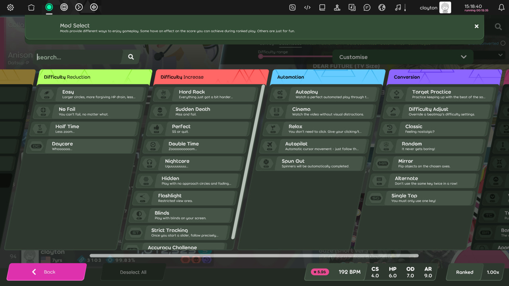

# Game modifier (lazer)

*For the osu!stable version of this article, see: [Game modifier](/wiki/Gameplay/Game_modifier)*\
*For other uses of "mod", see: [Mod (disambiguation)](/wiki/Disambiguation/Mod)*

Mods are separated into five categories: `Difficulty Reduction`, `Difficulty Increase`, `Automation`, `Conversion` and `Fun`. They can either reduce or increase the Score Multiplier. When two mods are being used simultaneously, the mods' respective multiplier will be multiplied together (e.g., 1.06x * 1.12x = 1.1872x).

## List of mods

Each of the mods below listed will have their compatible game modes' icon (![][osu!] ![][osu!taiko] ![][osu!catch] ![][osu!mania]) next to it.

### Difficulty Reduction

- [Easy (EZ)](/wiki/Gameplay/Game_modifier/Easy_(lazer)) ![][osu!] ![][osu!taiko] ![][osu!catch] ![][osu!mania]
- [No Fail (NF)](/wiki/Gameplay/Game_modifier/No_Fail_(lazer)) ![][osu!] ![][osu!taiko] ![][osu!catch] ![][osu!mania]
- [Half Time (HT)](/wiki/Gameplay/Game_modifier/Half_Time_(lazer)) ![][osu!] ![][osu!taiko] ![][osu!catch] ![][osu!mania]
- [Daycore (DC)](/wiki/Gameplay/Game_modifier/Daycore) ![][osu!] ![][osu!taiko] ![][osu!catch] ![][osu!mania]
- [No Release (NR)](/wiki/Gameplay/Game_modifier/No_Release) ![][osu!mania]

### Difficulty Increase

- [Hard Rock (HR)](/wiki/Gameplay/Game_modifier/Hard_Rock_(lazer)) ![][osu!] ![][osu!taiko] ![][osu!catch] ![][osu!mania]
- [Sudden Death (SD)](/wiki/Gameplay/Game_modifier/Sudden_Death_(lazer)) ![][osu!] ![][osu!taiko] ![][osu!catch] ![][osu!mania]
- [Perfect (PF)](/wiki/Gameplay/Game_modifier/Perfect_(lazer)) ![][osu!] ![][osu!taiko] ![][osu!catch] ![][osu!mania]
- [Double Time (DT)](/wiki/Gameplay/Game_modifier/Double_Time_(lazer)) ![][osu!] ![][osu!taiko] ![][osu!catch] ![][osu!mania]
- [Nightcore (NC)](/wiki/Gameplay/Game_modifier/Nightcore_(lazer)) ![][osu!] ![][osu!taiko] ![][osu!catch] ![][osu!mania]
- [Fade In (FI)](/wiki/Gameplay/Game_modifier/Fade_In_(lazer)) ![][osu!mania]
- [Hidden (HD)](/wiki/Gameplay/Game_modifier/Hidden_(lazer)) ![][osu!] ![][osu!taiko] ![][osu!catch] ![][osu!mania]
- [Cover (CO)](/wiki/Gameplay/Game_modifier/Cover)) ![][osu!mania]
- [Flashlight (FL)](/wiki/Gameplay/Game_modifier/Flashlight_(lazer)) ![][osu!] ![][osu!taiko] ![][osu!catch] ![][osu!mania]
- [Blinds (BL)](/wiki/Gameplay/Game_modifier/Blinds) ![][osu!]
- [Strict Tracking (ST)](/wiki/Gameplay/Game_modifier/Strict_Tracking) ![][osu!]
- [Accuracy Challenge (AC)](/wiki/Gameplay/Game_modifier/Accuracy_Challenge) ![][osu!] ![][osu!taiko] ![][osu!catch] ![][osu!mania]

### Automation

- [Autoplay (AT)](/wiki/Gameplay/Game_modifier/Autoplay_(lazer)) ![][osu!] ![][osu!taiko] ![][osu!catch] ![][osu!mania]
- [Cinema (CN)](/wiki/Gameplay/Game_modifier/Cinema_(lazer)) ![][osu!] ![][osu!taiko] ![][osu!catch] ![][osu!mania]
- [Relax (RX)](/wiki/Gameplay/Game_modifier/Relax_(lazer)) ![][osu!] ![][osu!taiko] ![][osu!catch]
- [Autopilot (AP)](/wiki/Gameplay/Game_modifier/Autopilot_(lazer)) ![][osu!]
- [Spun Out (SO)](/wiki/Gameplay/Game_modifier/Spun_Out_(lazer)) ![][osu!]

### Conversion

- [Target Practice (TP)](/wiki/Gameplay/Game_modifier/Target_Practice_(lazer)) ![][osu!]
- [Difficulty Adjust (DA)](/wiki/Gameplay/Game_modifier/Difficulty_Adjust) ![][osu!] ![][osu!taiko] ![][osu!catch] ![][osu!mania]
- [Classic (CL)](/wiki/Gameplay/Game_modifier/Classic) ![][osu!] ![][osu!taiko]
- [Random (RD)](/wiki/Gameplay/Game_modifier/Random_(lazer)) ![][osu!] ![][osu!taiko] ![][osu!mania]
- [Mirror (MR)](/wiki/Gameplay/Game_modifier/Mirror_(lazer)) ![][osu!] ![][osu!catch] ![][osu!mania]
- [Alternate (AL)](/wiki/Gameplay/Game_modifier/Alternate) ![][osu!]
- [Swap (SW)](/wiki/Gameplay/Game_modifier/Swap) ![][osu!taiko]
- [Single Tap (SG)](/wiki/Gameplay/Game_modifier/Single_Tap) ![][osu!] ![][osu!taiko]
- [Invert (IN)](/wiki/Gameplay/Game_modifier/Invert) ![][osu!mania]
- [Constant Speed (CS)](/wiki/Gameplay/Game_modifier/Constant_Speed) ![][osu!taiko] ![][osu!mania]
- [Hold Off (HO)](/wiki/Gameplay/Game_modifier/Hold_Off) ![][osu!mania]
- [Key mods (1K, 2K, 3K, 4K, 5K, 6K, 7K, 8K, 9K, 10K)](/wiki/Gameplay/Game_modifier/Key_mods_(lazer)) ![][osu!mania]

### Fun

- [Transform (TR)](/wiki/Gameplay/Game_modifier/Transform) ![][osu!]
- [Wiggle (WG)](/wiki/Gameplay/Game_modifier/Wiggle) ![][osu!]
- [Spin In (SI)](/wiki/Gameplay/Game_modifier/Spin_In) ![][osu!]
- [Grow (GR)](/wiki/Gameplay/Game_modifier/Grow) ![][osu!]
- [Deflate (DF)](/wiki/Gameplay/Game_modifier/Deflate) ![][osu!]
- [Wind Up (WU)](/wiki/Gameplay/Game_modifier/Wind_Up) ![][osu!] ![][osu!taiko] ![][osu!catch] ![][osu!mania]
- [Wind Down (WD)](/wiki/Gameplay/Game_modifier/Wind_Down) ![][osu!] ![][osu!taiko] ![][osu!catch] ![][osu!mania]
- [Traceable (TC)](/wiki/Gameplay/Game_modifier/Traceable) ![][osu!]
- [Barrel Roll (BR)](/wiki/Gameplay/Game_modifier/Barrel_Roll) ![][osu!]
- [Approach Different (AD)](/wiki/Gameplay/Game_modifier/Approach_Different) ![][osu!]
- [Floating Fruits (FF)](/wiki/Gameplay/Game_modifier/Floating_Fruits) ![][osu!catch]
- [Muted (MU)](/wiki/Gameplay/Game_modifier/Muted) ![][osu!] ![][osu!taiko] ![][osu!catch] ![][osu!mania]
- [No Scope (NS)](/wiki/Gameplay/Game_modifier/No_Scope) ![][osu!] ![][osu!catch]
- [Magnetised (MG)](/wiki/Gameplay/Game_modifier/Magnetised) ![][osu!]
- [Repel (RP)](/wiki/Gameplay/Game_modifier/Repel) ![][osu!]
- [Adaptive Speed (AS)](/wiki/Gameplay/Game_modifier/Adaptive_Speed) ![][osu!] ![][osu!taiko] ![][osu!mania]
- [Freeze Frame (FR)](/wiki/Gameplay/Game_modifier/Freeze_Frame) ![][osu!]
- [Bubbles (BU)](/wiki/Gameplay/Game_modifier/Bubbles) ![][osu!]
- [Synesthesia (SY)](/wiki/Gameplay/Game_modifier/Synesthesia) ![][osu!]
- [Depth (DP)](/wiki/Gameplay/Game_modifier/Depth) ![][osu!]
- [Bloom (BM)](/wiki/Gameplay/Game_modifier/Bloom) ![][osu!]

### System

- [Score V2 (SV2)](/wiki/Gameplay/Game_modifier/Score_V2_(lazer)) ![][osu!] ![][osu!taiko] ![][osu!catch] ![][osu!mania]
- [Touch Device (TD)](/wiki/Gameplay/Game_modifier/Touch_Device_(lazer)) ![][osu!]

#### Personal Presets

The **Personal Presets** are located in a category of its own, allowing you to save any combination of mods directly into it. You can name them anything you like or add an extra description with it. Each Personal Presets are unique its game mode.

#### Customise

Similar to the Difficulty Adjust (DA) mod, the pre-configured settings **Customise** guarantees a customizable gaming experience based on the mods you've chosen. Any change in these settings will result in your score being unranked.

[osu!]: /wiki/shared/mode/osu.png "osu!"
[osu!taiko]: /wiki/shared/mode/taiko.png "osu!taiko"
[osu!catch]: /wiki/shared/mode/catch.png "osu!catch"
[osu!mania]: /wiki/shared/mode/mania.png "osu!mania"
