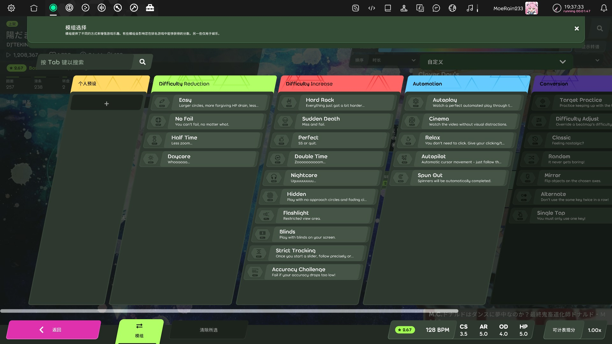

# 游戏模组 (lazer)

*对于该文章的 osu!(stable) 版本，请见：[游戏模组](/wiki/Gameplay/Game_modifier)*\
*对于 "Mod" 一词的其他用法，请见：[Mod（消歧义）](/wiki/Disambiguation/Mod)*

模组被分为五类：`降低难度`、`增加难度`、`自动化`、`转换`、`娱乐`，它们能够降低或增加得分系数。同时使用多个模组时，最终的得分系数是所有模组得分系数的乘积（如 1.06x * 1.12x = 1.1872x）。

## 模组列表

下表列出的所有模组只能在它们右侧列出的游戏模式（![][osu!] ![][osu!taiko] ![][osu!catch] ![][osu!mania]）内发挥作用。

### 降低难度

- [Easy (EZ)](Easy_(lazer)) ![][osu!] ![][osu!taiko] ![][osu!catch] ![][osu!mania]
- [No Fail (NF)](No_Fail_(lazer)) ![][osu!] ![][osu!taiko] ![][osu!catch] ![][osu!mania]
- [Half Time (HT)](Half_Time_(lazer)) ![][osu!] ![][osu!taiko] ![][osu!catch] ![][osu!mania]
- [Daycore (DC)](Daycore) ![][osu!] ![][osu!taiko] ![][osu!catch] ![][osu!mania]
- [Simplified Rhythm (SR)](Simplified_Rhythm) ![][osu!taiko]
- [No Release (NR)](No_Release) ![][osu!mania]

### 增加难度

- [Hard Rock (HR)](Hard_Rock_(lazer)) ![][osu!] ![][osu!taiko] ![][osu!catch] ![][osu!mania]
- [Sudden Death (SD)](Sudden_Death_(lazer)) ![][osu!] ![][osu!taiko] ![][osu!catch] ![][osu!mania]
- [Perfect (PF)](Perfect_(lazer)) ![][osu!] ![][osu!taiko] ![][osu!catch] ![][osu!mania]
- [Double Time (DT)](Double_Time_(lazer)) ![][osu!] ![][osu!taiko] ![][osu!catch] ![][osu!mania]
- [Nightcore (NC)](Nightcore_(lazer)) ![][osu!] ![][osu!taiko] ![][osu!catch] ![][osu!mania]
- [Fade In (FI)](Fade_In_(lazer)) ![][osu!mania]
- [Hidden (HD)](Hidden_(lazer)) ![][osu!] ![][osu!taiko] ![][osu!catch] ![][osu!mania]
- [Traceable (TC)](Traceable) ![][osu!]
- [Cover (CO)](Cover) ![][osu!mania]
- [Flashlight (FL)](Flashlight_(lazer)) ![][osu!] ![][osu!taiko] ![][osu!catch] ![][osu!mania]
- [Blinds (BL)](Blinds) ![][osu!]
- [Strict Tracking (ST)](Strict_Tracking) ![][osu!]
- [Accuracy Challenge (AC)](Accuracy_Challenge) ![][osu!] ![][osu!taiko] ![][osu!catch] ![][osu!mania]

### 自动化

- [Autoplay (AT)](Autoplay_(lazer)) ![][osu!] ![][osu!taiko] ![][osu!catch] ![][osu!mania]
- [Cinema (CN)](Cinema_(lazer)) ![][osu!] ![][osu!taiko] ![][osu!catch] ![][osu!mania]
- [Relax (RX)](Relax_(lazer)) ![][osu!] ![][osu!taiko] ![][osu!catch]
- [Autopilot (AP)](Autopilot_(lazer)) ![][osu!]
- [Spun Out (SO)](Spun_Out_(lazer)) ![][osu!]

### 转换

- [Target Practice (TP)](Target_Practice_(lazer)) ![][osu!]
- [Difficulty Adjust (DA)](Difficulty_Adjust) ![][osu!] ![][osu!taiko] ![][osu!catch] ![][osu!mania]
- [Classic (CL)](Classic) ![][osu!] ![][osu!taiko] ![][osu!mania]
- [Random (RD)](Random_(lazer)) ![][osu!] ![][osu!taiko] ![][osu!mania]
- [Dual Stages (DS)](Dual_Stages) ![][osu!mania]
- [Mirror (MR)](Mirror_(lazer)) ![][osu!] ![][osu!catch] ![][osu!mania]
- [Alternate (AL)](Alternate) ![][osu!]
- [Swap (SW)](Swap) ![][osu!taiko]
- [Single Tap (SG)](Single_Tap) ![][osu!] ![][osu!taiko]
- [Invert (IN)](Invert) ![][osu!mania]
- [Constant Speed (CS)](Constant_Speed) ![][osu!taiko] ![][osu!mania]
- [Hold Off (HO)](Hold_Off) ![][osu!mania]
- [按键模组 (1K, 2K, 3K, 4K, 5K, 6K, 7K, 8K, 9K, 10K)](Key_mods_(lazer)) ![][osu!mania]

### 娱乐

- [Transform (TR)](Transform) ![][osu!]
- [Wiggle (WG)](Wiggle) ![][osu!]
- [Spin In (SI)](Spin_In) ![][osu!]
- [Grow (GR)](Grow) ![][osu!]
- [Deflate (DF)](Deflate) ![][osu!]
- [Wind Up (WU)](Wind_Up) ![][osu!] ![][osu!taiko] ![][osu!catch] ![][osu!mania]
- [Wind Down (WD)](Wind_Down) ![][osu!] ![][osu!taiko] ![][osu!catch] ![][osu!mania]
- [Barrel Roll (BR)](Barrel_Roll) ![][osu!]
- [Approach Different (AD)](Approach_Different) ![][osu!]
- [Floating Fruits (FF)](Floating_Fruits) ![][osu!catch]
- [Muted (MU)](Muted) ![][osu!] ![][osu!taiko] ![][osu!catch] ![][osu!mania]
- [No Scope (NS)](No_Scope) ![][osu!] ![][osu!catch]
- [Magnetised (MG)](Magnetised) ![][osu!]
- [Repel (RP)](Repel) ![][osu!]
- [Adaptive Speed (AS)](Adaptive_Speed) ![][osu!] ![][osu!taiko] ![][osu!mania]
- [Freeze Frame (FR)](Freeze_Frame) ![][osu!]
- [Bubbles (BU)](Bubbles) ![][osu!]
- [Moving Fast (MF)](Moving_Fast) ![][osu!catch]
- [Synesthesia (SY)](Synesthesia) ![][osu!] ![][osu!catch]
- [Depth (DP)](Depth) ![][osu!]
- [Bloom (BM)](Bloom) ![][osu!]

### 系统

- [Score V2 (SV2)](Score_V2_(lazer)) ![][osu!] ![][osu!taiko] ![][osu!catch] ![][osu!mania]
- [Touch Device (TD)](Touch_Device_(lazer)) ![][osu!]

#### 个人预设

**个人预设**位于一个独立的类别中，允许你将任何模组组合直接保存到其中。你可以为它们命名或添加额外的描述。每个个人预设都是仅适用于其对应的游戏模式的。

#### 自定义

与 Difficulty Adjust (DA) 模组类似，预定义的**自定义**设置能够基于选择的模组，提供可定制的游戏体验。更改自定义设置可能会导致分数无法计入排名。

[osu!]: /wiki/shared/mode/osu.png "osu!"
[osu!taiko]: /wiki/shared/mode/taiko.png "osu!taiko"
[osu!catch]: /wiki/shared/mode/catch.png "osu!catch"
[osu!mania]: /wiki/shared/mode/mania.png "osu!mania"
