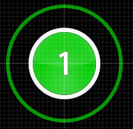

# Hit Objects

히트 오브젝트는 osu! 플레이의 중심이라고 봐도 됩니다. 이 히트 오브젝트에는 세가지의 종류가 있는데 :

- 히트 서클
- 슬라이더
- 스피너

히트 서클과 슬라이더는 맵에서 매우 많이 볼수 있지만 스피너는 가끔씩만 나옵니다. 비트맵 플레이중 보이는 모든 것들을 통틀어서 히트 오브젝트라고 합니다.

## 히트 서클

[DS 게임들에서는](/wiki/iNiS_games) 히트 마커라고 불렀던 것들입니다. 동그라미 중간에 해당 [콤보](/wiki/Beatmapping/Combo) 숫자에 따라서 숫자가 적혀있습니다. 이 주위에([어프로치 서클이](/wiki/Gameplay/Hit_object/Approach_circle) 생기고 히트 서클로 다가오는데 이 두개가 겹칠때 히트 서클을 눌러주셔야 합니다 , 서클을 누른 정확도에 따라 (50,100,300)점중 하나를 획득하게 됩니다, 또한 해당 서클이 해당 콤보의 마지막 서클이였다면 [Beat!](/wiki/Gameplay/Score) 또는 [Elite Beat!을](/wiki/Gameplay/Score) 받을수도 있습니다. Tapping regular Hit Circles gives a very small boost to the [Life Bar](/wiki/Client/Interface/Health_bar), and a good boost if it is a end combo circle.

## 슬라이더

슬라이더는 두개의 히트 서클 사이를 잇는 직선 또는 베지어 곡선으로 이루어져 있습니다. An Approach Circle is around the beginning Hit Circle of the Slider. Once the Approach Circle reaches its border, the player must tap the beginning of the Slider and then, keeping the button pressed, follow (with his cursor) a moving graphical image \[called Slider Ball - An graphic (ball-shaped by default) that moves along a Slider's path based on BPM and Slider Velocity given by the mapper\] along the Slider's path until the end Hit Circle is reached. If there is a reverse arrow graphic at that point, the player follows the Slider Ball back along the same path and repeats as long as a reverse arrow graphic is visible.

슬라이더 틱은 슬라이더의 경로 내에 있는 작은 점들을 말합니다. 슬라이더 도중에 공 범위 밖으로 벗어나거나 슬라이더 경로에 틱이 있을때 슬라이더를 누르고 있지 않으면 콤보가 리셋됩니다. 이론적으로는 슬라이더 틱 사이사이에는 슬라이더를 누르고 있지 않아도 지장이 없습니다. 매퍼들은 매핑을 할때 슬라이더 사이에 있는 틱 숫자를 조정할수 있습니다. 많은 틱 들은 콤보를 빠르게 올리고 높은 점수를 얻을 수 있는 기회를 제공하지만, 그만큼 슬라이더 난이도가 올라가게 됩니다. 틱 하나를 클리어 할때마다 10점을 얻습니다. (콤보와 상관없이)

슬라이더는 곡 내에서 길거나 히트 서클로는 표현하기 힘든 소리들을 맵에 맞게 하기위해 사용됩니다. 가끔씩은 히트 서클을 여러개 사용하는 스트림을 쉽게 하게위해 사용되기도 합니다.

## Spinner

A Spinner is a circle that takes up the entire height of the play area and has a Spinner Metre on either side. A large circular outline similar to a [Approach Circle](/wiki/Gameplay/Hit_object/Approach_circle) appears on the Spinner’s border and gradually converges on its centre. The player should hold the mouse button down and spin in either a clockwise or anti-clockwise direction. As long as the mouse button is held down, the cursor is locked on the Spinner’s area, so the player need not worry about going outside it. The Spinner is cleared if all the levels of the Spinner Metre are filled before its Approach Circle reaches the centre. Depending on the difficulty settings of each [beatmap](/wiki/Beatmap), a different number of spins are required to fill each level of the Spinner Metre (worth 100 points). If the player fills the Spinner Metre before the Approach Circle reaches the Spinner’s centre, each additional spin before time runs out will award the player with 1,000 bonus points (each receiving a bonus multiplier depending on the player’s current [Combo](/wiki/Beatmapping/Combo)). Spinning a Spinner provides a continuous minor boost to the [Life Bar](/wiki/Client/Interface/Health_bar) depending on the spinning speed.

**정보:** 현재 osu! 기본 스킨 \[osu! by peppy\] 는 스피너에 어프로치 서클과 스피너 게이지가 없습니다만, 구 버전 스킨 \[osu!default by peppy\] 에는 둘다 있습니다.
