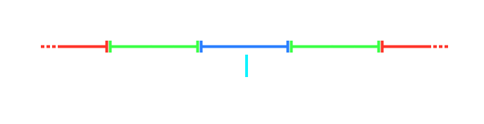

# Trefferfenster

Spieler müssen jedes [Hit-Objekt](/wiki/Gameplay/Hit_object) in einer bestimmten Zeitspanne, genannt **Trefferfenster**, treffen. Je höher die Genauigkeit eines Treffers ist, desto mehr Punkte erhält man. Verfehlt man ein Hit-Objekt, wird das als Miss gewertet.

Je nachdem, in welchem Bereich ein Treffer innerhalb eines Trefferfensters landet, erhält man eine bestimmte [Beurteilung](/wiki/Gameplay/Judgement). Die Bereiche können als verschachtelte Trefferfenster gesehen werden. Die Länge eines Trefferfensters wird durch die [allgemeine Schwierigkeit](/wiki/Beatmap/Overall_difficulty) sowie durch geschwindigkeitsändernde Mods wie [Double Time](/wiki/Gameplay/Game_modifier/Double_Time) und [Half Time](/wiki/Gameplay/Game_modifier/Half_Time) beeinflusst.

Die Anzahl und die Länge der Trefferfenster variiert je nach [Spielmodus](/wiki/Game_mode). Zum Beispiel existiert in [osu!catch](/wiki/Game_mode/osu!catch) kein Zeitkonzept, d. h. alle Hit-Objekte gelten als getroffen oder als verfehlt.
