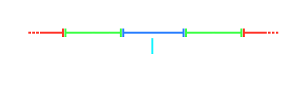

# Hit window

Each [hit object](/wiki/Gameplay/Hit_object) has a time frame called a **hit window** in which players are required to hit them. The higher the accuracy of the hit, the more score will be rewarded. Failing to hit the hit object at all will incur a miss.

The regions within a hit window award different [judgements](/wiki/Gameplay/Judgement) and can each be considered a nested hit window. Their lengths are affected by the [overall difficulty](/wiki/Beatmap/Overall_difficulty) as well as rate-changing mods like [Double Time](/wiki/Gameplay/Game_modifier/Double_Time) and [Half Time](/wiki/Gameplay/Game_modifier/Half_Time).

The amount and length of hit windows also varies by [game mode](/wiki/Game_mode). For example, [osu!catch](/wiki/Game_mode/osu!catch) has no concept of timing, so any hit objects will be judged as either hit or missed.
