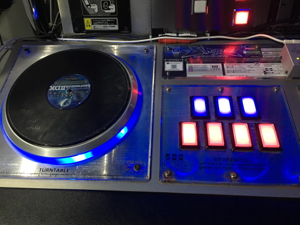

# Beatmania 控制器

Beatmania 控制器是一种兼容于 *[Beatmania](https://zh.wikipedia.org/wiki/Beatmania)* 游戏系列的控制器。

因其性质，Beatmania 控制器通常在 [osu!mania](/wiki/Game_mode/osu!mania) 作为输入装置。

## 输入方式

有 PS2 (Playstation 2) 版本的 Beatmania 控制器的玩家，可以通过 USB 转接头连接到电脑上并绑定按键。如果是持有 *DJ DAO IIDX* 版本的控制器的玩家，可以直接插到电脑上的 USB 插孔并绑定按键。
