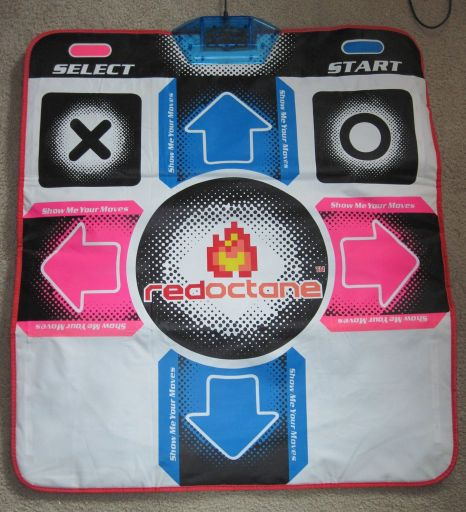

# Dance pad

A **dance pad**, or **dance mat**, is a type of rhythm game controller that uses a player's feet placement as input. Shown below, dance pads are placed on the floor and enable the user to step anywhere from four to nine "directions" to activate the keys. These kinds of controllers are most often used in rhythm games like *[Dance Dance Revolution](https://en.wikipedia.org/wiki/Dance_Dance_Revolution)*.

The [Wii](https://en.wikipedia.org/wiki/Wii) Dance Mat requires the use of a [GameCube](https://en.wikipedia.org/wiki/GameCube) controller adapter to function with a computer. Once you have connected the dance pad to your computer, you can bind the correct keys in the osu! settings.
