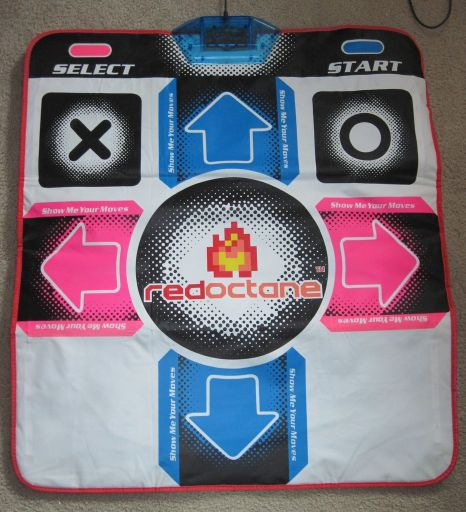

# Dance pad

**Dance pad** หรือ **dance mat** คือคอนโทรลเลอร์เกมจังหวะประเภทหนึ่งที่ใช้ตำแหน่งเท้าของผู้เล่นเป็นอินพุต ตามภาพด้านล่าง dance pad จะวางบนพื้น และให้ผู้ใช้เหยียบได้ตั้งแต่สี่ถึงเก้า "ทิศทาง" เพื่อสั่งปุ่ม คอนโทรลเลอร์ประเภทนี้มักใช้ในเกมจังหวะอย่าง *[Dance Dance Revolution](https://en.wikipedia.org/wiki/Dance_Dance_Revolution)*

Dance Mat ของ [Wii](https://en.wikipedia.org/wiki/Wii) ต้องใช้อะแดปเตอร์คอนโทรลเลอร์ [GameCube](https://en.wikipedia.org/wiki/GameCube) เพื่อให้ทำงานกับคอมพิวเตอร์ได้ หลังจากเชื่อมต่อ dance pad เข้ากับคอมพิวเตอร์แล้ว สามารถ bind ปุ่มที่ถูกต้องได้ใน settings ของ osu!
