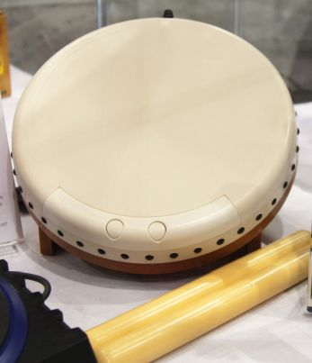

# Contrôleur de tambour

Le **contrôleur de tambour** est un périphérique d'entrée conçus pour fonctionner avec des jeux de batterie de type Taiko. Ils ont le plus souvent quatre zones d'entrée : centre de la batterie droite, le centre de la batterie gauche , le bord de la batterie droite et le bord de la batterie gauche, chaque entrée (touche) étant activée par une baguette de batterie qui est frappée sur la zone correspondante de la batterie.

## Entrée

Les propriétaires de contrôleur de tambour Taiko pour la [PlayStation 4 (PS4)](https://fr.wikipedia.org/wiki/PlayStation_4) ou la [Nintendo Switch](https://fr.wikipedia.org/wiki/Nintendo_Switch) devront brancher leur contrôleur à l'ordinateur via USB et lier les bonnes touches dans les paramètres d'osu!. Les propriétaires de la manette Tatacon de la [Wii](https://fr.wikipedia.org/wiki/Wii) devront coupler leur manette à leur ordinateur avant d'activer l'option de support Wiimote/Tatacon dans les paramètres d'osu!. La plupart des contrôleurs de batterie tiers fonctionnent également avec osu!, mais le support peut varier.
