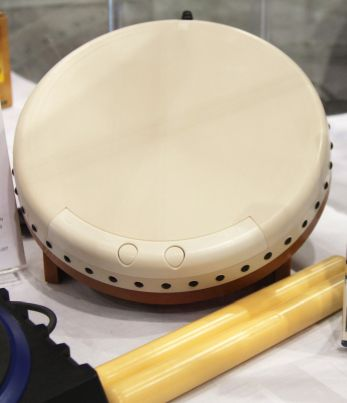

# 太鼓控制器

**太鼓控制器**是用于游玩太鼓之达人及与其相似的游戏的输入装置。通常分成四个输入区域：右鼓面、左鼓面、右鼓边和左鼓边。使用鼓棒敲打对应的区域来输入对应的按键。

## 使用

使用 [PlayStation 4 (PS4)](https://www.qiuwenbaike.cn/wiki/PlayStation_4) 或 [Nintendo Switch](https://www.qiuwenbaike.cn/wiki/%E4%BB%BB%E5%A4%A9%E5%A0%82Switch) 专用实体鼓的玩家需要通过 USB 与电脑连接，并在 osu! 的设置中绑定按键。使用 [Wii](https://www.qiuwenbaike.cn/wiki/Wii) 专用实体鼓的玩家需要先通过蓝牙与电脑配对后，再开启 osu! 设置中的 Wiimote/Tatacon 支持选项。大部分的副厂实体鼓也能在 osu! 使用，但实际支持情况可能有所不同。
