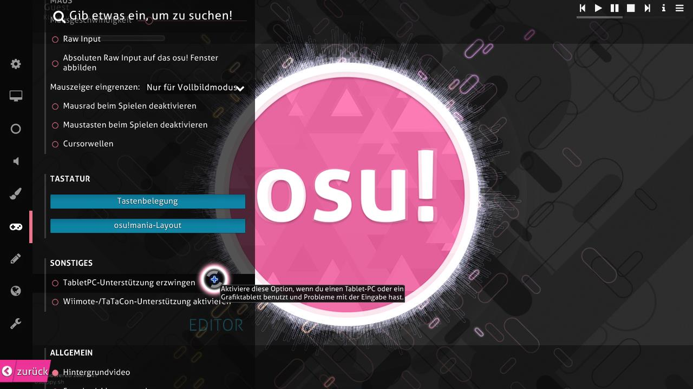

# Grafiktablett

*Siehe auch: [Spielweise](/wiki/Gameplay/Play_style)*

Ein **Grafiktablett**, oder einfach nur *Tablet*, ist ein Eingabegerät, das ursprünglich für digitales Zeichnen und künstlerische Arbeiten gedacht ist, aber auch zur Steuerung der Cursorbewegung in [osu!](/wiki/Game_mode/osu!) verwendet werden kann. Es ist eine der häufigsten Spielweisen in osu!.

*Hinweis für Tablet-Spieler: Die Verwendung eines Tablet-PCs oder von Tablet-Klicks in osu! kann manchmal fehlerhaft verarbeitet werden. Um dies zu beheben, aktiviere den Punkt "TabletPC-Unterstützung erzwingen" im Optionsmenü.*

<!-- TODO: mention tap-x as a way of clicking with a tablet -->
