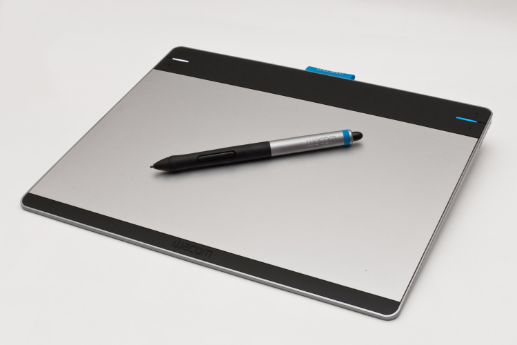
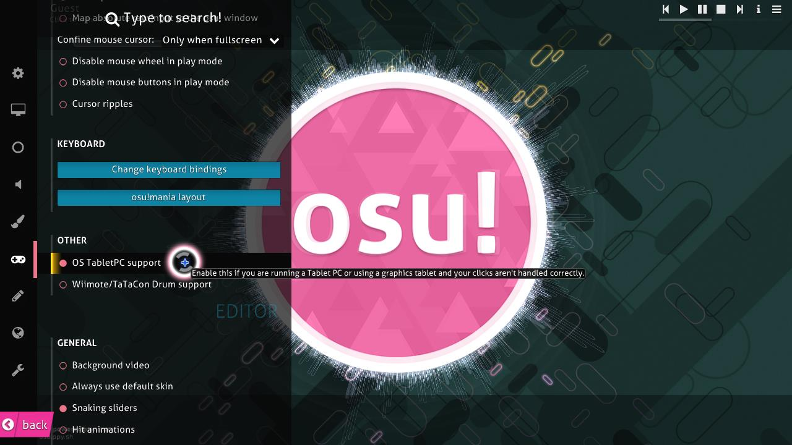

# Graphics tablet

*See also: [Play style](/wiki/Gameplay/Play_style)*

A **graphics tablet**, or just *tablet*, is an input device that is originally intended for digital drawing and artistry, but can be used as a way to control cursor movement in [osu!](/wiki/Game_mode/osu!). It is one of the most common play styles in osu!.

## Tablet Settings

*Note to tablet players: the use of a Tablet PC or tablet clicks in osu! may sometimes be handled incorrectly. In order to fix this, enable the `OS Tablet PC support` setting in the Options menu.*

<!-- TODO: mention tap-x as a way of clicking with a tablet -->
<!-- TODO: add osu!(lazer) tablet settings, including high precision mouse -->

## OpenTabletDriver

[OpenTabletDriver](https://opentabletdriver.net) is an open-source, cross-platform tablet driver commonly used by osu! players on Linux. It provides precise control over tablet area, pen pressure, and input handling. In addition, it includes many plugins that combat and improve upon common issues.

### Plugins

OpenTabletDriver supports community made plugins. Players commonly use plugins such as [Temporal Resampler](https://github.com/shmkle/TemporalResampler) to improve cursor clarity for higher refresh rate (Hz) monitors with minimal latency, and [Kuuube's CHATTER EXTERMINATOR](https://github.com/Kuuuube/Kuuube-s-CHATTER-EXTERMINATOR) to prevent chatter (unintended inputs caused by the pen hovering near the tablet).

A full list of available plugins can be found on the [OpenTabletDriver plugin repository](https://opentabletdriver.net/Plugins). Each plugin has a public repository with personal author notes.

### Troubleshooting

#### Linux

##### Tablet input not detected in osu!(stable) on Wayland

`Absolute Mode` should not be used as the output mode. Use `Artist Mode` instead, as Wine and XWayland currently have issues parsing absolute mouse input.

If smoothing or slowness is present with Artist Mode, see the [OpenTabletDriver Linux FAQ](https://opentabletdriver.net/Wiki/FAQ/Linux#libinput-smoothing) for instructions on removing it.

##### Cursor stuck in osu!(lazer) on Wayland

See the [OpenTabletDriver app-specific FAQ](https://opentabletdriver.net/Wiki/FAQ/LinuxAppSpecific#osu-lazer-broken-input-wayland) for the recommended fix.
