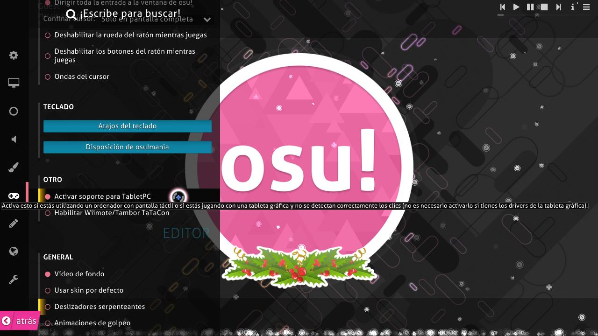

# Tabletas gráficas

*Véase también: [Estilos de juego](/wiki/Gameplay/Play_style)*

Una **tableta gráfica**, o simplemente *tableta*, es un dispositivo de entrada diseñado originalmente para el dibujo y el arte digital, pero que puede usarse como una forma de controlar el movimiento del cursor en [osu!](/wiki/Game_mode/osu!). Es uno de los estilos de juego más comunes en osu!.

*Nota para los jugadores de tabletas: el uso de una Tablet PC o los clics de la tableta en osu! a veces pueden ser manejados incorrectamente. Para solucionar este problema, habilita el ajuste `Activar soporte para TabletPC` en el menú de opciones.*

