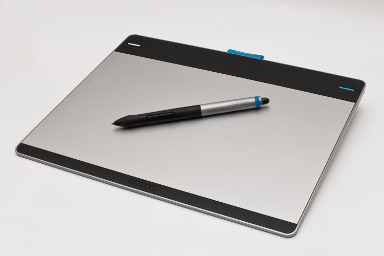
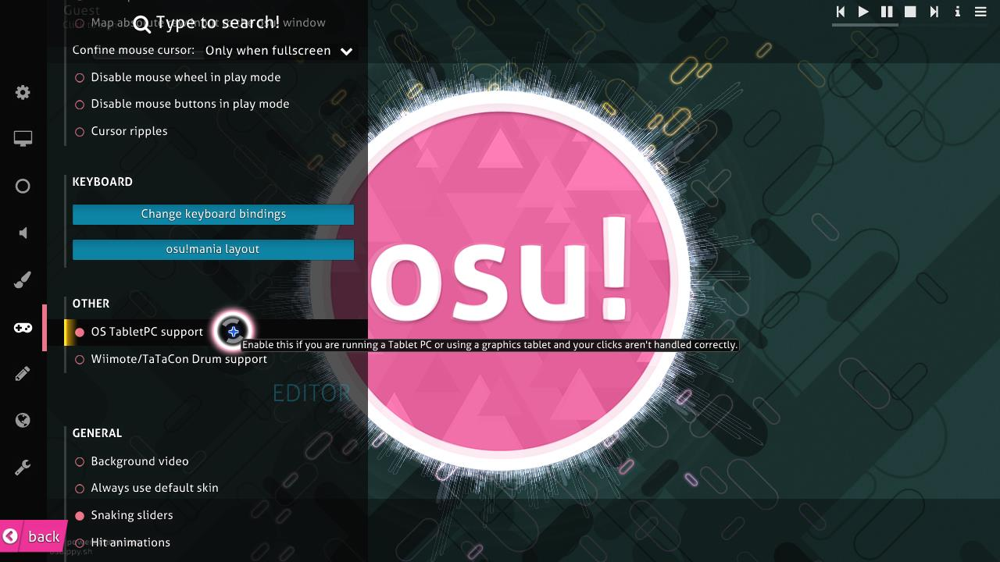

# Tablette graphique

*Voir aussi : [Style de jeu](/wiki/Gameplay/Play_style)*

Une **tablette graphique**, ou tout simplement une *tablette*, est un périphérique d'entrée destiné à l'origine au dessin numérique et à l'art, mais qui peut être utilisé comme moyen de contrôler le mouvement du curseur dans le mode [osu!](/wiki/Game_mode/osu!). C'est l'un des styles de jeu les plus courants dans osu!.

*Note aux joueurs de tablettes : l'utilisation d'une tablette PC ou de tablette clic dans osu! peut parfois être mal gérée. Pour résoudre ce problème, activez le paramètre `Support Tablet PC` dans le menu Options.*

<!-- TODO: mention tap-x as a way of clicking with a tablet -->
