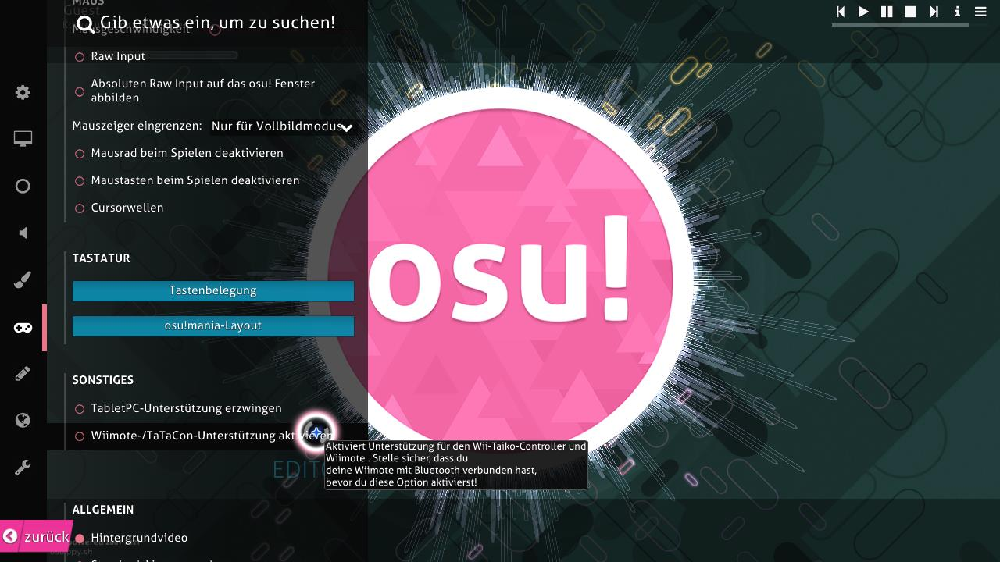

# Wiimote

Die **Wiimote** ist der primäre Game-Controller für die Nintendo [Wii](https://de.wikipedia.org/wiki/Wii). Obwohl die Wiimote meist als Spielerei oder albern angesehen wird, kann sie in osu! zum Zielen über die Sensorleiste verwendet werden. In den Optionen von osu! kann jeder Knopf zum Klicken neu zugewiesen werden.

Die Wiimote kann auch verwendet werden, um [osu!taiko](/wiki/Game_mode/osu!taiko) Trommelschläge über die Bewegungssteuerung oder die Tasten der Wiimote selbst zu steuern. Dies kann jedoch einige fortgeschrittene Kenntnisse über Software und Wiimotes erfordern, um es funktionsfähig zu machen.

Um die Wiimote in osu! zum Laufen zu bringen, muss man möglicherweise die im obigen Bild gezeigte Option aktivieren.
