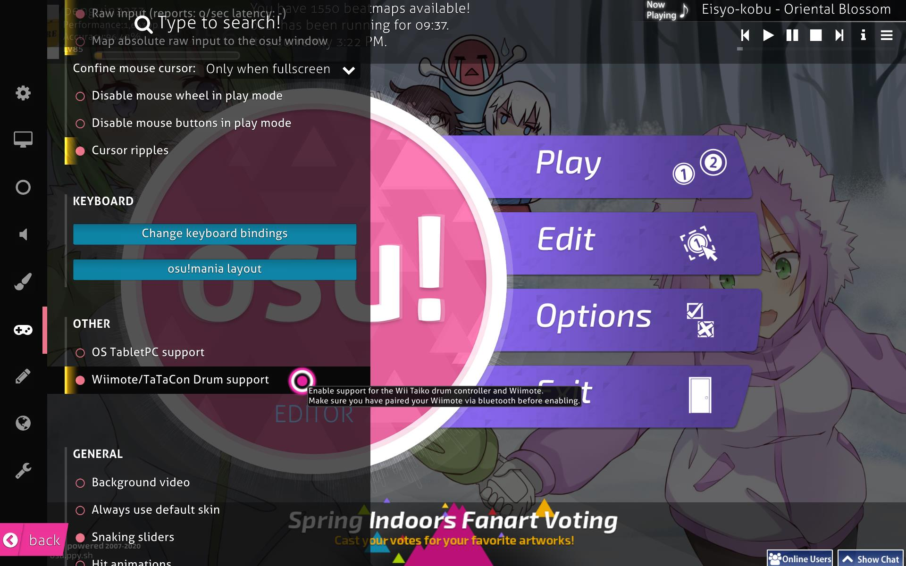

# Wiimote

The **Wiimote** is the primary game controller for the Nintendo Wii console. 
osu! supports using the Wiimote as an input device. 
The Wiimote can be used to aim in osu! using the sensor bar and to click using ???. 
To use the Wiimote in osu! you need to first enable support for it in the osu! options. 

<!-- this is a stub, article in progress..-->
