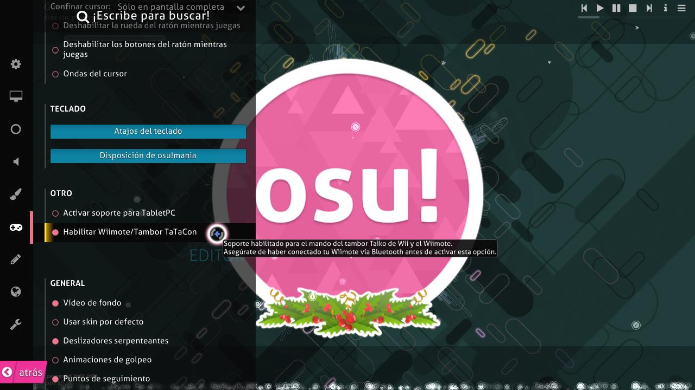

# Wiimote

**Wiimote** es el mando de juego principal para la Nintendo [Wii](https://es.wikipedia.org/wiki/Wii). Aunque en su mayoría se ve como un truco o una tontería, el Wiimote se puede usar en osu! para apuntar usando la barra de sensores. Puedes volver a asignar cualquier botón para hacer clic en las opciones de osu!.

El Wiimote también se puede usar para controlar los golpes de tambor en [osu!taiko](/wiki/Game_mode/osu!taiko) mediante controles de movimiento o botones en el propio Wiimote. Sin embargo, esto puede requerir un conocimiento más avanzado del software y de los Wiimotes para que funcione.

Para que el Wiimote funcione en osu!, es posible que tengas que marcar la opción que se muestra en la imagen de arriba.
