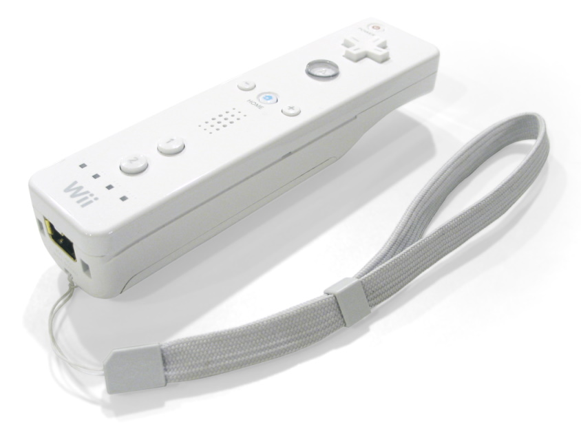
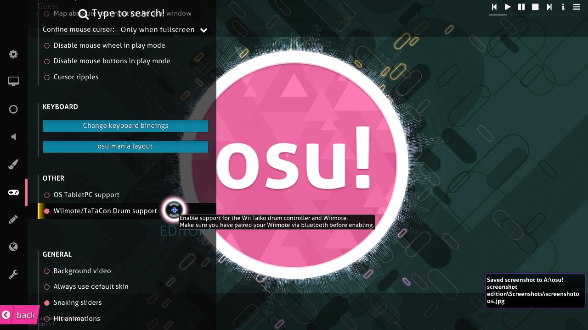

# Wiimote

**Wiimote** คือคอนโทรลเลอร์หลักของ Nintendo [Wii](https://en.wikipedia.org/wiki/Wii) ถึงแม้มักถูกมองว่าเป็นของเล่นแปลก ๆ หรือดูขำ ๆ แต่ Wiimote สามารถใช้ใน osu! เพื่อ aim ด้วย sensor bar ได้ ผู้เล่นสามารถ rebind ปุ่มใดก็ได้ให้ใช้คลิกใน options ของ osu!

Wiimote ยังอาจใช้ควบคุมการตีใน [osu!taiko](/wiki/Game_mode/osu!taiko) ผ่าน motion control หรือปุ่มบนตัว Wiimote เองได้ อย่างไรก็ตาม การทำให้ใช้งานได้อาจต้องมีความรู้ด้านซอฟต์แวร์และ Wiimote ในระดับสูงขึ้นเล็กน้อย

หากต้องการให้ Wiimote ทำงานใน osu! อาจต้องติ๊กตัวเลือกตามภาพด้านบน
