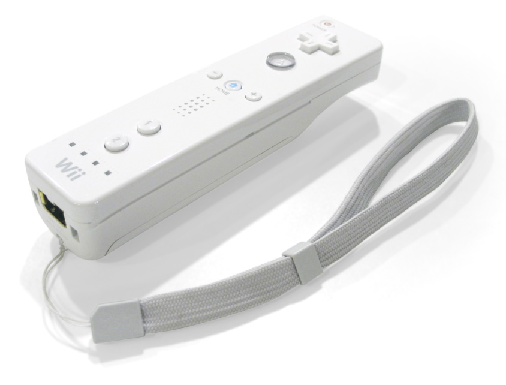
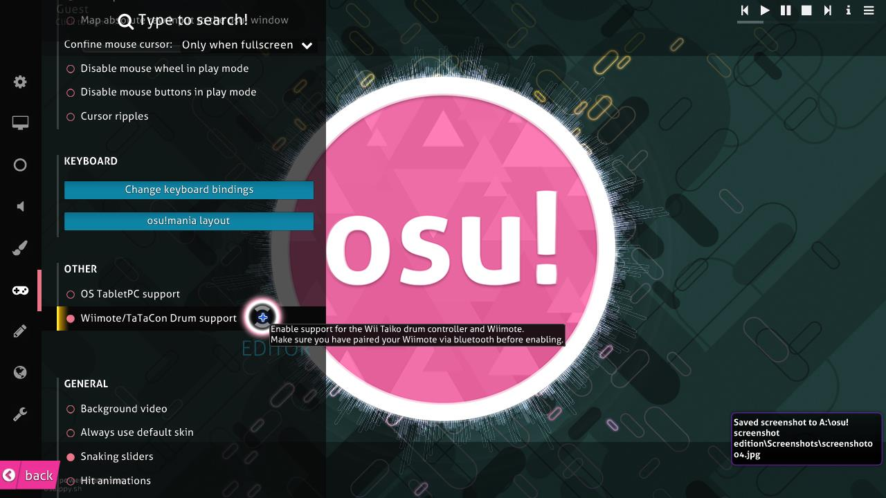

# Wiimote

**Wiimote** 是任天堂 [Wii](https://en.wikipedia.org/wiki/Wii) 的主要遊戲控制器。 雖然聽起來很蠢，但 Wiimote 能夠透過感應條來控制游標。您可以在 osu! 的選項中綁定要用來點擊的按鍵。

Wiimote 也能夠透過動態控制或本身的按鍵在 [osu!taiko](/wiki/Game_mode/osu!taiko) 中擊鼓。然而，這將需要玩家對軟體和 Wiimote 有足夠的認識。

若要使 Wiimote 在 osu! 中運作，您可能會需要勾選上方圖片中的選項。
