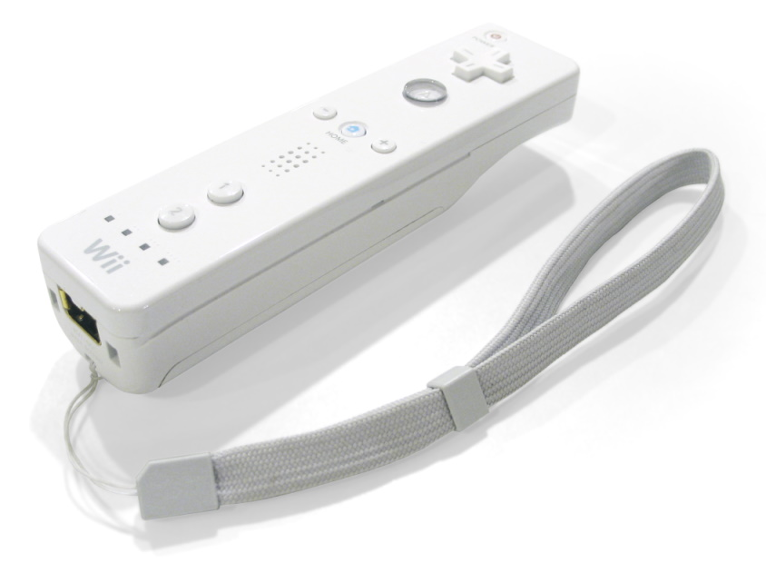
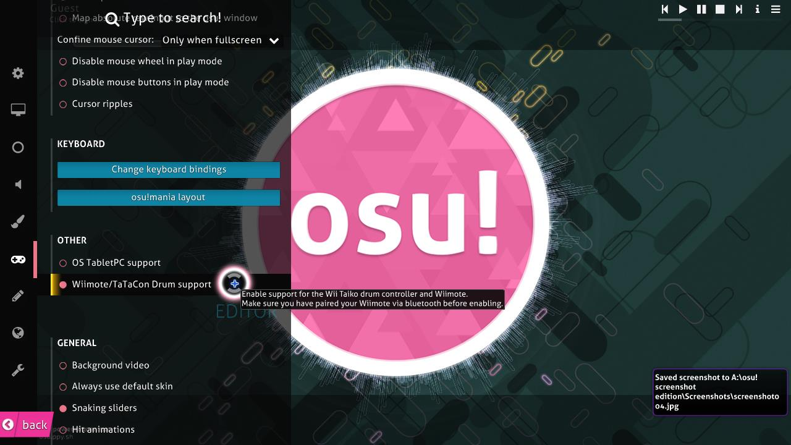

# Wiimote

**Wiimote** 是任天堂 [Wii](https://www.qiuwenbaike.cn/wiki/Wii) 的主要游戏控制器。虽然听起来有点蠢，但 Wiimote 能够通过感应条来控制鼠标指针。您可以在 osu! 的设置中绑定要用来点击的按键。

Wiimote 也能够通过体感或按键在 [osu!taiko](/wiki/Game_mode/osu!taiko) 中击鼓。这可能需要玩家对软件和 Wiimote 有足够的认识。

若要使 Wiimote 在 osu! 中运作，您可能会需要勾选上方图片中的选项。
