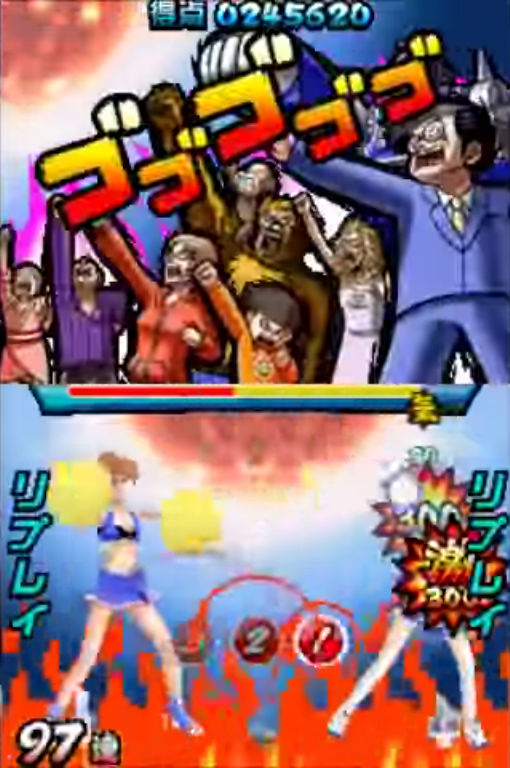

---
tags:
  - "300"
  - perfect
---

# Geki

*Voir aussi : [Katu](/wiki/Gameplay/Judgement/Katu)*

**Geki (激)**, ou *Elite Beat!*, est un terme de [jugement](/wiki/Gameplay/Judgement) utilisé pour désigner le moment où un [combo](/wiki/Beatmapping/Combo) est complété avec la plus grande [précision](/wiki/Gameplay/Accuracy) possible sur chaque note. Il donne un boost de HP plus élevé par rapport aux 300 sur un combo non parfait.

Geki vient du jeu Nintendo DS [Elite Beat Agents](/wiki/iNiS_games), sur lequel le gameplay du mode [osu!](/wiki/Game_mode/osu!) est basé.

## Captures d'écran

## Autres modes de jeu

### osu!taiko

Le Geki n'est affiché sur l'écran des résultats que pour les frappes de grosses notes réussies.

### osu!catch

osu!catch n'a pas de Geki.

### osu!mania

Geki désigne un coup parfaitement synchronisé, et son sprite osu!mania est un `300` aux couleurs de l'arc-en-ciel, souvent appelé MAX. Sa valeur de score est de 320, mais il a la même valeur de précision qu'un 300 normal.

## Storyboard

### Jeux DS

Geki déclenche le meilleur niveau du storyboard pendant le jeu, ce qui montre généralement un esprit très fort pendant la séquence.

### osu!

L'obtention de Geki déclenche plusieurs événements :

- [Fail Layer](/wiki/Storyboard/Scripting/General_Rules#couches) est désactivé.
- [Pass Layer](/wiki/Storyboard/Scripting/General_Rules#couches) est activé.
- L'événement "Passing" est déclenché, si l'état précédent était "Fail".
