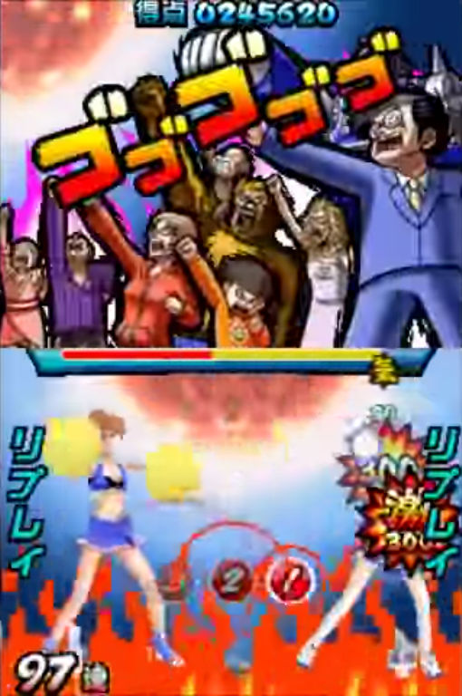
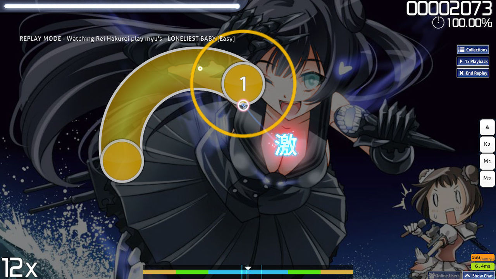

---
tags:
  - "300"
  - perfect
needs_cleanup: true  # https://github.com/ppy/osu-wiki/issues/9613
---

# Geki

*ดูเพิ่มเติม: [Katu](/wiki/Gameplay/Judgement/Katu)*

**Geki (激)** หรือ *Elite Beat!* คือคำใน [judgement](/wiki/Gameplay/Judgement) ที่ใช้เมื่อ[คอมโบ](/wiki/Beatmapping/Combo)หนึ่งชุดถูกจบด้วย[ความแม่นยำ](/wiki/Gameplay/Accuracy)สูงสุดที่เป็นไปได้ในทุกโน้ต โดยจะให้ HP เพิ่มมากกว่าการได้ 300 ตัวสุดท้ายในคอมโบที่ไม่ perfect

Geki มาจากเกม Nintendo DS [Elite Beat Agents](/wiki/iNiS_games) ซึ่งเป็นต้นแบบเกมเพลย์ของ [osu!](/wiki/Game_mode/osu!)

## ภาพตัวอย่าง

## โหมดเกมอื่น

### osu!taiko

Geki จะแสดงเฉพาะบนหน้าผลลัพธ์สำหรับการตีโน้ตใหญ่สำเร็จ

### osu!catch

osu!catch ไม่มี Geki

### osu!mania

ใน osu!mania Geki หมายถึง hit ที่ตรงเวลาอย่างสมบูรณ์แบบ และ sprite ของ osu!mania จะเป็น `300` สีรุ้ง ซึ่งมักเรียกว่า MAX ค่าคะแนนของมันคือ 320 แต่มีค่า accuracy เท่ากับ 300 ปกติ

## Storyboard

### เกม DS

Geki จะ trigger tier ที่ดีที่สุดบน storyboard ระหว่างเล่น ซึ่งมักแสดงพลังใจที่แข็งแกร่งมากในช่วงนั้น

### osu!

การได้ Geki จะ trigger เหตุการณ์หลายอย่าง:

- [Fail Layer](/wiki/Storyboard/Scripting/General_Rules#layers) ถูกปิดใช้งาน
- [Pass Layer](/wiki/Storyboard/Scripting/General_Rules#layers) ถูกเปิดใช้งาน
- เหตุการณ์ "Passing" จะถูก trigger หากสถานะก่อนหน้าคือ "Fail"
