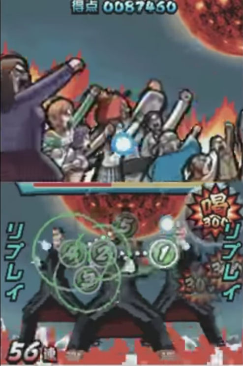
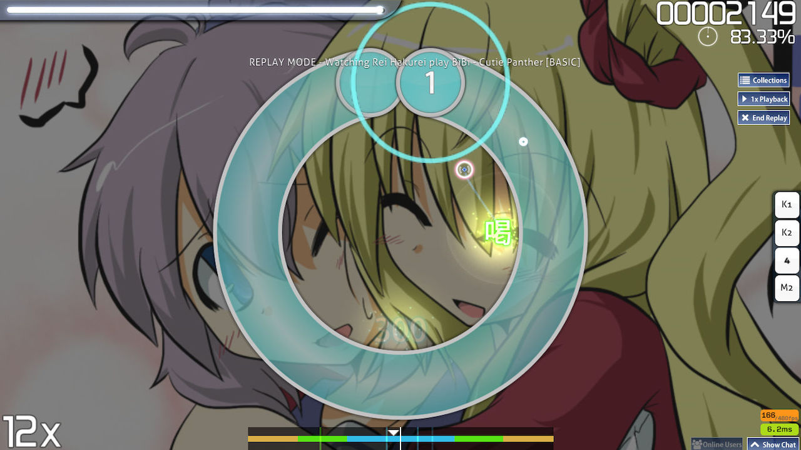
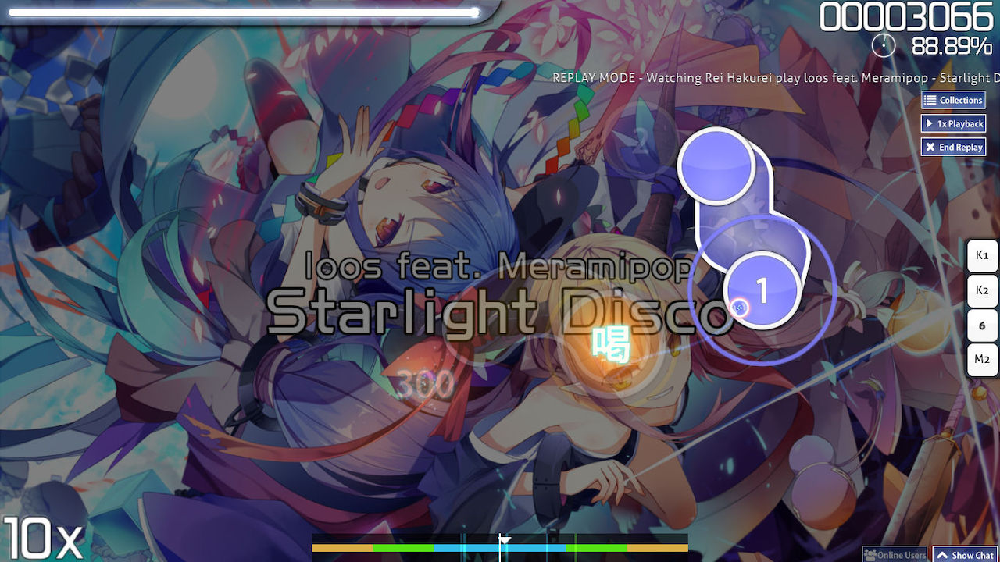

---
tags:
  - "100"
  - katsu
needs_cleanup: true
---

# Katu

*ดูเพิ่มเติม: [Geki](/wiki/Gameplay/Judgement/Geki)*\
*อย่าสับสนกับคำว่า Katu ในโหมด osu!taiko*

**Katu (喝)** (หรือสะกดว่า *Katsu* หรือเรียกว่า *Beat!*) คือคำศัพท์ในระบบ [การตัดสิน (Judgement)](/wiki/Gameplay/Judgement) เมื่อผู้เล่นจบชุด [คอมโบ (Combo)](/wiki/Beatmapping/Combo) โดยที่ไม่ได้ระดับความแม่นยำสูงสุดในทุกๆ โน้ตของชุดนั้น อย่างไรก็ตาม ผู้เล่นจะได้รับ Katu ก็ต่อเมื่อในชุดคอมโบนั้นไม่มีระดับ 50 หรือการกดพลาด (Miss) ปะปนอยู่เลย

Katu แบ่งออกเป็น 2 ประเภทตามค่าความแม่นยำของโน้ตตัวสุดท้ายในชุดคอมโบ:
1. ประเภทที่ได้คะแนนพื้นฐาน 300 คะแนน
2. ประเภทที่ได้คะแนนพื้นฐาน 100 คะแนน

ระดับ 100-point Katu จะช่วยฟื้นฟูพลังชีวิต (HP) ได้น้อยที่สุด ส่วนระดับ 300-point Katu จะฟื้นฟูได้น้อยกว่าการได้รับ [Geki](/wiki/Gameplay/Judgement/Geki)

Katu มีที่มาจากเกมบนเครื่อง Nintendo DS ชื่อ [Elite Beat Agents](/wiki/iNiS_games) ซึ่งเป็นเกมที่เป็นแรงบันดาลใจให้กับระบบการเล่นของ [osu!](/wiki/Game_mode/osu!)

## ภาพตัวอย่าง

## โหมดการเล่นอื่นๆ

### osu!taiko

ในโหมด osu!taiko คำว่า Katu จะใช้เรียกการตัดสินเมื่อผู้เล่นกดโน้ตขนาดใหญ่ได้สมบูรณ์แบบด้วยการกดสองปุ่มที่มีสีเดียวกันพร้อมกัน

### osu!catch

ในโหมด osu!catch ค่า Katu จะถูกนับสำหรับทุกๆ หยดน้ำเล็ก (Droplet) ที่ผู้เล่นรับพลาด อย่างไรก็ตามค่านี้จะไม่ถูกนำไปแสดงในหน้าสรุปผลการเล่น

### osu!mania

ในโหมด osu!mania ระบบจะแสดง Katu ในรูปแบบของตัวเลข 200 ซึ่งให้คะแนนพื้นฐาน 200 คะแนนและมีค่าความแม่นยำที่ลดลงเล็กน้อย

## Storyboard

### เกมบนเครื่อง DS

การได้รับ Katu จะไปกระตุ้นเลเยอร์ระดับที่สองของ Storyboard ในระหว่างการเล่น ซึ่งมักจะแสดงฉากที่ตัวละครมีความฮึกเหิมในระดับปกติ

### osu!

การได้รับ Katu จะไปกระตุ้นเหตุการณ์ต่างๆ ในเกมดังนี้:

- ปิดการทำงานของ [Fail Layer](/wiki/Storyboard/Scripting/General_Rules#layers) (เลเยอร์เมื่อเล่นพลาด)
- เปิดการทำงานของ [Pass Layer](/wiki/Storyboard/Scripting/General_Rules#layers) (เลเยอร์เมื่อเล่นผ่าน)
- กระตุ้นเหตุการณ์ "Passing" หากสถานะก่อนหน้านี้เป็น "Fail"
