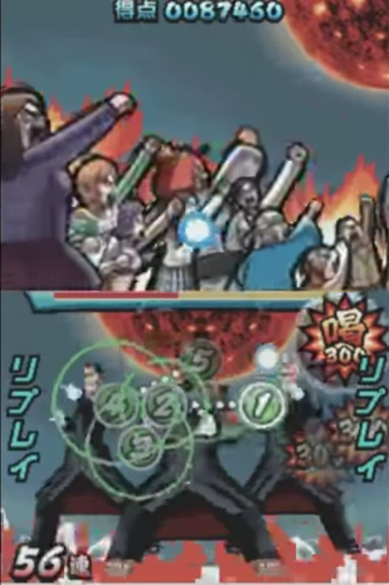
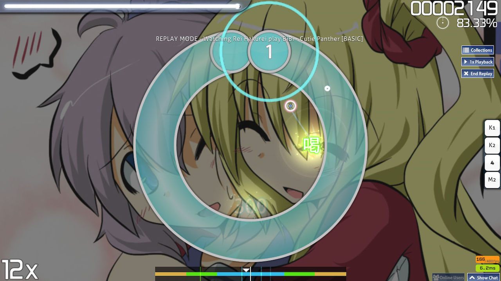
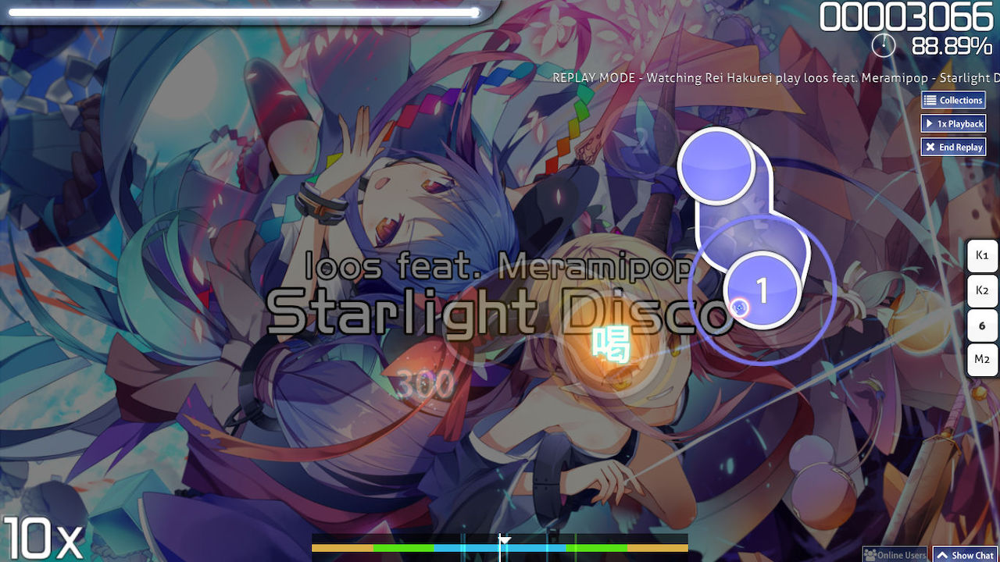

---
tags:
  - "100"
  - katsu
  - 喝
needs_cleanup: true  # https://github.com/ppy/osu-wiki/issues/9613
---

# 喝

*另见：[激 (Geki)](/wiki/Gameplay/Judgement/Geki)*\
*请勿与 osu!taiko 中的“喝”混淆。*

**喝**（**Katu**、*Katsu* 或 *Beat!*）是一个[判定](/wiki/Gameplay/Judgement)术语，指的是[连击](/wiki/Beatmapping/Combo)中有物件没有获得理论最高[准确率](/wiki/Gameplay/Accuracy)时获得的判定。然而，当连击中有物件获得 50 或 MISS 时，则无法获得“喝”判定。

取决于连击中最后一次打击结果的准确度，有两种不同的“喝”：第一种基本分值为 300 分，而第二种基本分值为 100 分。100 分“喝”的回血最少，300 分“喝”的回血低于[激 (Geki)](/wiki/Gameplay/Judgement/Geki)。

“喝”来自任天堂 DS 游戏[《精英节拍特工》](/wiki/iNiS_games)，[osu!](/wiki/Game_mode/osu!) 游戏模式基于此游戏设计。

## 截图

## iNiS 游戏游玩

- [Elite Beat Agents: Without a Fight/Jumpin' Jack Flash - YouTube](https://www.youtube.com/watch?v=wPOCmzY_fqs)
- [Osu! Tatakae! Ouendan 2: Countdown - YouTube](https://www.youtube.com/watch?v=6us1tY8jOSI)

## 其他游戏模式

### osu!taiko

“喝”代表玩家通过同时按下正确颜色对应的两个按键，完美打击大音符时给出的判定。

### osu!catch

“喝”代表玩家没接到的小果数目。这个数值不会在结算屏幕显示。

### osu!mania

“喝”在 osu!mania 中显示为 200。此判定会给出 200 分的基准分，且会小幅降低准确率。

## 故事板

### DS 游戏

“喝”在游玩过程中会触发故事板的第二层，通常在该阶段展示常规的精神状态。

### osu!

获得“喝”时会触发以下事件：

- 停用[失败层](/wiki/Storyboard/Scripting/General_Rules#图层)。
- 激活[通过层](/wiki/Storyboard/Scripting/General_Rules#图层)。
- 当前一状态为“Fail”时，则触发“Passing”事件。
