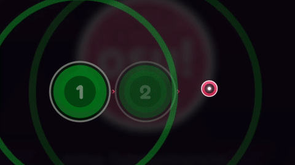

---
tags:
  - note lock
  - jittering notes
  - shaking notes
---

# Notelock

**Notelock**, ou **note lock**, est un terme informel pour désigner un mécanisme de jeu du mode [osu!](/wiki/Game_mode/osu!) qui peut empêcher un joueur de cliquer sur un objet. Cela se produit si **deux** conditions sont réunies en même temps :

1. Les [timing windows](/wiki/Beatmap/Overall_difficulty#timing) de deux objets se chevauchent.
2. Le premier de ces deux objets n'a pas encore été jugé (touché ou manqué).

Dans ce cas, on dit que le deuxième objet est *verrouillé* derrière le premier, ce qui fait qu'osu! ignore les actions du joueur sur cet objet jusqu'à ce que la hit window du premier objet soit passée. Le notelock ne devient un problème que si le joueur est incapable de revenir à l'objet précédent et de le jouer, ce qui lèverait le verrouillage. Dans ce cas, une note verrouillée peut provoquer un échec en forçant le joueur à manquer de plus en plus d'objets suivants, jusqu'à ce qu'il n'ait plus de [santé](/wiki/Gameplay/Health) et échoue la beatmap.

Lorsque le notelock se produit, l'objet bloqué tremble. Cela ne se produit pas pour les sliders et les spinners.

## Cause

Le notelock est une partie du système de timing d'osu! et se produit lorsque les timing windows de deux objets se chevauchent. Il se produit plus souvent sur les beatmaps avec des faibles valeurs d'[OD](/wiki/Beatmap/Overall_difficulty) ou de hautes valeurs de [BPM](/wiki/Music_theory/Tempo), parce que les timing windows peuvent se chevaucher plus fréquemment.

Puisque les objets des beatmaps du mode osu! sont censés être joués dans l'ordre dans lequel ils apparaissent, le verrouillage causé par le notelock joue généralement un rôle positif :

- Il ne permet pas aux joueurs d'ignorer une partie de la beatmap.
- Sur les difficultés plus élevées et plus rapides, il empêche les joueurs de perdre le rythme et de se désynchroniser.

## Prévention

Du point de vue d'un mappeur, le notelock peut être évité en choisissant soigneusement la valeur OD d'une [difficulté](/wiki/Beatmap/Difficulty) en fonction de la densité des objets et du BPM. Sur les beatmaps dont le BPM est de 200 ou plus, il est recommandé d'utiliser une valeur OD de 5 ou plus. Pour une analyse plus détaillée, consultez le guide "[Avoiding notelock at high BPM](https://osu.ppy.sh/community/forums/topics/334458)".

## Modifications des mécanismes

Avec la sortie d'osu!(lazer), un nouveau verrouillage de note a été ajouté, qui n'était pas inclus dans la version stable. Le changement concerne son fonctionnement : le premier objet arrête de verrouiller le second dès que sa fenêtre temporelle atteint un décalage de 0 ms.

Grâce aux modifications des mécanismes, le verrouillage de note ne vous bloquera plus sur les cartes avec des [flux](/wiki/Beatmap/Pattern/osu!/Stream) ou des [sauts](/wiki/Beatmap/Pattern/osu!/Jump) avec une [OD](/wiki/Beatmap/Overall_difficulty) faible en raison d'un seul échec. Il vous permettra d'appuyer sur la note suivante au bon moment et ne la bloquera pas.