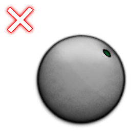

# osu!catch judgement system

<!-- TODO: the article itself may probably be simplified -->

## Hit values

| Image | Name | Effect |
| :-: | :-: | :-- |
|  | Fruit | A large fruit which is equivalent to normal Hit-circle or Slider's starting, repeating and ending point. Catching it is equivalent to perfect hit (shown as 300 on multiplayer and result). |
|  | Juice Drops (Slider Tick) | These large droplets signifies Slider's ticks, similar to the dots (slider ticks) inside the sliders. It is compulsory to catch for combo. It is twice the size of Droplet (Slider Trails). 30pt for successful capture (shown as 100 on multiplayer and result). |
|  | Droplets (Slider Trail) | These small droplets are slider trails. They form the trails of the slider and are smaller comparatively to Juice Drops. 10pt for each Droplets. It would decrease accuracy for not capturing but does not break combo count (shown as 50 on multiplayer and result) |
| (None) | Miss Droplets | Droplets (Slider Trails) not caught. Not shown in Results screen but is shown in server-side. Combo will not be broken but will decrease accuracy and lose out one of the 50's score. Not considered a miss. Not shown at multiplayer and result but shown as *Droplet Miss* in website leaderboard. |
|  | Bananas | Spinner's equivalent. These pesky Bananas will become smaller as they fall towards the catcher. It is not compulsory to catch them. 1,100pt given, however this one follows spinner clear in osu! which combines 1000 as bonus and 100 as spinning score. |
|  | Miss | Normal Fruit and Juice Drops not caught. Breaks combo count. Given when failed to catch the Fruit/Juice Drops. No score given and breaks combo. This can only be seen from the results screen. |

## Judgement mechanics

**All except bananas:**

- Full score when collected.
- Miss when failed.

**Bananas:**

- Constant score of 1,100 per banana collected.
- Nothing happens for missed bananas.
