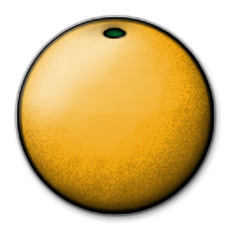
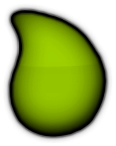
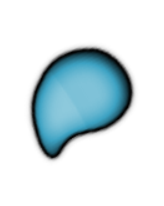
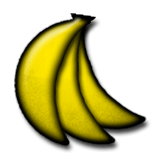

# Система оценивания osu!catch

## Базовые значения

**Оценка** (жарг. *джаджмент*, англ. *judgement*), или **результат попадания**, — это результат взаимодействия с [игровым объектом](/wiki/Gameplay/Hit_object) в рамках его временного окна. osu!catch отличается от остальных режимов тем, что не использует концепты тайминга или временного окна. Таким образом, всё оценивается либо как попадание, либо как промах.

| Изображение | Название | [Базовые очки](/wiki/Gameplay/Score/ScoreV1/osu!catch) |
| :-: | :-: | --: |
|  | [Фрукт](/wiki/Gameplay/Hit_object/Fruit) | 300 |
|  | [Капля](/wiki/Gameplay/Hit_object/Juice_stream#drop) | 30 |
|  | [Капелька](/wiki/Gameplay/Hit_object/Juice_stream#droplet) | 10 |
|  | [Банан](/wiki/Gameplay/Hit_object/Banana) | 1,100 |

## Механики оценивания

- Точность в osu!catch рассчитывается как соотношение пойманных фруктов, капель и капелек.
- Фрукты и капли увеличивают комбо и приводят к промахам, если их не поймать, в то время как капельки и бананы этого не делают.
