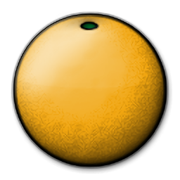
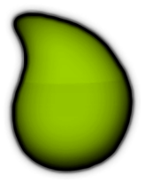
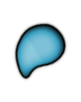
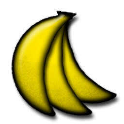

# ระบบการตัดสินของ osu!catch (osu!catch judgement system)

## ค่าคะแนน (Hit values)

**การตัดสิน (Judgement)** หรือ **ผลการกด (Hit result)** คือผลลัพธ์ที่ได้จากการโต้ตอบกับ [วัตถุ (Hit object)](/wiki/Gameplay/Hit_object) ในระหว่างการเล่น โหมด osu!catch นั้นแตกต่างจากโหมดอื่นๆ ตรงที่ไม่มีแนวคิดเรื่องจังหวะเวลาในการกด (Timing) หรือช่วงเวลาการกด (Hit windows) ซึ่งหมายความว่าทุกอย่างจะถูกตัดสินเพียงแค่ "รับได้" หรือ "รับพลาด" เท่านั้น

| รูปภาพ | ชื่อเรียก | [คะแนนที่ได้รับ](/wiki/Gameplay/Score/ScoreV1/osu!catch) |
| :-: | :-: | --: |
|  | [ผลไม้ (Fruit)](/wiki/Gameplay/Hit_object/Fruit) | 300 |
|  | [หยดน้ำใหญ่ (Drop)](/wiki/Gameplay/Hit_object/Juice_stream#drop) | 30 |
|  | [หยดน้ำเล็ก (Droplet)](/wiki/Gameplay/Hit_object/Juice_stream#droplet) | 10 |
|  | [กล้วย (Banana)](/wiki/Gameplay/Hit_object/Banana) | 1,100 |

## กลไกการตัดสิน (Judgement mechanics)

- ความแม่นยำ (Accuracy) ในโหมด osu!catch คำนวณจากสัดส่วนของ ผลไม้, หยดน้ำใหญ่ และหยดน้ำเล็ก ที่รับได้ทั้งหมด
- ผลไม้ (Fruits) และหยดน้ำใหญ่ (Drops) จะช่วยเพิ่มจำนวนคอมโบ และหากรับพลาดจะทำให้คอมโบหลุด (Miss)
- หยดน้ำเล็ก (Droplets) และกล้วย (Bananas) จะไม่ช่วยเพิ่มคอมโบ และหากรับพลาดจะไม่มีผลต่อคอมโบ (แต่หยดน้ำเล็กจะมีผลต่อความแม่นยำ)
