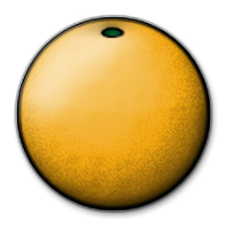
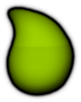
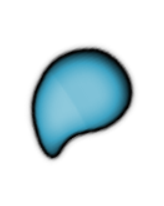
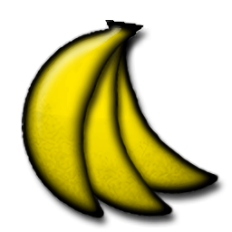

# osu!catch 判定系统

## 打击分值

**判定**（也被称为**打击结果**）指的是玩家在[打击物件](/wiki/Gameplay/Hit_object)的判定区间内，与之交互的反馈结果。与其他游戏模式不同，osu!catch 没有计时或打击区间的概念，也就意味着所有物件的判定结果要么是击中，要么是 Miss。

| 图像 | 名称 | [打击分值](/wiki/Gameplay/Score/ScoreV1/osu!catch) |
| :-: | :-: | --: |
|  | [大果](/wiki/Gameplay/Hit_object/Fruit) | 300 |
|  | [中果](/wiki/Gameplay/Hit_object/Juice_stream#中果) | 30 |
|  | [小果](/wiki/Gameplay/Hit_object/Juice_stream#小果) | 10 |
|  | [香蕉](/wiki/Gameplay/Hit_object/Banana) | 1,100 |

## 判定机制

- osu!catch 中的准确率由接到的大果、中果与小果的比例计算得出。
- 大果与中果会使连击数增加且会导致 Miss，而小果与香蕉没有效果。
