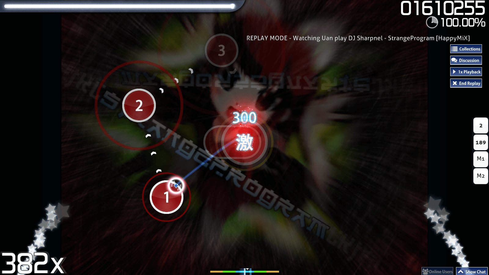
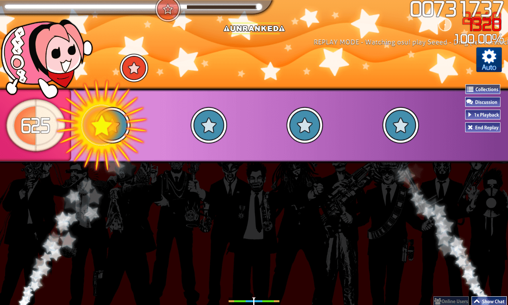
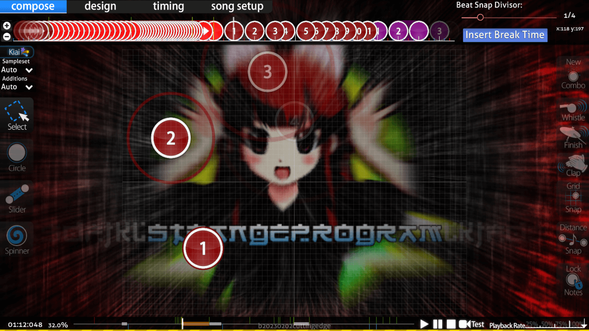

---
tags:
  - kiai mode
  - kiai section
---

# Kiai time

*For regulations surrounding kiai time, see: [Ranking criteria](/wiki/Ranking_criteria)*

::: Infobox

:::

::: Infobox

:::

**Kiai time**, or *kiai*, is a set of distinctive visual effects emphasising a part of a [beatmap](/wiki/Beatmap), which is inspired[^taiko-roots] by Go-Go Time from the [Taiko no Tatsujin](https://en.wikipedia.org/wiki/Taiko_no_Tatsujin) series. Kiai sections are indicated by spraying star fountains, stars falling from under the cursor, and [hit objects](/wiki/Gameplay/Hit_object) flashing to the beat with the frequency of [BPM](/wiki/Music_theory/Tempo). Similar effects, such as frequent sideways flashes and star fountains, are also visible in the [main menu](/wiki/Client/Interface#main-menu).

While kiai time doesn't affect gameplay mechanics in osu!, osu!catch, or osu!mania, it provides a 20% [score](/wiki/Gameplay/Score) gain in [osu!taiko](/wiki/Game_mode/osu!taiko).

## Beatmapping

::: Infobox

:::

Kiai time is most commonly used for the strongest part of a song, which is usually the chorus; such sections are typically more challenging than the rest of the beatmap. Kiai time may be enabled for certain [timing sections](/wiki/Client/Beatmap_editor/Timing) by a mapper from the `Style` tab of the `Timing and Control Points` panel, and cannot be deactivated by the player.

## References

[^taiko-roots]: [YouTube video by Dean Herbert "osu! "Kiai Time" preview"](https://www.youtube.com/watch?v=1iFHftUNMrE)
