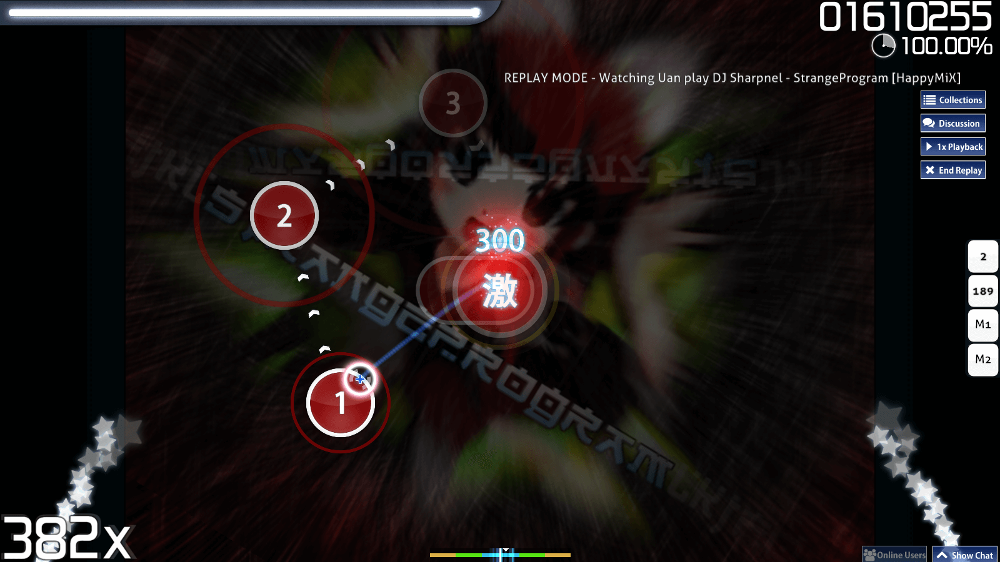
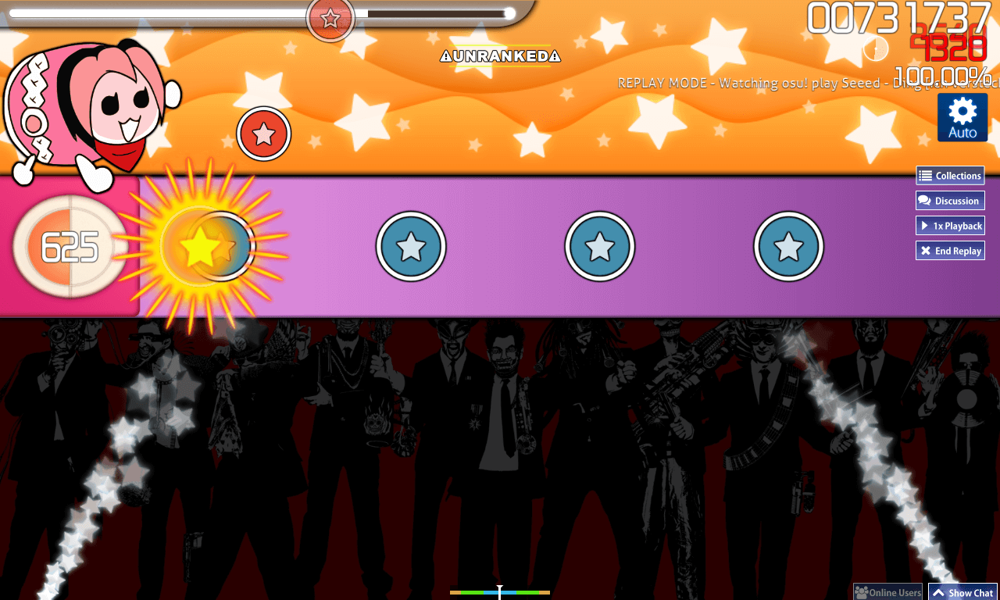
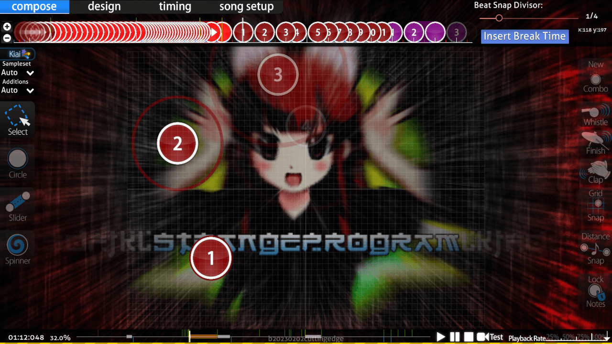

---
tags:
  - kiai mode
  - kiai section
  - tryb kiai
  - sekcja kiai
no_native_review: true
---

# Czas kiai

::: alert-note
Zasady używania czasu kiai można zobaczyć w [kryteriach rankingowych](/wiki/Ranking_criteria)
:::

::: Infobox

:::

::: Infobox

:::

**Czas kiai** (znany także jako *kiai*) to zbiór różnych efektów wizualnych mających na celu podkreślenie wybranej sekcji [beatmapy](/wiki/Beatmap). Został zainspirowany[^taiko-roots] przez Go-Go Time z serii [Taiko no Tatsujin](https://en.wikipedia.org/wiki/Taiko_no_Tatsujin). Sekcje kiai są wyróżnione gwiezdnymi fontannami, gwiazdkami lecącymi spod kursora oraz miganiem [elementów rozgrywki](/wiki/Gameplay/Hit_object) zgodnie z [tempem](/wiki/Music_theory/Tempo) piosenki. Podobne efekty, takie jak miganie boków ekranu oraz gwiezdne fontanny, są widoczne również w [menu głównym](/wiki/Client/Interface#menu-główne).

Kiai nie wpływa na rozgrywkę w trybach gry osu!, osu!catch oraz osu!mania, jednak w trybie [osu!taiko](/wiki/Game_mode/osu!taiko) sprawia, że gracz otrzymuje 20% więcej [punktów](/wiki/Gameplay/Score).

## Tworzenie beatmap

::: Infobox

:::

Kiai najczęściej stosuje się do zaakcentowania „najmocniejszego” momentu piosenki, którym zazwyczaj jest refren. Takie sekcje są zwykle trudniejsze od pozostałych części mapy. Kiai może zostać włączone przez twórcę beatmapy dla wybranych [sekcji czasowych](/wiki/Client/Beatmap_editor/Timing) w zakładce `Style` panelu `Timing and Control Points`. Kiai nie może zostać wyłączone przez gracza.

## Przypisy

[^taiko-roots]: [Film na YouTubie opublikowany przez Deana Herberta: "osu! "Kiai Time" preview"](https://www.youtube.com/watch?v=1iFHftUNMrE)
