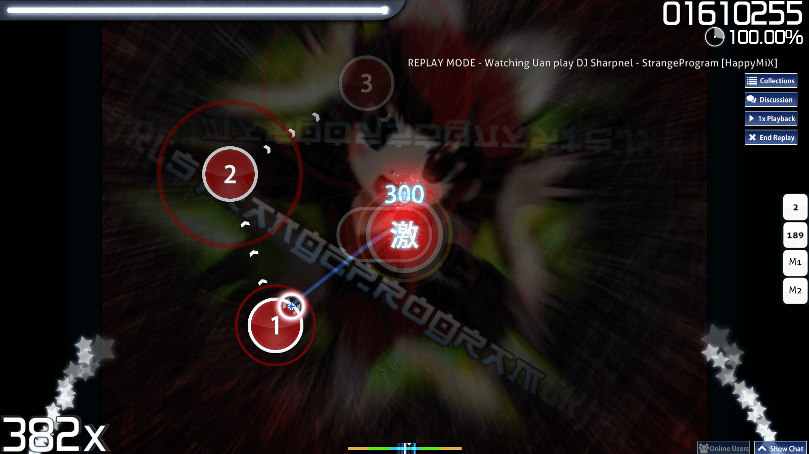
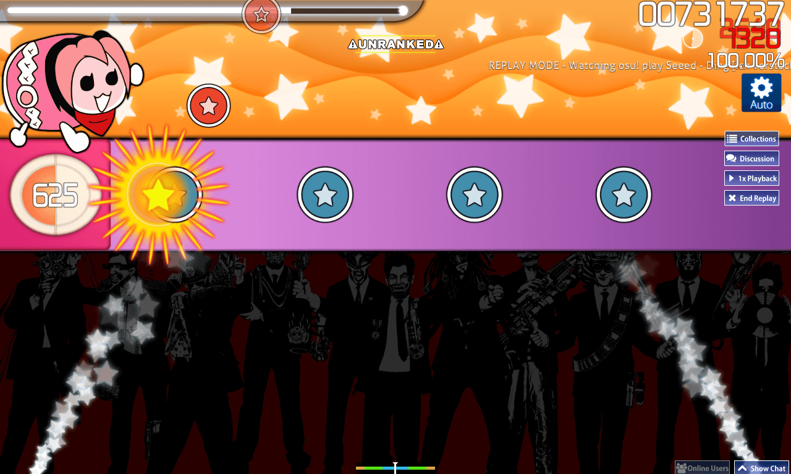
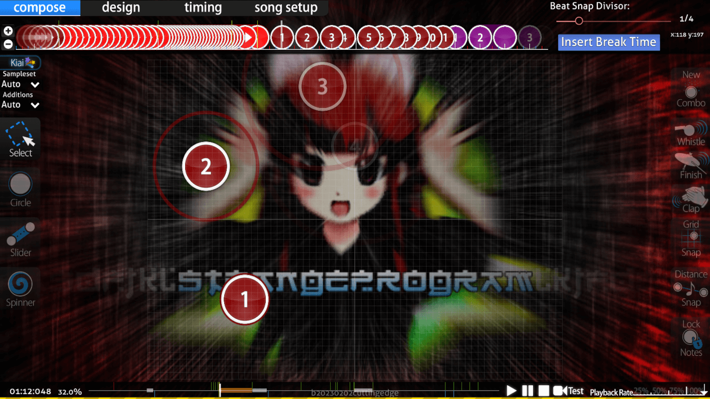

---
tags:
  - kiai mode
  - kiai section
---

# Kiai time

*สำหรับกฎระเบียบเกี่ยวกับการใช้งาน Kiai time ดูที่: [เกณฑ์การพิจารณา Ranked (Ranking criteria)](/wiki/Ranking_criteria)*

::: Infobox

:::

::: Infobox

:::

**Kiai time** หรือเรียกสั้นๆ ว่า **Kiai** (เคไอ) คือชุดของเอฟเฟกต์ภาพที่โดดเด่นเพื่อเน้นย้ำส่วนสำคัญของ [บีทแมพ (Beatmap)](/wiki/Beatmap) ซึ่งได้รับแรงบันดาลใจมาจากระบบ Go-Go Time จากซีรีส์เกม [Taiko no Tatsujin](https://en.wikipedia.org/wiki/Taiko_no_Tatsujin)[^taiko-roots] ช่วง Kiai สังเกตได้จากน้ำพุดาวที่พุ่งออกมา, ดาวที่ร่วงหล่นจากใต้เคอร์เซอร์ และ [วัตถุ (Hit objects)](/wiki/Gameplay/Hit_object) ที่กระพริบตามจังหวะ [BPM](/wiki/Music_theory/Tempo) ของเพลง เอฟเฟกต์ที่คล้ายกันนี้ เช่น การกระพริบด้านข้างและน้ำพุดาว ยังสามารถพบเห็นได้ในหน้า [เมนูหลัก](/wiki/Client/Interface#main-menu) ของเกมอีกด้วย

แม้ว่า Kiai time จะไม่มีผลต่อกลไกของเกมในโหมด osu!, osu!catch หรือ osu!mania แต่สำหรับโหมด [osu!taiko](/wiki/Game_mode/osu!taiko) ช่วงเวลานี้จะช่วยเพิ่ม [คะแนน (Score)](/wiki/Gameplay/Score) ที่ได้รับขึ้นอีก 20%

## การทำบีทแมพ (Beatmapping)

::: Infobox

:::

Kiai time มักถูกนำมาใช้ในส่วนที่หนักแน่นที่สุดของเพลง ซึ่งโดยปกติจะเป็นท่อนฮุค (Chorus) โดยส่วนดังกล่าวมักจะมีความท้าทายในการเล่นมากกว่าส่วนอื่นๆ ของบีทแมพ Mapper สามารถเปิดใช้งาน Kiai time ได้ในบางช่วงของ [Timing sections](/wiki/Client/Beatmap_editor/Timing) ผ่านแถบ `Style` ในหน้าต่าง `Timing and Control Points` ทั้งนี้ผู้เล่นไม่สามารถปิดการแสดงผล Kiai time ได้

## อ้างอิง (References)

[^taiko-roots]: [วิดีโอ YouTube โดย Dean Herbert "osu! "Kiai Time" preview"](https://www.youtube.com/watch?v=1iFHftUNMrE)
