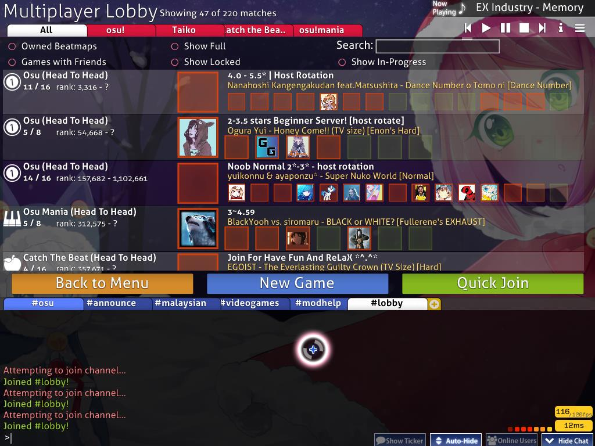
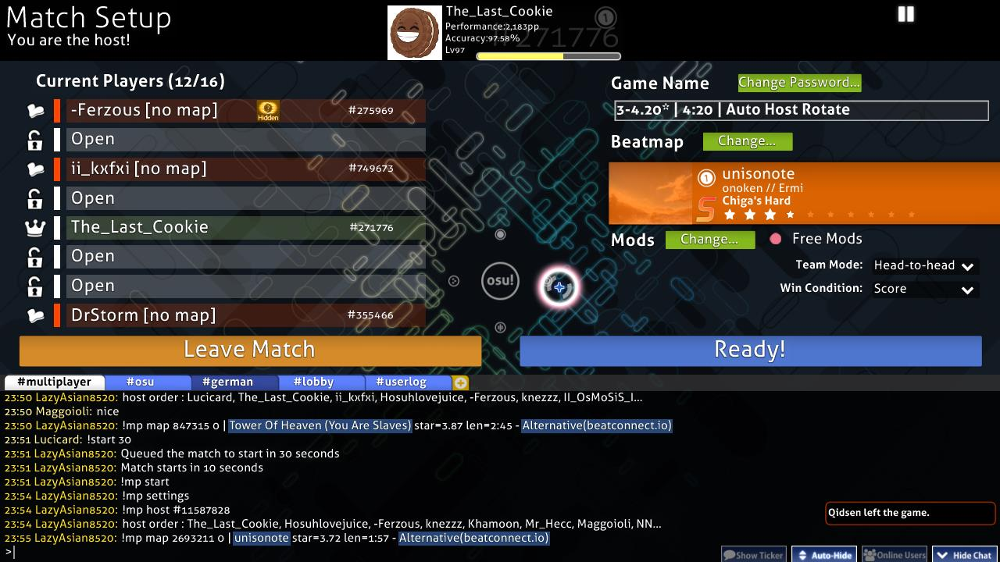
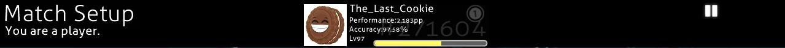
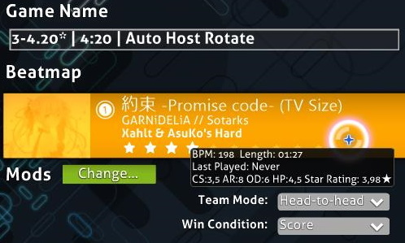
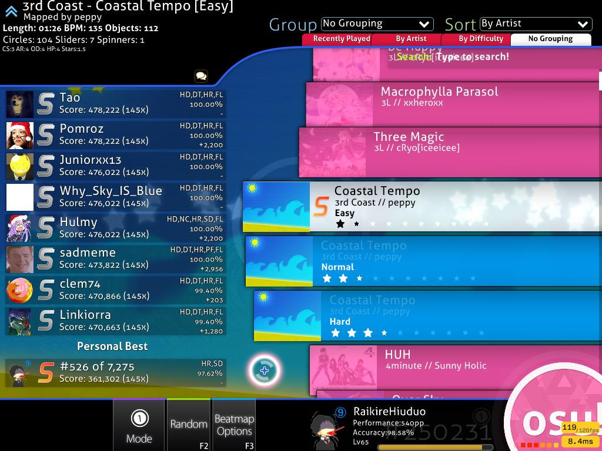
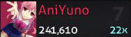
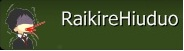
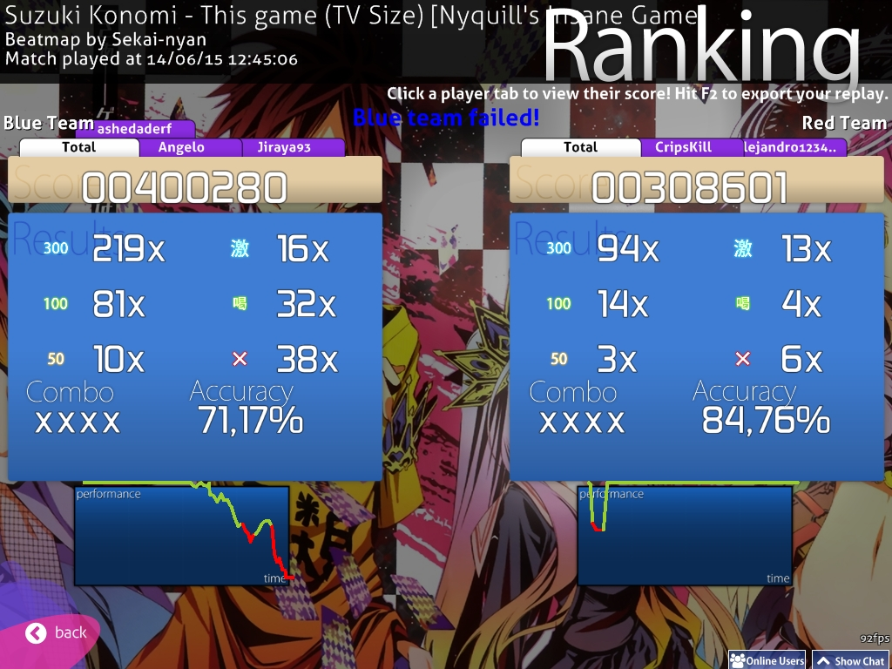
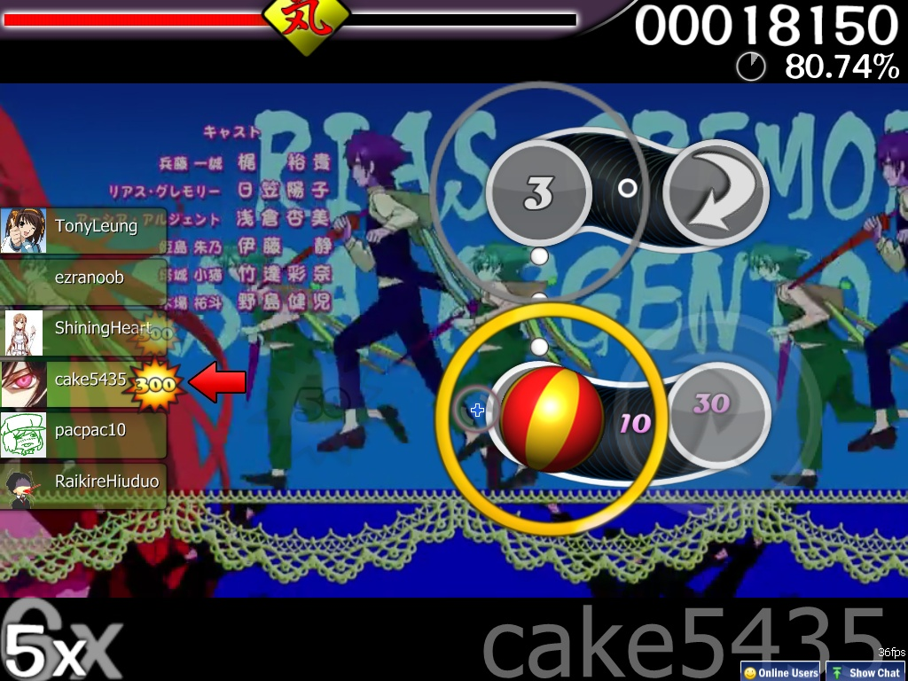

# Multiplayer

**Multiplayer** (sometimes shortened to *Multi*) is a mode in which up to 16 players can compete against each other or as a team on maps decided by the host.

The [osu!academy](/wiki/Community/Video_series/osu!academy) covers this part of the client in video format in [Episode 6](https://www.youtube.com/watch?v=QPTLyG7O8ak), along with the [online users panel](/wiki/Client/Interface/Chat_console#extended-chat-console).

## How to play

*Notice: A player cannot play in multiplayer if their account is [silenced](/wiki/Silence).*

In order to join a multiplayer lobby, the player must be [signed in to their osu! account](/wiki/Registration). From the main menu, the the main multiplayer lobby can be accessed with the following steps:

1. Click the `Play` button or press `P`.
2. Click the `Multi` button or press `M`.

Losing internet connection while playing in multiplayer will put the player back in the main menu.

## Main lobby

*Notice: An active [osu!supporter](/wiki/osu!supporter) tag is required to enter the lobby while using the `Cutting Edge` build.*

On entering, the player is presented with all currently available matches.

### Filter options

The listed match lobbies can be filtered using the filter options at the top left.

| Title | Description |
| :-: | :-- |
| `All` / `osu!` / `osu!taiko` / `osu!catch` / `osu!mania` | Only show matches either with the currently selected [game mode](/wiki/Game_mode) or from all game modes. |
| `Owned Beatmaps` | Only show matches if the player owns the [beatmap](/wiki/Beatmap) currently being played. |
| `Show Full` | Show matches even if they have no empty slots available. |
| `Search` | Search for a specific beatmap being played or the host's name using the search bar. When searching, all filters will temporarily be ignored except `Show In-progress`. |
| `Games with Friends` | Only show matches the player's friends are playing in. This filter option will override all other filters when enabled. |
| `Show Locked` | Show matches that require a password to enter. |
| `Show In-progress` | Show matches that are currently being played. These can still be entered if there are empty slots available. They are indicated with a grey match title and with `(In progress)` appended to it until the match ends. |

### Matches

In the middle, there are rows displaying available matches.

The player slots on the right side can have three different colours:

| Colour | Description |
| :-: | :-- |
| Red | The slot is taken by a player. |
| Green | The slot is available. |
| No colour | The slot is locked. |

To enter a match, click on one of the desired rows.

### General options

The three buttons above the [chat console](/wiki/Client/Interface/Chat_console) can be used in the main lobby:

| Title | Description |
| :-: | :-- |
| `Back to Menu` | Leave the lobby and return to the main menu. |
| `New Game` | Create a new game. See below for more details. |
| `Quick Join` | Join an available match *randomly* based on the player's current pp rank range. |

## Creating a new game

| Title | Description |
| :-: | :-- |
| `Game Name` | The name of the match. The default value is `{account name}'s game`. |
| `Require password to join` | Make the match private. |
| `Password` | Set a password for the match. Only appears if the `Require password to join` button was enabled. |
| `Max Players` | Total number of players allowed to join the match. The default is 8 players, with a range from 2 to a total of 16 players, including the player as host. It can be adjusted later by locking/unlocking the slots. |

Pressing the `1. Start Game` button will create the match with the beatmap playing in the jukebox as the match's beatmap. The button `2. Cancel` brings the player back to the lobby.

## Match setup

After going into or creating a match, the match setup will be displayed. The subsections below will focus on the different parts of the screen starting from top to bottom and going left to right.

The [options](/wiki/Client/Options) can be accessed by pressing `Ctrl` + `O` while in a match.

The match setup screen looks different for hosts and players. Further, the host can see the following:

And here is the view of the player:

### Header section

There is a phrase in the top-left displaying `Match Setup`, and whether the player is a host or a normal player.

In the middle, there's a box containing information about the player's profile. This will display the account's name, the [total pp](/wiki/Performance_points/Total_performance_points), the [overall accuracy](/wiki/Beatmapping/Overall_difficulty), the level, the rank and the [game mode](/wiki/Game_mode) that is currently chosen.

At the right side is a button to pause the currently playing song.

### Current players list

The players list shows all slots for a match. The bracket shows the number of available players in the match over the total amount of allowed players.

Unlocked slots are still available and can be used by clicking on them. Slots with a closed lock besides them are not accessible. Players are able to change their flag colour to blue/red if it is a team play. Hovering above a player bar will show the level, nation and [accuracy](/wiki/Gameplay/Accuracy) of the player in question. If `Free Mods` is enabled, it also shows the mods used by the player.

The host can transfer its host rights to one of the other players, kick players, or unlock/lock the slots.

There are four important states to take note of:

| Colour (state) | Description |
| :-: | :-- |
| **Red (no map)** | The player does not have the beatmap. A `[no map]` notice will be appended at the end of player's name until the beatmap was downloaded, extracted, and ready to play. This player will not be affected by the Force Start effect. |
| **White (not ready)** | The player has the beatmap but is not ready yet. Game modifiers can be changed in this state, and must be confirmed for the game modifier change to take effect. This player will be affected by the Force Start effect regardless of ready state. |
| **Green (ready)** | The player is ready. Game modifiers can't be changed in this state. A player can press the `Not Ready` button to return to the white state. The host will have a `Start Game` button after pressing ready. |
| **Light Blue (playing)** | The player is playing. A `[playing]` notice will be appended at the end of player's name until the match ends. |

### Match settings

This section is about the match settings. The host can change the game name, the beatmap, the team mode and other stuff.

#### Change game name and password

Here, the host can change the name for the match. Additionally, the password for the match can be adjusted via the `Change Password` button.

#### Beatmap

The beatmap section shows the beatmap to be played for this match.

When choosing the beatmap, the host will enter a menu similar to the song selection, but they will not be able to apply any mods.

Normally, the beatmap selection will show the background image, game mode symbol, the title, artist of the song, creator of the beatmap, the selected [difficulty](/wiki/Beatmap/Difficulty) selected and the [star rating](/wiki/Beatmapping/Star_rating).

On hovering over the beatmap, there will be an extra dialogue displaying further information about the beatmap. These are as follows:

| Value | Description |
| :-: | :-- |
| `BPM` | Beats per minute |
| `Length` | Length of the beatmap |
| `Last Played` | When the beatmap was played the last time |
| `CS` | Circle Size |
| `AR` | Approach Rate |
| `OD` | Overall Difficulty |
| `HP` | HP Drain Rate |
| `Stars` | Star Difficulty |

If the player does not have the beatmap, one of these statuses will be shown:

| Beatmap status | Description |
| :-: | :-- |
| `Ranked` / `Approved` / `Pending` / `Graveyard` | The [beatmap category](/wiki/Beatmap/Category). Clicking on the beatmap card will open the beatmap page on the website, where it can be [downloaded](/wiki/Beatmap#downloading-beatmaps). |
| `Not uploaded or not up-to-date` | The beatmap is not available for download. The host should find the link (in the beatmap listing) for the player if the issue persists. |
| `Cannot update the beatmap` | The host is playing a modified version of the beatmap. |

#### Mods

 mods options (with Free Mods enabled)")

The lower left section is the mods section. This section will show the [game mods](/wiki/Game_modifier) used for this match.

The host can enable `Free Mods` to allow players to freely choose any mod combination, except ones that change gameplay speed ([Double Time (DT)](/wiki/Game_modifier/Double_Time), [Nightcore (NC)](/wiki/Game_modifier/Nightcore) and [Half Time (HT)](/wiki/Game_modifier/Half_Time)).

#### Team mode {#team-mode-match-setup}

*For more information about team modes, see [Team mode](#team-mode-while-playing).*

There are four different ways a match can be played:

| Team mode | Description |
| :-- | :-- |
| `Head-to-head` | Compete against each other to reach the top spot of the match leaderboard. |
| `Team VS` | Compete against each other in teams (Red and Blue) for match supremacy. |
| `Tag co-op` (osu! only, unranked) | Team up to complete the beatmap, one combo at a time together. |
| `Tag-team VS` (osu! only, unranked) | The same as `Tag co-op`, but with two teams competing against each other. |

##### Tag Colour

If the team mode was set to `Tag co-op` or `Tag-team VS`, a `Tag Colour: (combo colour)` section will be shown which allows choosing a custom colour for each player. Setting this to `Default` will use the beatmap's original combo colours.

#### Win condition

There are four different ways the winner of a match can be decided:

| Title | Description |
| :-: | :-- |
| `Score` | The player with the highest score wins. |
| `Accuracy` | The player with the highest accuracy wins. If there are two players with 100.00%, the player with the highest score (from spinners) wins. Otherwise, it is a tie. |
| `Combo` | The player with the highest combo count *at the end of the beatmap* wins. If the combo count is the same, the player with the highest score wins. The maximum combo is not counted in this case. |
| `Score v2` | The player with the highest (standardised) score wins. |

### Match setup buttons

There are two large wide orange and blue buttons above the [chat console](/wiki/Client/Interface/Chat_console). The orange `Leave Match` button on the left is self-explanatory.

The blue button is used to control the player ready state and to start the match.

| Title | Description |
| :-: | :-- |
| `Ready!` | The player can click it to mark himself as ready (green on the player list). The button will change to `Not Ready`. For the match host, it will change to either `Start Game!` or `Force Start Game!` if there are players in the lobby. |
| `Not Ready` | The player can click it to mark himself as not ready (white on the player list). The button will change to `Ready!` |
| `Start Game!` | The host can click it to start the match. This button only appears for the match host when all players are ready. |
| `Force Start Game! ({ready}/{total})` | The host can click it to start the match, even if not all of the players are ready. This button only appears for the match host when some players are ready. The amount of ready players compared to the total amount of players is shown in parentheses. |

### Match history

The bottom section of the screen is the [chat console](/wiki/Client/Interface/Chat_console). Every match has its own channel in a tab called `#multiplayer`, with [BanchoBot](/wiki/BanchoBot) providing a link to the match history on the first line.

For `Head-to-head` matches, the result will be displayed privately in another tab called `#userlog` upon conclusion, where BanchoBot says `You placed #{placement} of {total} players in multiplayer on {beatmap} [difficulty] <game mode>.`

## While playing

### General

#### Quitting the match

There is no way to pause a multiplayer match. Pressing `Esc` will give a warning in the lower-right corner, and pressing it again will quit the match.

#### Visual settings

While the match is starting, moving the cursor to the bottom of the screen will open the visual settings panel. See the [Visual settings](/wiki/Client/Interface/Visual_settings) page for more information.

#### Health

When a player's health bar has been depleted completely, they can still continue playing, but the score will be considered as failed and will not appear on leaderboards. The player can be revived if they reach full health again, unless they use [Sudden Death (SD)](/wiki/Game_modifier/Sudden_Death) or [Perfect (PF)](/wiki/Game_modifier/Perfect).

In `Team VS` matches, being in the failed state at the end of the match will make the score not contribute to the team score.

#### Results

Despite there being no [extended results screen](/wiki/Client/Interface#extended-results-screen) below the results screen like when playing solo, scores set during multiplayer matches (with the exception of `Tag co-op` and `Tag-team VS` matches) will still appear on online leaderboards if they are good enough. The result will not be shown on the local leaderboard.

#### Saving the replay

The replay of the score can be exported by pressing `F2`, except in `Tag co-op` and `Tag-team VS`.

#### Multiplayer leaderboard

The leaderboard to the side of the screen shows different live statistics for each player based on the match settings.

For `Head-to-head` and `Team VS` matches:

| Win condition | Statistics displayed |
| :-- | :-- |
| `Score` / `Score v2` | Individual score, combo multiplier, judgements |
| `Accuracy` | Accuracy, individual score, combo multiplier, judgements |
| `Combo` | Current combo counts |

For `Tag co-op` and `Tag-team VS`:

| `Score` / `Score v2` | Team score, individual score, judgements |
| `Accuracy` | Team average accuracy, individual score, judgements |
| `Combo` | Current combo count, individual score, judgements |

If a player fails during a `Tag co-op` match, the match ends and the players return to the match lobby. In `Tag-team VS`, the opposing team receives a win by default instead. Failed players do not contribute towards the team unless they have been revived by the end of the match.

If a player quits when playing in these modes, the game will perfectly play their part for them, but not contribute anything to the team. If all players of a team quit, the opposing team will win by default.

Players who have failed or quit will be placed at the bottom of the leaderboard with their scores sorted separately from other players.

The colour of each player on the leaderboard while playing indicates the status of the player during the match.

| Example image | Status | Description |
| :-: | :-: | :-- |
|  | Normal | The player has more than half of their health. The colour will become a brighter blue or bleed to red depending on the player's health. |
|  | Danger | The player has less than half of their health. The colour will become a brighter red or change to blue depending on the player's health. |
|  | Failed | The player has reached 0 HP and is in the [failed state](#health). |
|  | Tag | In `Tag co-op` and `Tag-team VS`, the player box will always be green. A green arrow points at the current player with a subtle white glow. |
|  | Skipped | A request from the player to skip the intro of a beatmap if there is one. The intro will be skipped once all players have requested to skip. |
|  | Quit | The player has quit the match, either by pressing `Esc` twice or by disconnecting from [Bancho](/wiki/Bancho_(server)). The text colour will be changed from white to red, with `[Quit]` appended at the end. The box colour signifies the status before quitting the game. |

### Team mode {#team-mode-while-playing}

#### Head-to-head

##### Interface

Head-to-head is a team mode where players duke it all out in a free-for-all match for the top spot on the leaderboard. This is the default team mode and does not have any special characteristics in gameplay, other than going for the top spot.

##### Result

At the end of the match, the winner's avatar is shown in a big winner's box, along with the match leaderboard to the right

The [grade](/wiki/Gameplay/Grade) for the play is placed behind the result like a watermark. Other players' results can be checked by clicking on their panel on the leaderboard.

Each player will receive their match result as a private message in the `#userlog` tab in [chat](/wiki/Client/Interface/Chat_console).

#### Team VS

##### Interface

`Team VS` pits two teams, Blue and Red, against each other.

Blue is on the left and Red is on the right. A crown at the centre moves left and right to show which team is currently winning.

Changing teams can be done while in the lobby. There is no handicap for teams with fewer members, and it is entirely possible to start a match with only one team.

##### Result

The winning team is announced at the top of the results screen.

Only players who are alive by the end of the match count towards their teams' totals.

The panels to the sides the show results for each player in different tabs. The `Total` tab shows the total count of [judgements](/wiki/Gameplay/Judgement) for both teams and their average accuracy.

#### Tag co-op / Tag-team VS

##### Interface

*Note: This team mode is unranked and only available in osu! mode.*

`Tag co-op` makes all players in the match work together to pass the beatmap, one combo at a time. `Tag-team VS` is just `Tag co-op` but with two teams playing against each other.

In this mode, the players' slot placement in the lobby determines the order they play in.

A green arrow will show the player who is currently playing, and their name will be shown at the lower right. Warning arrows indicate when it is about to be the player's turn and the hit objects will be coloured. The player can set a fixed combo colour at the match setup the [Tag Colour](#tag-colour) section in the match lobby.

All players must spin the spinner, or the combo will break.

If a player quits during the match, the game will play their part for them.

All players share the same health bar. If it depletes completely, the match ends. In `Tag-team VS`, each team has their own health bars, and losing all health will cause that team to lose.

Players using the [Sudden Death (SD)](/wiki/Game_modifier/Sudden_Death) or [Perfect (PF)](/wiki/Game_modifier/Perfect) game modifier will cause the whole team to fail if they fail due to it.

##### Result

No ranked score or performance points are awarded for `Tag co-op` or `Tag-team VS` matches.

For `Tag co-op`, the result shown is the total score, the [judgements](/wiki/Gameplay/Judgement) and accuracy of the team. Individual results are not shown, and can only be seen in the match history. The result screen only appears if the beatmap was cleared successfully, unlike other multiplayer modes.

For `Tag-team VS` results screen, refer to `Tag-team VS`'s [result screen explanation](#team-vs).

## Trivia

### History

::: Infobox
, but not yet playable in multiplayer")
:::

- The initial multiplayer version was implemented on June 3, 2008 in osu! Public Release b335.
- Match setup used to allow only up to a total of 8 players.
- osu!mania was shown as a "3" in the lobby for players that had not yet updated their client to the latest release patch (which enabled osu!mania with no ranking support).
- No Video used to be the *only* game modifier allowed for players to use, but it was removed in favour of its placement in the [visual settings](/wiki/Client/Interface/Visual_settings).
