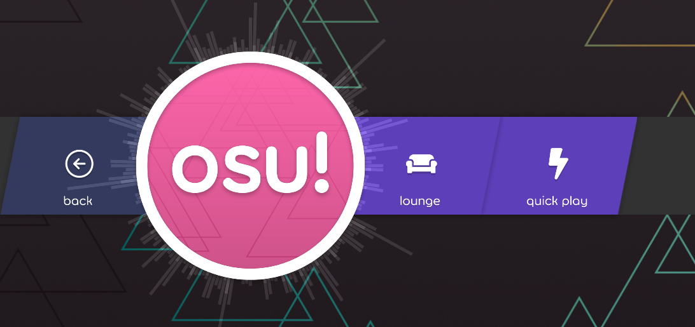
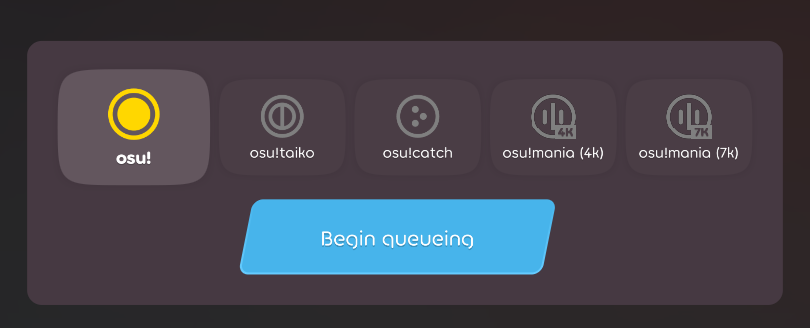
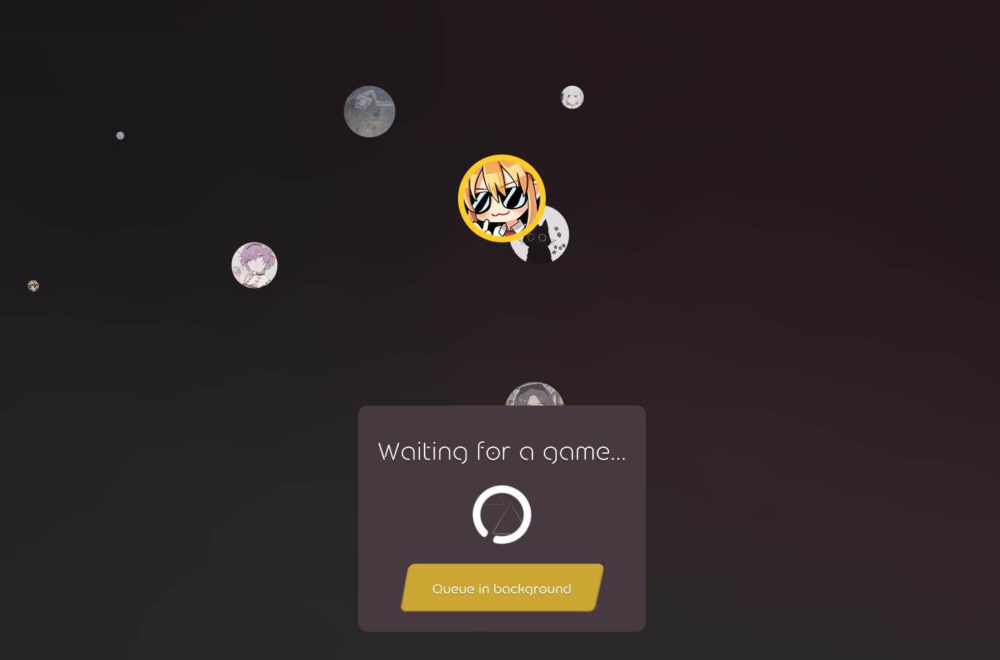
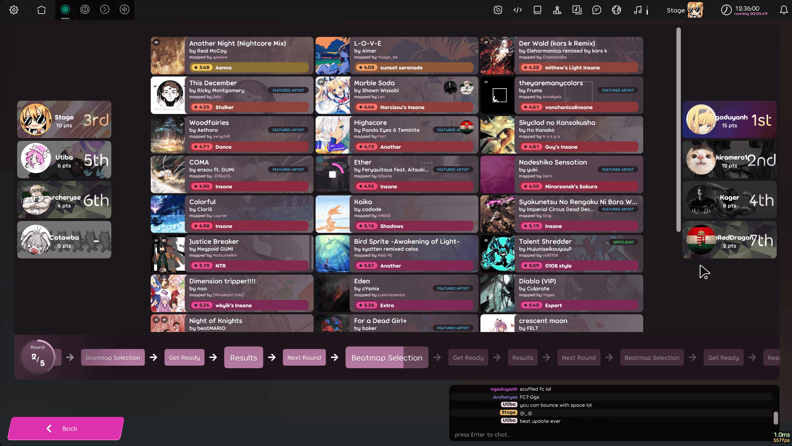

---
tags:
  - quickplay
  - matchmaking
  - match making
  - multiplayer
  - MMR
  - rating
  - partida rápida
  - partidas rápidas
  - emparejamiento
  - multijugador
---

# Partida rápida

Las **partidas rápidas** son un modo multijugador basado en colas de espera que se introdujo en [osu!(lazer)](/wiki/Client/Release_stream/Lazer) el 29 de octubre de 2025 ([registro del lanzamiento](https://osu.ppy.sh/home/changelog/lazer/2025.1029.1)). Es el primer sistema multijugador basado en colas de espera introducido en el juego.

## Interfaz

Se puede acceder al modo de las partidas rápidas haciendo clic en `jugar` > `multi` > `quick play` desde el menú principal. Se puede acceder a la interfaz tradicional del modo multijugador a través de la opción `lounge`.

Para entrar en la cola de espera para una partida, primero selecciona un [modo](/wiki/Game_mode)[^mania], y luego haz clic en el botón para entrar en la cola de espera.

Después de entrar en la cola, los jugadores son llevados a una zona de espera. Esta pantalla muestra a los demás usuarios que están esperando en la cola al mismo tiempo. Los avatares de los jugadores aparecen como burbujas en movimiento que se agrupan a medida que se forman las salas.

Se puede salir de esta pantalla mientras se espera la cola en segundo plano haciendo clic en el botón «Queue in background».

Cuando se forme una sala y todos los jugadores confirmen su participación, los jugadores accederán a una pantalla para la selección de los beatmaps, donde pueden votar por el primer beatmap que se jugará de un [grupo predeterminado de mapas](#curación-de-beatmaps).

## Jugabilidad

Las salas están formadas por un máximo de 8 jugadores con un nivel de habilidad similar. Las partidas duran 5 rondas.

### Selección de beatmaps

Durante cada ronda, los jugadores reciben un pequeño mappool. Al hacer clic en un beatmap, se emite un voto a su favor, y cuantos más votos reciba un mapa, más probabilidades tendrá de ser seleccionado. Una vez que todos los jugadores hayan votado, se elegirá al azar un beatmap para jugar en esa ronda.

### Sistema de clasificación

El rango del emparejamiento («MMR» o «rating») es una variable oculta que se le asigna a cada jugador y que varía según su rendimiento en las salas de las partidas rápidas. El MMR se usa para juntar a los jugadores con niveles de habilidad similares cuando se forman las salas. Los beatmaps seleccionados tienen asignados valores de MMR fijos, lo que permite al servidor estimar con mayor precisión si un beatmap es demasiado fácil o difícil para una sala determinada.

El MMR de un beatmap se deriva directamente de su [calificación por estrellas](/wiki/Beatmap/Star_rating) (SR). Los curadores de los beatmaps tienen la capacidad de modificar manualmente el valor de dificultad (SR) para informar mejor al servidor sobre la dificultad real de un beatmap. Por ejemplo, debido a la exigencia de lectura, la dificultad de [este beatmap](https://osu.ppy.sh/beatmapsets/1799413#osu/3688768) (según la valoración de los curadores) es de aproximadamente 7,7 estrellas, a pesar de que solo es alrededor de 5,5 estrellas.

### Sistema de puntuación

El rango de un usuario depende de la cantidad de puntos que gane a lo largo de la partida. Una mejor puntuación en cada ronda otorgará más puntos según la siguiente tabla:

| Posición | Puntos |
| :-- | --: |
| 1.º lugar | 15 |
| 2.º lugar | 12 |
| 3.º lugar | 10 |
| 4.º lugar | 8 |
| 5.º lugar | 6 |
| 6.º lugar | 4 |
| 7.º lugar | 2 |
| 8.º lugar | 1 |

## Rango del emparejamiento

El rango del emparejamiento («MMR», «rating») es una variable asignada a cada usuario que varía según su rendimiento en las partidas rápidas. El rango se usa para agrupar a los jugadores con niveles similares de habilidad cuando se forman las partidas.

A los beatmaps también se les asigna un rango según el nivel en el que son apropiados para ser jugados, de modo que el mappool para cada partida sea representativo del nivel promedio de habilidad de los jugadores.

## Curación de beatmaps

Por el momento, los beatmaps usados en las partidas rápidas son seleccionados por un equipo de voluntarios de la comunidad. La lista completa de los beatmaps disponibles para todos los modos se puede ver en [esta hoja de cálculo](https://docs.google.com/spreadsheets/d/1ZbvLvHlXH3IF1WgN4YkHqOttO7wG-1Duto-535tqKnQ/edit?gid=0#gid=0).

Cada modo de juego tiene un mappool seleccionado por miembros de la comunidad que están familiarizados con los beatmaps del modo. Todos los beatmaps que aparecen son clasificados, aprobados o amados.

## Preguntas frecuentes

### ¿Dónde puedo dejar mis comentarios o dudas?

Si tienes alguna pregunta o duda rápida sobre cualquier aspecto de las partidas rápidas, puedes publicarla en el [canal `#quick-play`](https://discord.com/channels/188630481301012481/1440912440224120882) ubicado en el [servidor de Discord osu!](https://discord.gg/ppy). Los comentarios y sugerencias para los desarrolladores se deberían dejar en esta [discusión de GitHub](https://github.com/ppy/osu/discussions/35506).

[^mania]: osu!mania 4K y 7K se dividen en colas separadas y funcionan como modos completamente independientes en el contexto de las partidas rápidas.
