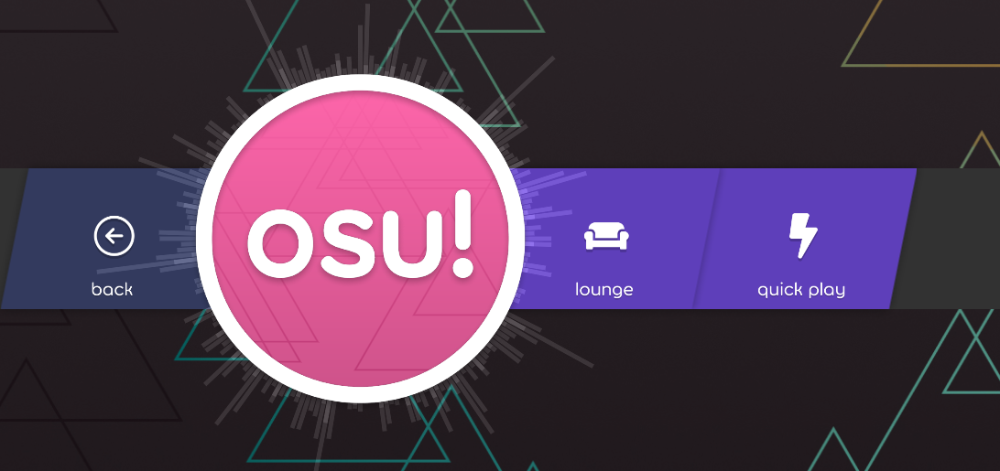
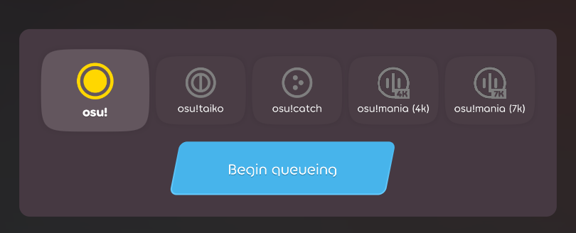
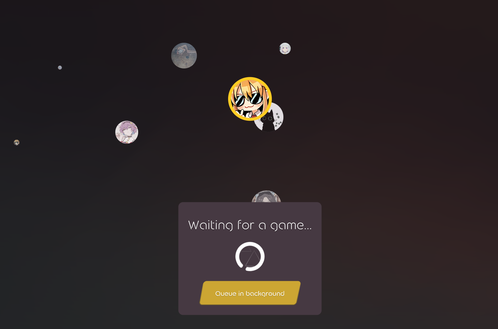
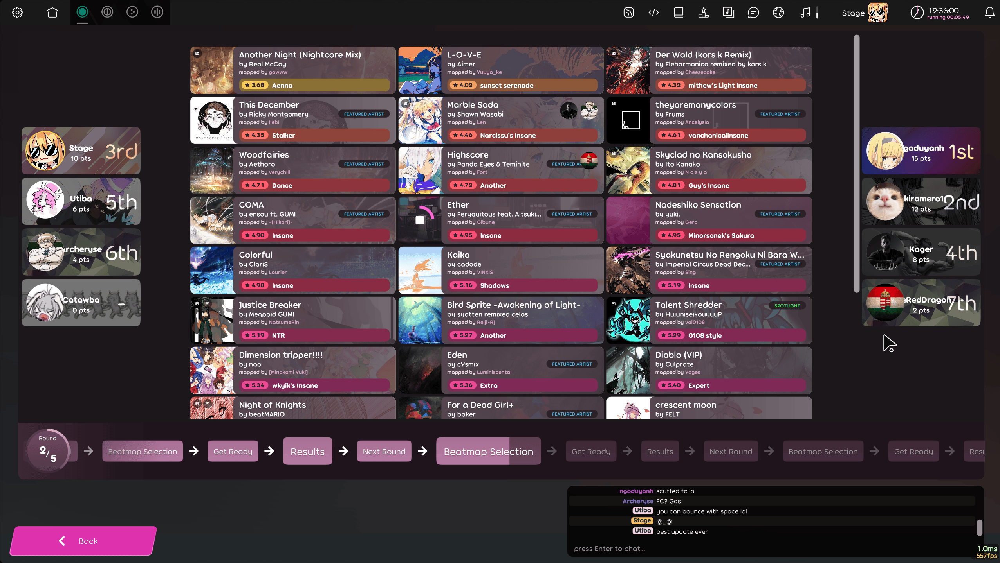

---
tags:
  - quickplay
  - matchmaking
  - match making
  - multiplayer
  - MMR
  - rating
---

# Quick play

**Quick play** คือโหมด multiplayer แบบ queue-based ที่ถูกเพิ่มเข้า [osu!(lazer)](/wiki/Client/Release_stream/Lazer) เมื่อวันที่ 29 ตุลาคม 2025 ([release](https://osu.ppy.sh/home/changelog/lazer/2025.1029.1)) และเป็นระบบ multiplayer แบบ queue-based ระบบแรกที่ถูกเพิ่มเข้าเกม

## อินเทอร์เฟซ

Quick play เข้าได้จาก `play > multi > quick play` ผ่านเมนูหลัก ส่วนอินเทอร์เฟซ lobby multiplayer แบบเดิมเข้าได้ผ่านตัวเลือก `lounge`

หากต้องการ queue เพื่อหา match ให้เลือก[โหมด](/wiki/Game_mode)[^mania]ก่อน แล้วคลิกปุ่มเพื่อ queue เข้า match

หลังเข้า queue แล้ว ผู้เล่นจะถูกพาไปยังพื้นที่รอ หน้าจอนี้จะแสดงว่ามีใครกำลัง queue พร้อมกันบ้าง avatar ของผู้เล่นจะปรากฏเป็น bubble ที่เคลื่อนที่และรวมกลุ่มกันเมื่อ lobby ถูกสร้าง

สามารถออกจากหน้าจอนี้โดยยัง queue หา match อยู่เบื้องหลังได้ ด้วยการคลิกปุ่ม "Queue in background"

เมื่อ lobby ถูกสร้างและผู้เล่นทุกคนยืนยันเข้าร่วม ผู้เล่นจะเข้าสู่หน้าจอเลือกบีตแมป ซึ่งสามารถโหวตบีตแมปแรกที่จะเล่นจาก[พูลแมปที่กำหนดไว้ล่วงหน้า](#beatmap-curation)

## เกมเพลย์

Lobby จะสร้างจากผู้เล่นสูงสุด 8 คนที่มีระดับฝีมือใกล้เคียงกัน match จะเล่นทั้งหมด 5 round

### การเลือกบีตแมป

ในแต่ละ round ผู้เล่นจะเห็นบีตแมปชุดเล็ก ๆ การคลิกบีตแมปจะนับเป็นการโหวตให้แมปนั้น โดยหลาย vote บนแมปเดียวกันจะเพิ่มโอกาสที่แมปนั้นจะถูกเลือก หลังผู้เล่นทุกคนโหวตแล้ว บีตแมปหนึ่งจะถูกสุ่มเลือกมาเล่นใน round นั้น

### Standings

Matchmaking rating หรือ "MMR"/"rating" คือค่าที่ซ่อนอยู่และถูกกำหนดให้กับผู้เล่นแต่ละคน โดยจะเปลี่ยนตามผลงานใน lobby quick play MMR ใช้สำหรับจัดกลุ่มผู้เล่นที่มีระดับฝีมือใกล้เคียงกันเมื่อสร้าง lobby บีตแมปที่คัดเลือกไว้จะมีค่า MMR คงที่ ทำให้เซิร์ฟเวอร์ประเมินได้แม่นขึ้นว่าบีตแมปนั้นง่ายหรือยากเกินไปสำหรับ lobby หนึ่ง ๆ หรือไม่

MMR ของบีตแมปดึงมาจาก [star rating](/wiki/Beatmap/Star_rating) (SR) โดยตรง ผู้คัดเลือกบีตแมปสามารถกำหนด override SR เองได้ เพื่อบอกเซิร์ฟเวอร์ให้เข้าใจความยากจริงของบีตแมปได้ดีขึ้น ตัวอย่างเช่น เพราะข้อกำหนดด้านการอ่าน [บีตแมปนี้](https://osu.ppy.sh/beatmapsets/1799413#osu/3688768) มีความยากตามการประเมินของผู้คัดเลือกประมาณ 7.7 ดาว แม้จะมีค่าเพียง ~5.5 ดาว

### การคิดคะแนน

อันดับของผู้ใช้ขึ้นอยู่กับจำนวนแต้มที่ได้ตลอด match คะแนนที่ดีกว่าในแต่ละ round จะให้แต้มมากขึ้นตามตารางด้านล่าง:

| Placement | Points |
| :-- | --: |
| 1st | 15 |
| 2nd | 12 |
| 3rd | 10 |
| 4th | 8 |
| 5th | 6 |
| 6th | 4 |
| 7th | 2 |
| 8th | 1 |

## Matchmaking rating

Matchmaking rating หรือ "MMR"/"rating" คือค่าที่กำหนดให้กับผู้ใช้แต่ละคน และจะเปลี่ยนตามผลงานใน quick play match Rating ใช้สำหรับจัดกลุ่มผู้เล่นที่มีระดับฝีมือใกล้เคียงกันเมื่อสร้าง match

บีตแมปจะถูกให้ rating ตามระดับที่เหมาะสมสำหรับการเล่นด้วย เพื่อให้ beatmap pool ของแต่ละ match สะท้อนระดับฝีมือเฉลี่ยของผู้เล่น

## Beatmap curation

บีตแมปที่ใช้ใน quick play ตอนนี้ถูกคัดเลือกโดยทีมอาสาสมัครจากคอมมูนิตี้ รายชื่อบีตแมปทั้งหมดที่มีให้เล่นในทุกโหมดเปิดเผยต่อสาธารณะผ่าน[สเปรดชีตนี้](https://docs.google.com/spreadsheets/d/1ZbvLvHlXH3IF1WgN4YkHqOttO7wG-1Duto-535tqKnQ/edit?gid=0#gid=0)

แต่ละโหมดเกมมี mappool ที่คัดเลือกโดยสมาชิกคอมมูนิตี้ที่คุ้นเคยกับบีตแมปของโหมดนั้น บีตแมปทั้งหมดที่ถูกใช้จะเป็น Ranked, Approved หรือ Loved

## FAQ

### จะส่ง feedback หรือข้อกังวลได้ที่ไหน?

สำหรับคำถามสั้น ๆ หรือข้อกังวลเกี่ยวกับ quick play ส่วนใดก็ตาม ให้เขียนใน[`#quick-play` channel](https://discord.com/channels/188630481301012481/1440912440224120882) ที่อยู่ใน [osu! Discord server](https://discord.gg/ppy) ส่วน feedback และข้อเสนอแนะสำหรับผู้พัฒนาให้ฝากไว้ใน [GitHub discussion](https://github.com/ppy/osu/discussions/35506) นี้ด้วย

[^mania]: osu!mania 4K และ 7K ถูกแยกเป็น queue คนละชุด และในบริบทของ quick play จะทำงานเหมือนเป็นโหมดแยกกันโดยสมบูรณ์
