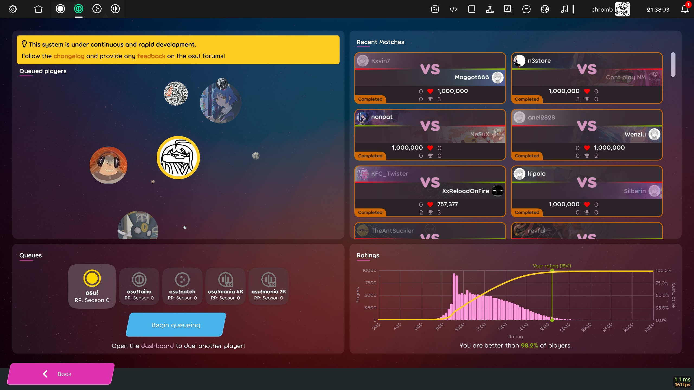
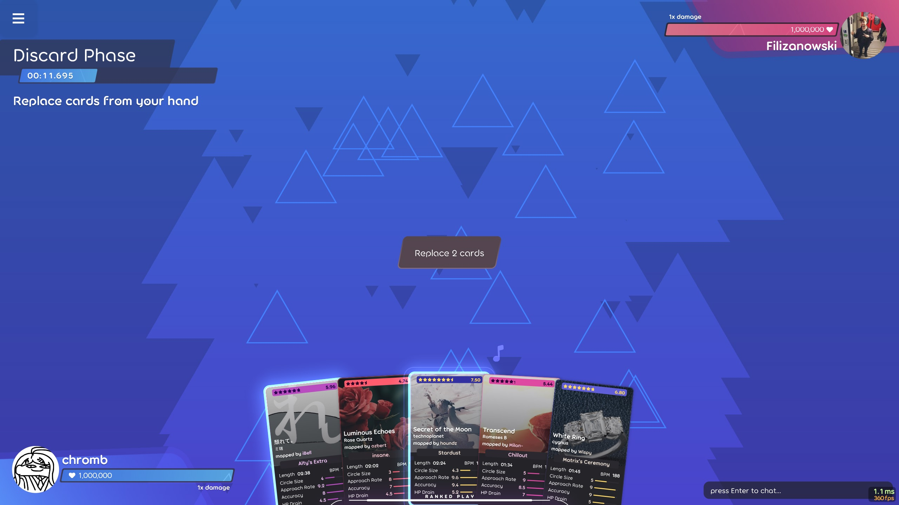
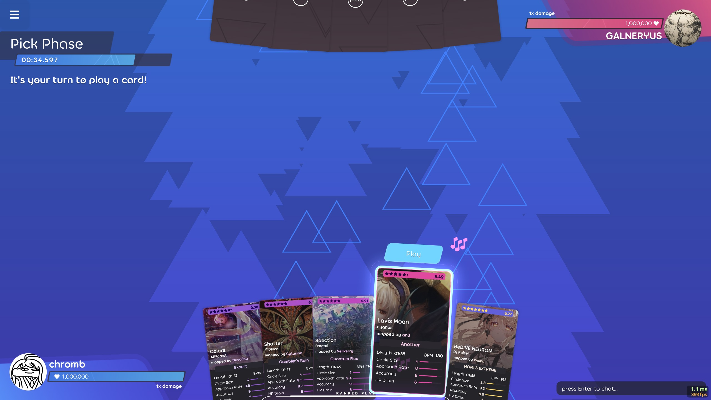
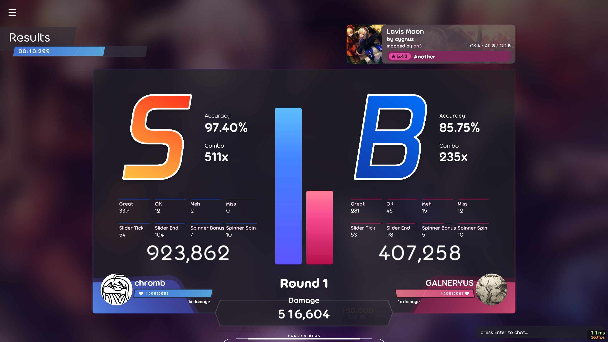
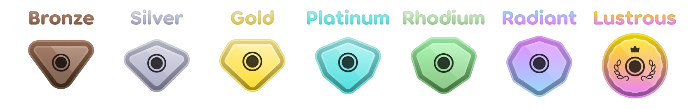
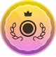
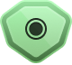

# Ranked play

::: alert-note
**Note:** Not to be confused with the [ranked status](/wiki/Beatmap/Category) for beatmaps.
:::

::: alert-note
**Note:** For the discontinued multiplayer ranked system, see [Quick play](/wiki/Gameplay/Quick_play).
:::
**Ranked play** is a multiplayer mode in [osu!(lazer)](/wiki/Client/Release_stream/Lazer) where players can compete in 1v1 matches, climb up an all-new leaderboard, and progress through an all-new tier system.

Beatmaps in ranked play are selected from the full list of **all ranked featured artist beatmaps**, and are matched to the players' skill level when they play.

## How to play

From the main menu, ranked play can be accessed with the following steps:

1. Click the `play` button or press `P`
2. Click the `multiplayer` button or press `M`
3. Click the `ranked play` button or press `R`.

From this menu, the user can select the gamemode (and for osu!mania, the keycount) that they would like to play, see all users currently in the queue for a match, see global match history, and see how they compare to all other ranked users. 

Upon entering the queue, the player is able to exit this menu to play solo, and will be notified when a match is ready to join.

## Ranked gameplay

### Discard phase

At the start of each match, both players are dealt a hand of **five** cards. They are then given **30 seconds** to discard any number of cards that they would like to reroll.

::: alert-tip
**Tip:**
A beatmap card can be right-clicked to open it's beatmap page.
:::

### Pick phase

After the discard phase, the player with the **lowest rating** will take their turn first. The current turn is signified by the colour of the background (blue for the user's turn, red for their opponent's turn).

The player will have **45 seconds** to select a beatmap from their hand to play, after which both players will download the beatmap (if required) and gameplay will commence.

::: alert-warning
**Warning:**
If a player fails to pick or download a map, they will take damage.
:::

### Beatmap results

After a beatmap is played, both players are shown a results screen showing how they each performed. After a short animation, the player with the worse score on the map will take damage.

After this, gameplay returns to the pick phase, with the opposite player now having control.

## Health system

Each player starts the match with **one million** health, and they will take damage based on the score difference between them and their opponent.

Damage dealt is based on the following formula:

`DamageDealt = (Score Difference * Multiplier) + 50000`

Multiplier is not shared between players, and starts at 1.0x for each player. This increases by 0.5 for a round loss, and 1 for a round win.

A match will end when any player reaches **zero** health.

### Last stand

In the event that a player takes over one million damage for their first loss, their health will instead be set to one. This is intended to discourage single-map victories.

## Matchmaking Rating

Matchmaking rating (shortened to "MMR" or simply "rating") is a variable assigned to each user which fluctuates depending on how well they perform in ranked play matches. Ratings are used to pair players of similar skill levels together when forming matches.

A second 'uncertainty' variable is used when players do not have recent matches, resulting in greater changes to their rating. In the event where a player has never played ranked play, they are assigned an initial rating based on their performance points.

Beatmaps are also given a rating based on how players perform on them. This is used to ensure that beatmaps that are not properly represented by their star rating are pooled more accurately.

## Tiers

Ranked play has 7 tiers, each split into 3 subdivisions (I -> II -> III). The following table contains the percentile of players that is in each tier (e.g. a player in the platinum tier is higher ranked than 50% of all players).

::: alert-note
**Note**
The lustrous tier instead consists of the 100 players for each gamemode.
:::

|  | Tier Name | %ile (I) | %ile (II) | %ile (III) |
| --: | :-: | :-: | :-: | :-: |
|  | Lustrous | Top 100 | N/A | N/A |
|  | Radiant | 5% | 2.5% | 1% |
|  | Rhodium | 20% | 15% | 10% |
|  | Platinum | 50% | 40% | 30% |
|  | Gold | 75% | 65% | 55% |
|  | Silver | 95% | 87.5% | 80% |
|  | Bronze | 100% | 98% | 96% |

## Trivia

- The health system for ranked play was heavily inspired by a similar mechanic in *GeoGuessr*
