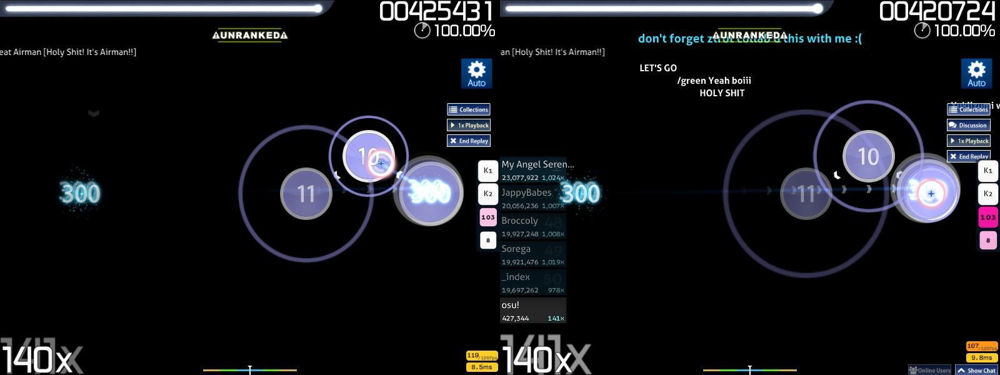
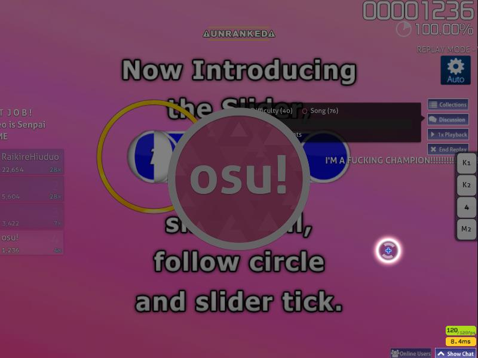
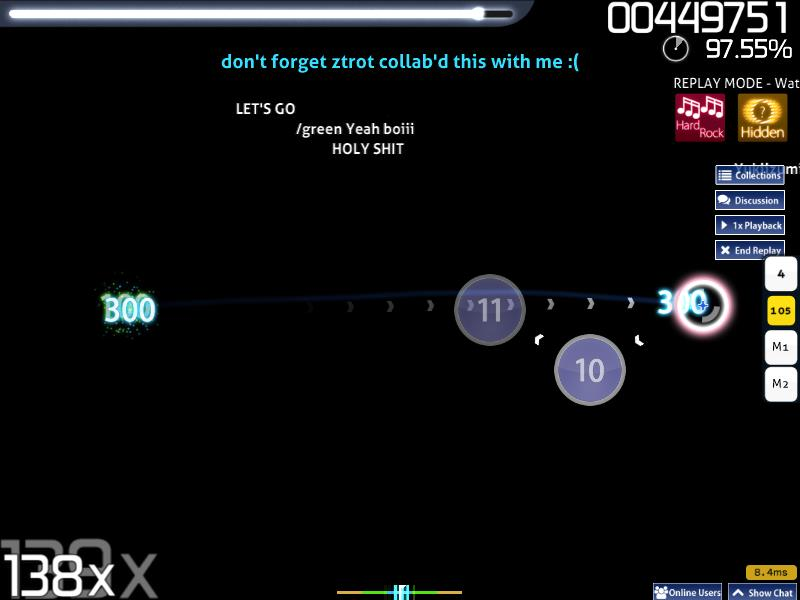
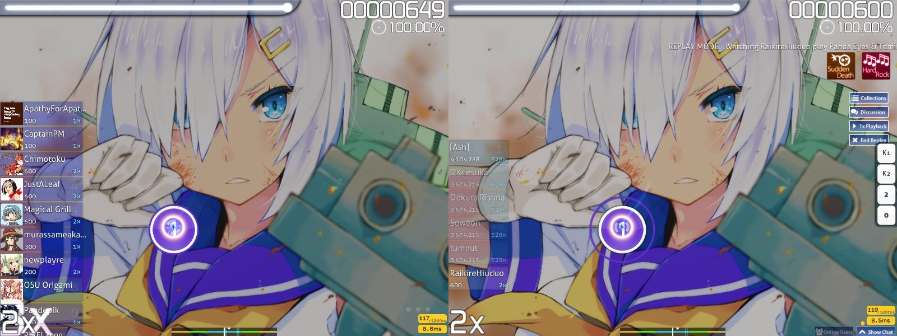
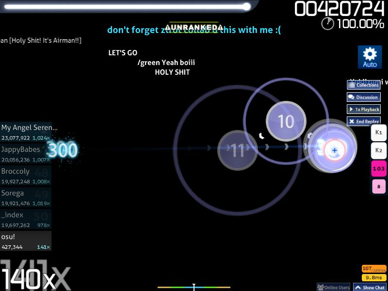
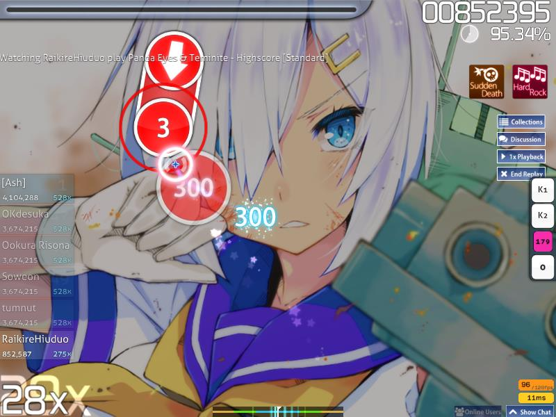

<!-- TODO: this is riddled with old client information and probably needs to be rewritten anyway. -->

# Replay

A replay is a rebroadcast or direct emulation of a play, either by a player or a perfect play done by the [Auto](/wiki/Gameplay/Game_modifier/Auto) mod.
As long as the local replay emulation file with a `.osr` file extension is available with the difficulty/beatmap or a top `Global leaderboard` play was downloaded, a complete replay can be constructed by osu! to be watched.

## Replay options



To rewatch a replay, press and hold the custom default grave/tilde (`` ` ``/`~`) key (which can be changed in [Options sidebar under keyboard](/wiki/Client/Options#keyboard); inside the `Change keyboard bindings` button as **Quick Retry (hold briefly)**) or `Ctrl`+`R` for a while.
The screen should darken and a sound will be played when the quick restart was successful.
Releasing the key early will fail the quick retry.

Access to the [Chat Console](/wiki/Client/Interface/Chat_console) (`F8`)/[Extended Chat Console](/wiki/Client/Interface/Chat_console#extended-chat-console) (`F9`) will still be available.
Press the `Tab` key to hide/show the currently-selected leaderboard.
Press the `H` key to hide/show all elements of replay except the game mods used and **UNRANKED** notice if played by [Auto](/wiki/Gameplay/Game_modifier/Auto).

A [Cinema](/wiki/Gameplay/Game_modifier/Cinema) replay will:-

- hide all the replay options,
- disable gameplay access,
- hide all the skin elements of the game mode,
- enable the background image/video,
- play only the pass storyboard,
- set to 0% background dim, and
- play the hitsounds on timing points where the notes would be completed.

To skip the starting/ending point of the play, press the `Spacebar` key.

### Discussion

The button **only appears when an in-game osu!account was connected to Bancho and the difficulty/beatmap can be found in the osu! beatmap list (ranked or otherwise)**.
Shows flowing right-to-left comments left by the community on the beatmap.

Click on the `Discussion` button to show the options available.


Click on `Show Comments` to enable flowing comments regarding the beatmap(set) at the middle of the screen.
An active osu!supporter account will have an extra `Colour` button which allows new comment to be coloured.



Click on `Click to add a comment at the current time!` to comment on the current difficulty/beatmap.
The replay will be paused, darken, and with an osu!logo at the foreground centre until the comment was completed (usually, `Enter` key) or cancelled (usually, `Esc` key).



To filter the comments by difficulty, enable `Difficulty (#)`.
To filter the comments by the overall beatmap, enable `Song (#)`.
When watching a top play from the `Global leaderboard`, enable `Player (#)` to show comments from the player itself.

Mapper's comment will be placed above the flowing comments with a light-blue text and an jump-out/jump-in animation instead.
Depending on resolution, it may be obstructed by a **UNRANKED** notice when watching an Auto replay.
To remove the **UNRANKED** notice, either watch a top replay from the `Global leaderboard`, or a local replay from the `Local leaderboard` without the Auto mod used.

When watching a top replay, the player of the replay's comment(s) will be shown *below* the screen instead, and will only be shown in this replay only.

By default without active osu!supporter, comments will be coloured based on chat colour (normal accounts will be white) except for mapper's comment(s) (light-blue).

### Collections

Add this beatmap(set) to *Collections*.
This will open up the Collections screen to put the current beatmap(set) into specific sections or rename the sections.

The replay will not pause and continue at the background while in this screen.

### Playback Speed

Adjust the playback speed of the replay.

The playback speed rotates between `1x`, `2x`, `0.5x`, or rotate back to `1x` playback speed per click.
Starting playback speed is always `1x`.

Shortcut key is the `F` key.

### End Replay

Self-explanatory; click to end the replay.

Shortcut key is the `Esc` key.

## Types of Replay

*Full documentation regarding the `.osr` file format: [.osr file format](/wiki/Client/File_formats/osr_(file_format))*

To export a replay, press `F2` in the results screen.
Exported replay will have an `.osr` file extension with a clean filename format as shown below:-

```
Format : {LocalPlayerName} - {Artist} - {Title} [{Difficulty}] ({YYYY-MM-DD}) {GameMode}
Example: dummytest1 - Loituma - Ievan Polkka [SPINNER-MADNESS] (2013-08-12) OsuMania
```

Do note that an exported replay file will **not** work if the **difficulty/beatmap linked to the replay file was missing/not found**.
Once opened, the exported replay data will be added to the local leaderboard and the file copied to the backend (specifically, in the hidden `Data/r` folder).
The original exported replay will not be lost after opening.

A quick way to remember whether the replay will be saved internally is the same as whether it will be saved in the local leaderboard after passing the difficulty.

A white, hovering text from right-to-left, will be shown above the comments but below the **UNRANKED** notice while watching a replay.

The format is shown below unless stated otherwise:-

```
Format : REPLAY MODE - Watching {PlayerName} play {ArtistName} - {BeatmapName} [{Difficulty}]
Example: REPLAY MODE - Watching osu! play Peter Lambert - osu!tutorial [Gameplay Basics]
```

### Local (Solo)


A local *Solo* play. As long as the difficulty was passed, a replay will be generated internally and can be exported to `Replays` folder.

At the backend, one pair of files will be created in the hidden folder, `Data/r`: `.osr` (osu! replay; the replay file), and `.osg` (accuracy and combo in real-time; used for spectators' replay only) with same encrypted filename.
It is highly suggested to **not rename the encrypted filename**, and make use of the export `F2` key instead.

Deleting the `.osg` file has no effect (it is a leftover file for spectator's replay; can be safely removed).
Deleting the `.osr` file will make the replay *lost forever* (since the replay data is missing and nothing to export).
Alternatively, deleting the `scores.db` (which contains local leaderboard scores and pointers to encrypted replays) *will make all (not exported) replays and local leaderboard scores lost forever*.

To set a local leaderboard name when not signed in (*Guest* account), scroll down from the results screen to access the online results screen directly after passing the difficulty and type in the name on the *Guest player name* textbox.
In this screen, an alternative to using the export `F2` key is to enable the `Save replay to Replays folder` button located at the upper-right.

Return to the *Song Selection* and changes will be updated for this replay (if no name was given, it will simply be blank).

### Failed


To access this screen, fail the map by draining the healthbar completely, or fail to fill 50% or more of the healthbar before the end of the difficulty in osu!taiko.

In the game over screen, press the `F1` key to replay the currently failed play.
The replay ends when the screen darkens, with the osu!logo in the middle, rather than the game over screen.

To save your failed play as a replay, press `F2` in the game over screen.

Due to the non-standard replay screen, use the `Esc` key to return to Song Selection.
Trying to restart the beatmap to directly play the beatmap again in this state is not possible.

It currently works in `Solo` only when given the game over screen.

Viewing a failed play does not work with the [No Fail(NF)](/wiki/Gameplay/Game_modifier/No_Fail)/[Relax(RL)](/wiki/Gameplay/Game_modifier/Relax)/[Auto Pilot(AP)](/wiki/Gameplay/Game_modifier/Autopilot) game modifier because it is impossible to fail.
Using the [Perfect(PF)](/wiki/Gameplay/Game_modifier/Perfect) game modifier would forcefully quick-retry instead of failing the player.

If there was a retry streak, it will be lost once entering the Failed replay state.

### Multi



Replays from Multi can only be exported from *Head-to-Head* or *Team VS* team mode only.
These replays will **not be saved internally and not considered in the local leaderboard**.
Multi elements will not be saved as shown in the image comparison above (refer to the second image).

### Spectator

As spectator mode requires access to the [Extended Chat Console](/wiki/Client/Interface/Chat_console#extended-chat-console), please sign in with an active in-game account and connect to Bancho.

After that, press `F9` to access the Extended Chat Console and pick a player to spectate.
Make sure to have the **same** difficulty/beatmap as the player, or a small red-outline warning box will appear at the bottom-right for not having the difficulty/beatmap specified, hence no spectator's replay.
Exiting the Extended Chat Console will start the spectator replay if both the spectator and player have the same difficulty/beatmap.

A `#spectator` tab will be opened in the Chat Console (both the spectator and the player) to discuss about the player's play.

Do note that depending on the player's settings, the spectators' account name in a list format will be shown at the player's screen on the top-left of the screen in white text.

A format and example is shown below for the player:-

```
Format :-
Spectator list (#):
{PlayerNameInNewlines}

Example:-
Spectator list (2):
deadbeat
ztrot
```

A white, hovering text from right-to-left will be shown on top when watching a spectator's replay.

The format and example is shown below:-

```
Format : SPECTATOR MODE - Watching {PlayerName} play {ArtistName} - {BeatmapName} [{Difficulty}]
Example: SPECTATOR MODE - Watching peppy play Peter Lambert - osu!tutorial [Gameplay Basics]
```

### Auto



The Auto game modifier plays the difficulty/beatmap.
It does not save internally but **can be exported**.
Opening an exported file of Auto play will put the play into the local leaderboard with a unique Auto game modifier used.

Do note that the **UNRANKED** notice cannot be removed at all.

#### Preview Gameplay

When the `Preview Gameplay` button in the `Options` sidebar is clicked, Auto will **randomly take a difficulty/beatmap** based on **currently selected game mode (set in Solo's Song Selection screen)** and **a random timespan to start**.

In this type of replay, Auto may randomly miss a few hit objects to show how the skins elements looks like.
If the `Preview Gameplay` button was not clicked again to randomise another difficulty/beatmap and timespan when the song ended, result screen will be shown for this play and the `Options` sidebar will be closed.

The `Options` sidebar cannot be reopened while playing or in results screen.

### Server


Server replays are reserved for the top 1000 plays in the `Global leaderboard` of a difficulty/beatmap.
The replay will be saved server-side.
It can be exported, or downloaded and watched immediately by request.

When watching a server-side replay (excluding exported replays), the player of the replay's profile will receive an increment of one(1) in the "Replays Watched by Others" counter.
If a new top 1000 global record was added, the previous holder for \#1000 position's server-side replay will be removed.

To watch a server replay, an osu! account must be signed in and be connected to Bancho.
At the *Song Selection* screen in `Solo`, switch the leaderboard to `Global leaderboard` and click on the preferred player at the leaderboard to watch the replay.
Press on the `Watch replay` button and osu! will download the replay file from the Bancho as shown in the left of the image.
The replay only plays once and will be deleted after the replay ends/quit early.

## Trivia

### General

Playback speed does not affect the `REPLAY MODE/SPECTATOR MODE` notice scrolling speed.

Pausing breaks during play will not be accounted in the replay data; only the active playing data was collected.

### Spectator

While it is possible to export a spectator replay, it is a bad idea if spectating in the middle or end of a play.

The exported replay file will only contain the play data from the timespan of the watched spectator replay.

For the timespan before that, the cursor will be placed at the starting point of the spectating timespan and shows no reaction, no hit burst occurrence, and health drain occur as usual (depending on game mode).

An empty healthbar will not fail the beatmap replay.

Do note that a failed spectator replay cannot be exported.

### Multi



Do note that this is currently the only way to save a replay which will continue playing even when the healthbar was drained to empty at least once.

### Preview Gameplay


Depending on the random timespan selected, it may start at the *end of the song* without any hit objects, leading directly to the results screen with 0 score, 0 combo, 0x hit bursts, D Grade, no performance graph, and 100.00% accuracy.
When watching the replay, the health drain will work as usual, no cursor movement, and *no miss* (hence 100.00% accuracy) until the point where the `Preview Gameplay` timespan was set to run, which the hit bursts will start to work.

Since Auto is unable to fail, an empty healthbar has no effect on Auto.
However, for osu!taiko, if Auto is unable to fill the healthbar 50% or more, the replay will be stuck in an *infinite loop*.
