<!-- TODO: this is riddled with old client information and probably needs to be rewritten anyway. -->

# Replay

Replay คือการออกอากาศซ้ำหรือการจำลองการเล่นโดยตรง ไม่ว่าจะเป็นการเล่นของผู้เล่น หรือการเล่น perfect จากม็อด [Auto](/wiki/Gameplay/Game_modifier/Auto)
ตราบใดที่มีไฟล์จำลองรีเพลย์ในเครื่องนามสกุล `.osr` สำหรับ difficulty/beatmap นั้น หรือดาวน์โหลดการเล่นอันดับสูงจาก `Global leaderboard` มาแล้ว osu! จะสามารถสร้างรีเพลย์แบบสมบูรณ์ให้ดูได้

## ตัวเลือกรีเพลย์

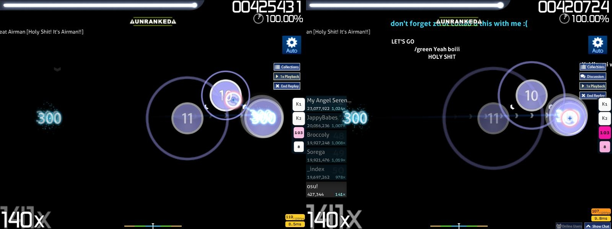

หากต้องการดูรีเพลย์อีกครั้ง ให้กดค้างปุ่ม grave/tilde ค่าเริ่มต้นแบบปรับเองได้ (`` ` ``/`~`) ซึ่งเปลี่ยนได้ใน [Options sidebar ใต้ keyboard](/wiki/Client/Options#keyboard) ภายในปุ่ม `Change keyboard bindings` ในชื่อ **Quick Retry (hold briefly)** หรือกด `Ctrl`+`R` ค้างสักครู่
หน้าจอจะมืดลงและมีเสียงเล่นเมื่อ quick restart สำเร็จ
หากปล่อยปุ่มเร็วเกินไป quick retry จะล้มเหลว

ยังสามารถเข้า [Chat Console](/wiki/Client/Interface/Chat_console) (`F8`)/[Extended Chat Console](/wiki/Client/Interface/Chat_console#extended-chat-console) (`F9`) ได้
กดปุ่ม `Tab` เพื่อซ่อน/แสดง leaderboard ที่เลือกอยู่ในตอนนั้น
กดปุ่ม `H` เพื่อซ่อน/แสดงองค์ประกอบทั้งหมดของรีเพลย์ ยกเว้นม็อดที่ใช้และข้อความ **UNRANKED** หากเล่นโดย [Auto](/wiki/Gameplay/Game_modifier/Auto)

รีเพลย์ [Cinema](/wiki/Gameplay/Game_modifier/Cinema) จะ:

- ซ่อนตัวเลือกรีเพลย์ทั้งหมด
- ปิดการเข้าถึงเกมเพลย์
- ซ่อนองค์ประกอบสกินทั้งหมดของโหมดเกม
- เปิดภาพ/วิดีโอพื้นหลัง
- เล่นเฉพาะ pass storyboard
- ตั้ง background dim เป็น 0%
- เล่น hitsound ณ timing point ที่โน้ตควรถูกเล่นสำเร็จ

หากต้องการข้ามจุดเริ่มต้น/จุดจบของการเล่น ให้กดปุ่ม `Spacebar`

### Discussion

ปุ่มนี้ **จะปรากฏเฉพาะเมื่อเชื่อมต่อ osu!account ในเกมกับ Bancho และ difficulty/beatmap นั้นพบได้ในรายการบีตแมปของ osu! ไม่ว่าจะ ranked หรือไม่ก็ตาม**
ใช้แสดงคอมเมนต์จากคอมมูนิตี้บนบีตแมปที่ไหลจากขวาไปซ้าย

คลิกปุ่ม `Discussion` เพื่อแสดงตัวเลือกที่มี

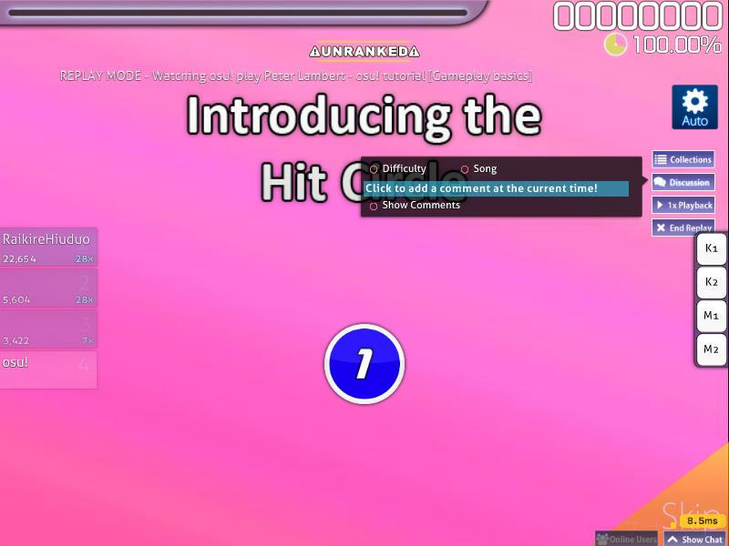

คลิก `Show Comments` เพื่อเปิดคอมเมนต์เกี่ยวกับ beatmap(set) ให้ไหลตรงกลางหน้าจอ
บัญชี osu!supporter ที่ยังใช้งานอยู่จะมีปุ่ม `Colour` เพิ่มมา ซึ่งให้คอมเมนต์ใหม่มีสีได้

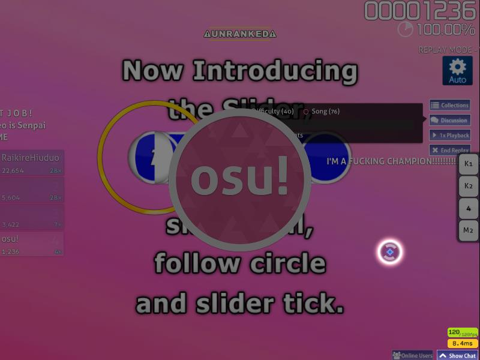

คลิก `Click to add a comment at the current time!` เพื่อคอมเมนต์บน difficulty/beatmap ปัจจุบัน
รีเพลย์จะถูก pause หน้าจอจะมืดลง และมีโลโก้ osu! อยู่ตรงกลางด้านหน้า จนกว่าจะเขียนคอมเมนต์เสร็จ โดยปกติใช้ปุ่ม `Enter` หรือยกเลิกโดยปกติใช้ปุ่ม `Esc`

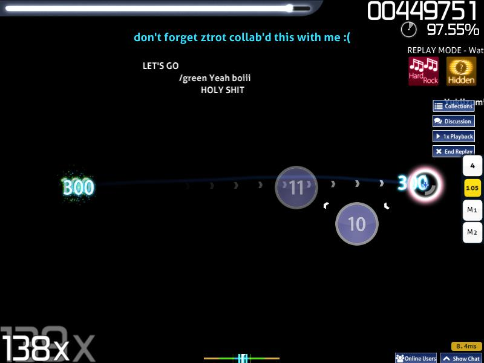

หากต้องการกรองคอมเมนต์ตาม difficulty ให้เปิด `Difficulty (#)`
หากต้องการกรองคอมเมนต์ตามบีตแมปโดยรวม ให้เปิด `Song (#)`
เมื่อดู top play จาก `Global leaderboard` ให้เปิด `Player (#)` เพื่อแสดงคอมเมนต์จากผู้เล่นคนนั้น

คอมเมนต์ของแมปเปอร์จะถูกวางไว้เหนือคอมเมนต์ที่ไหลอยู่ ด้วยข้อความสีฟ้าอ่อนและแอนิเมชันกระโดดออก/กระโดดเข้าแทน
ขึ้นอยู่กับความละเอียดหน้าจอ คอมเมนต์นี้อาจถูกข้อความ **UNRANKED** บังเมื่อดูรีเพลย์ Auto
หากต้องการลบข้อความ **UNRANKED** ให้ดู top replay จาก `Global leaderboard` หรือรีเพลย์ในเครื่องจาก `Local leaderboard` ที่ไม่ได้ใช้ม็อด Auto

เมื่อดู top replay คอมเมนต์ของผู้เล่นเจ้าของรีเพลย์จะแสดงอยู่ *ด้านล่าง* ของหน้าจอแทน และจะแสดงเฉพาะในรีเพลย์นี้เท่านั้น

โดยค่าเริ่มต้น หากไม่มี osu!supporter ที่ใช้งานอยู่ คอมเมนต์จะมีสีตามสีแชท โดยบัญชีปกติจะเป็นสีขาว ยกเว้นคอมเมนต์ของแมปเปอร์ซึ่งเป็นสีฟ้าอ่อน

### Collections

เพิ่ม beatmap(set) นี้ลงใน *Collections*
สิ่งนี้จะเปิดหน้าจอ Collections เพื่อใส่ beatmap(set) ปัจจุบันลงในหมวดที่ต้องการ หรือเปลี่ยนชื่อหมวด

รีเพลย์จะไม่ pause และจะเล่นต่ออยู่เบื้องหลังขณะอยู่ในหน้าจอนี้

### Playback Speed

ปรับความเร็วการเล่นรีเพลย์

ความเร็วจะวนระหว่าง `1x`, `2x`, `0.5x` หรือกลับไป `1x` ต่อหนึ่งคลิก
ความเร็วเริ่มต้นจะเป็น `1x` เสมอ

คีย์ลัดคือปุ่ม `F`

### End Replay

ตรงตามชื่อ คลิกเพื่อจบรีเพลย์

คีย์ลัดคือปุ่ม `Esc`

## ประเภทของรีเพลย์

*เอกสารเต็มเกี่ยวกับรูปแบบไฟล์ `.osr`: [.osr file format](/wiki/Client/File_formats/osr_(file_format))*

หากต้องการ export รีเพลย์ ให้กด `F2` บนหน้าผลลัพธ์
รีเพลย์ที่ export จะมีนามสกุลไฟล์ `.osr` พร้อมรูปแบบชื่อไฟล์สะอาดตามด้านล่าง:

```
Format : {LocalPlayerName} - {Artist} - {Title} [{Difficulty}] ({YYYY-MM-DD}) {GameMode}
Example: dummytest1 - Loituma - Ievan Polkka [SPINNER-MADNESS] (2013-08-12) OsuMania
```

โปรดทราบว่าไฟล์รีเพลย์ที่ export จะ **ไม่** ทำงาน หาก **difficulty/beatmap ที่ลิงก์กับไฟล์รีเพลย์หายไปหรือหาไม่เจอ**
เมื่อเปิดแล้ว ข้อมูลรีเพลย์ที่ export จะถูกเพิ่มเข้า local leaderboard และไฟล์จะถูกคัดลอกไปยัง backend โดยเฉพาะในโฟลเดอร์ซ่อน `Data/r`
รีเพลย์ที่ export ต้นฉบับจะไม่หายไปหลังเปิด

วิธีจำง่าย ๆ ว่ารีเพลย์จะถูกบันทึกภายในหรือไม่ คือดูเหมือนกับว่ามันจะถูกบันทึกใน local leaderboard หลังผ่าน difficulty หรือไม่

ข้อความสีขาวที่ลอยจากขวาไปซ้ายจะแสดงเหนือคอมเมนต์ แต่ใต้ข้อความ **UNRANKED** ขณะดูรีเพลย์

รูปแบบจะแสดงตามด้านล่าง เว้นแต่จะระบุไว้เป็นอย่างอื่น:

```
Format : REPLAY MODE - Watching {PlayerName} play {ArtistName} - {BeatmapName} [{Difficulty}]
Example: REPLAY MODE - Watching osu! play Peter Lambert - osu!tutorial [Gameplay Basics]
```

### Local (Solo)

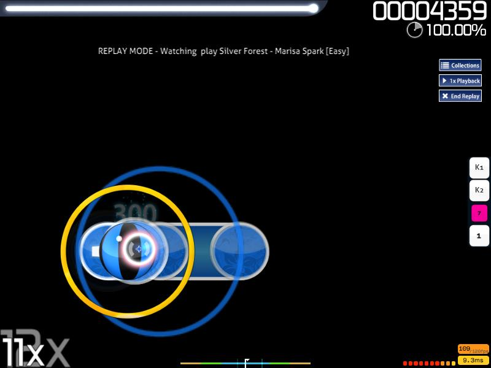

การเล่น *Solo* ในเครื่อง ตราบใดที่ผ่าน difficulty ได้ รีเพลย์จะถูกสร้างภายในและสามารถ export ไปยังโฟลเดอร์ `Replays` ได้

ที่ฝั่ง backend จะมีไฟล์หนึ่งคู่ถูกสร้างในโฟลเดอร์ซ่อน `Data/r`: `.osr` (osu! replay หรือไฟล์รีเพลย์) และ `.osg` (accuracy และคอมโบแบบ real-time ใช้สำหรับรีเพลย์ของ spectator เท่านั้น) โดยใช้ชื่อไฟล์เข้ารหัสเดียวกัน
ขอแนะนำอย่างมากว่า **อย่าเปลี่ยนชื่อไฟล์เข้ารหัส** และให้ใช้ปุ่ม export `F2` แทน

การลบไฟล์ `.osg` ไม่มีผล เพราะเป็นไฟล์ค้างสำหรับรีเพลย์ spectator และสามารถลบได้อย่างปลอดภัย
การลบไฟล์ `.osr` จะทำให้รีเพลย์ *หายไปตลอดกาล* เพราะข้อมูลรีเพลย์หายและไม่มีอะไรให้ export
อีกทางหนึ่ง การลบ `scores.db` ซึ่งเก็บคะแนน local leaderboard และ pointer ไปยังรีเพลย์เข้ารหัส จะ *ทำให้รีเพลย์ที่ไม่ได้ export ทั้งหมดและคะแนน local leaderboard หายไปตลอดกาล*

หากต้องการตั้งชื่อ local leaderboard ตอนยังไม่ได้ลงชื่อเข้าใช้ หรือบัญชี *Guest* ให้เลื่อนลงจากหน้าผลลัพธ์เพื่อเข้าหน้าผลลัพธ์ออนไลน์ทันทีหลังผ่าน difficulty แล้วพิมพ์ชื่อใน textbox *Guest player name*
ในหน้าจอนี้ ทางเลือกแทนการใช้ปุ่ม export `F2` คือเปิดปุ่ม `Save replay to Replays folder` ที่อยู่มุมขวาบน

กลับไปที่ *Song Selection* แล้วการเปลี่ยนแปลงจะอัปเดตสำหรับรีเพลย์นี้ หากไม่ได้ใส่ชื่อไว้ ชื่อจะเว้นว่างไว้เฉย ๆ

### Failed

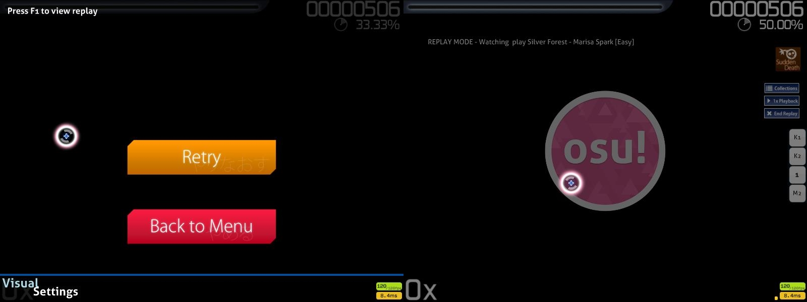

หากต้องการเข้าหน้าจอนี้ ให้ fail แมปด้วยการปล่อยให้ healthbar หมดสนิท หรือใน osu!taiko ให้เติม healthbar ไม่ถึง 50% หรือมากกว่าก่อนจบ difficulty

ในหน้าจอ game over ให้กดปุ่ม `F1` เพื่อ replay การเล่นที่เพิ่ง fail
รีเพลย์จะจบเมื่อหน้าจอมืดลงพร้อมโลโก้ osu! ตรงกลาง แทนที่จะเป็นหน้าจอ game over

หากต้องการบันทึกการเล่นที่ fail เป็นรีเพลย์ ให้กด `F2` ในหน้าจอ game over

เนื่องจากหน้าจอรีเพลย์นี้ไม่ใช่แบบมาตรฐาน ให้ใช้ปุ่ม `Esc` เพื่อกลับไป Song Selection
การพยายามรีสตาร์ตบีตแมปเพื่อกลับไปเล่นบีตแมปเดิมโดยตรงในสถานะนี้ทำไม่ได้

ตอนนี้ใช้งานได้เฉพาะใน `Solo` เมื่อมีหน้าจอ game over เท่านั้น

การดูการเล่นที่ fail ใช้ไม่ได้กับม็อด [No Fail(NF)](/wiki/Gameplay/Game_modifier/No_Fail)/[Relax(RL)](/wiki/Gameplay/Game_modifier/Relax)/[Auto Pilot(AP)](/wiki/Gameplay/Game_modifier/Autopilot) เพราะเป็นไปไม่ได้ที่จะ fail
การใช้ม็อด [Perfect(PF)](/wiki/Gameplay/Game_modifier/Perfect) จะบังคับ quick-retry แทนการทำให้ผู้เล่น fail

หากมี retry streak อยู่ มันจะหายไปเมื่อเข้าสู่สถานะ Failed replay

### Multi

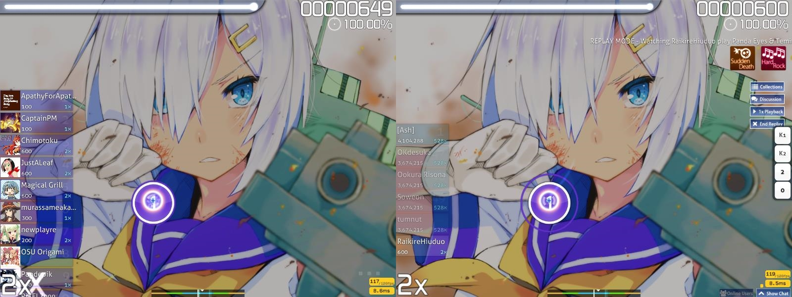

รีเพลย์จาก Multi สามารถ export ได้เฉพาะจากโหมดทีม *Head-to-Head* หรือ *Team VS* เท่านั้น
รีเพลย์เหล่านี้จะ **ไม่ถูกบันทึกภายในและไม่ถูกนับใน local leaderboard**
องค์ประกอบของ Multi จะไม่ถูกบันทึกตามภาพเปรียบเทียบด้านบน ให้ดูภาพที่สอง

### Spectator

เนื่องจากโหมด spectator ต้องใช้ [Extended Chat Console](/wiki/Client/Interface/Chat_console#extended-chat-console) โปรดลงชื่อเข้าใช้ด้วยบัญชีในเกมที่ยังใช้งานอยู่และเชื่อมต่อกับ Bancho

หลังจากนั้น กด `F9` เพื่อเข้า Extended Chat Console และเลือกผู้เล่นที่จะ spectate
ตรวจสอบให้แน่ใจว่ามี difficulty/beatmap **เดียวกัน** กับผู้เล่น ไม่อย่างนั้นจะมีกล่องเตือนกรอบแดงเล็ก ๆ ปรากฏที่มุมขวาล่างว่าคุณไม่มี difficulty/beatmap ที่ระบุ จึงไม่มีรีเพลย์ spectator
การออกจาก Extended Chat Console จะเริ่มรีเพลย์ spectator หากทั้ง spectator และผู้เล่นมี difficulty/beatmap เดียวกัน

แท็บ `#spectator` จะถูกเปิดใน Chat Console ทั้งฝั่ง spectator และผู้เล่น เพื่อพูดคุยเกี่ยวกับการเล่นของผู้เล่นคนนั้น

โปรดทราบว่า ขึ้นอยู่กับการตั้งค่าของผู้เล่น ชื่อบัญชีของ spectator ในรูปแบบรายการจะแสดงบนหน้าจอของผู้เล่นที่มุมซ้ายบนด้วยข้อความสีขาว

รูปแบบและตัวอย่างสำหรับผู้เล่นแสดงด้านล่าง:

```
Format :-
Spectator list (#):
{PlayerNameInNewlines}

Example:-
Spectator list (2):
deadbeat
ztrot
```

ข้อความสีขาวที่ลอยจากขวาไปซ้ายจะแสดงด้านบนเมื่อดูรีเพลย์ spectator

รูปแบบและตัวอย่างแสดงด้านล่าง:

```
Format : SPECTATOR MODE - Watching {PlayerName} play {ArtistName} - {BeatmapName} [{Difficulty}]
Example: SPECTATOR MODE - Watching peppy play Peter Lambert - osu!tutorial [Gameplay Basics]
```

### Auto

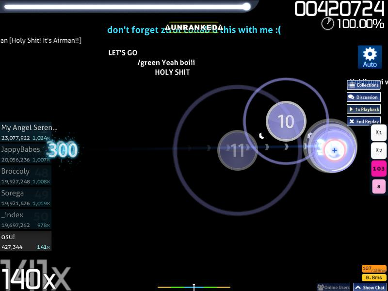

Game modifier Auto จะเล่น difficulty/beatmap
มันจะไม่บันทึกภายใน แต่ **สามารถ export ได้**
การเปิดไฟล์ที่ export จากการเล่น Auto จะใส่การเล่นนั้นลง local leaderboard พร้อม game modifier Auto แบบเฉพาะ

โปรดทราบว่าข้อความ **UNRANKED** ไม่สามารถลบออกได้เลย

#### Preview Gameplay

เมื่อคลิกปุ่ม `Preview Gameplay` ใน `Options` sidebar Auto จะ **สุ่มเลือก difficulty/beatmap** ตาม **โหมดเกมที่เลือกอยู่ตอนนั้น ซึ่งตั้งในหน้าจอ Song Selection ของ Solo** และ **สุ่มช่วงเวลาที่จะเริ่ม**

ในรีเพลย์ประเภทนี้ Auto อาจสุ่ม miss hit object บางตัวเพื่อแสดงให้เห็นว่าองค์ประกอบของสกินเป็นอย่างไร
หากไม่ได้คลิกปุ่ม `Preview Gameplay` อีกครั้งเพื่อสุ่ม difficulty/beatmap และช่วงเวลาใหม่เมื่อเพลงจบ หน้าผลลัพธ์ของการเล่นนี้จะแสดงขึ้น และ `Options` sidebar จะถูกปิด

ไม่สามารถเปิด `Options` sidebar อีกครั้งได้ระหว่างเล่นหรืออยู่ในหน้าผลลัพธ์

### Server

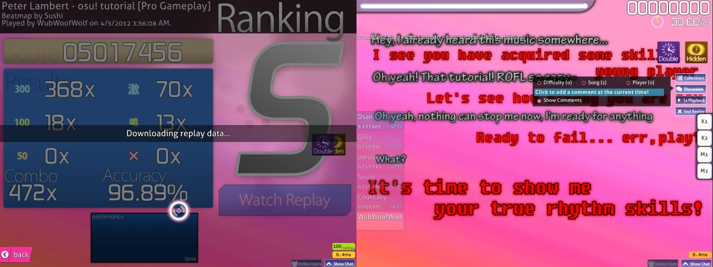

รีเพลย์ server สงวนไว้สำหรับ top 1000 plays ใน `Global leaderboard` ของ difficulty/beatmap
รีเพลย์จะถูกบันทึกฝั่งเซิร์ฟเวอร์
สามารถ export หรือดาวน์โหลดและดูทันทีเมื่อร้องขอได้

เมื่อดูรีเพลย์ฝั่งเซิร์ฟเวอร์ ไม่รวมรีเพลย์ที่ export โปรไฟล์ของผู้เล่นเจ้าของรีเพลย์จะได้รับการเพิ่มตัวนับ "Replays Watched by Others" หนึ่ง (1) ครั้ง
หากมีสถิติ global top 1000 ใหม่ถูกเพิ่ม รีเพลย์ฝั่งเซิร์ฟเวอร์ของผู้ถืออันดับ \#1000 คนก่อนหน้าจะถูกลบออก

หากต้องการดูรีเพลย์ server ต้องลงชื่อเข้าใช้บัญชี osu! และเชื่อมต่อกับ Bancho
ที่หน้าจอ *Song Selection* ใน `Solo` ให้เปลี่ยน leaderboard เป็น `Global leaderboard` แล้วคลิกผู้เล่นที่ต้องการบน leaderboard เพื่อดูรีเพลย์
กดปุ่ม `Watch replay` แล้ว osu! จะดาวน์โหลดไฟล์รีเพลย์จาก Bancho ตามที่แสดงทางซ้ายของภาพ
รีเพลย์จะเล่นได้ครั้งเดียวและจะถูกลบหลังรีเพลย์จบหรือออกก่อน

## เกร็ดน่ารู้

### ทั่วไป

ความเร็ว playback ไม่มีผลต่อความเร็วเลื่อนของข้อความ `REPLAY MODE/SPECTATOR MODE`

การ pause ระหว่างช่วงพักระหว่างเล่นจะไม่ถูกนับในข้อมูลรีเพลย์ โดยจะเก็บเฉพาะข้อมูลการเล่นช่วง active เท่านั้น

### Spectator

แม้จะ export รีเพลย์ spectator ได้ แต่ไม่ใช่ความคิดที่ดีหากเริ่ม spectate กลางหรือท้ายการเล่น

ไฟล์รีเพลย์ที่ export จะมีเฉพาะข้อมูลการเล่นจากช่วงเวลาที่ดูรีเพลย์ spectator เท่านั้น

สำหรับช่วงเวลาก่อนหน้านั้น เคอร์เซอร์จะถูกวางไว้ที่จุดเริ่มต้นของช่วงเวลาที่ spectate และจะไม่แสดงปฏิกิริยาใด ๆ ไม่มี hit burst เกิดขึ้น และ health drain จะเกิดตามปกติ ขึ้นอยู่กับโหมดเกม

หลอดชีวิตที่ว่างเปล่าจะไม่ทำให้รีเพลย์บีตแมป fail

โปรดทราบว่ารีเพลย์ spectator ที่ fail ไม่สามารถ export ได้

### Multi

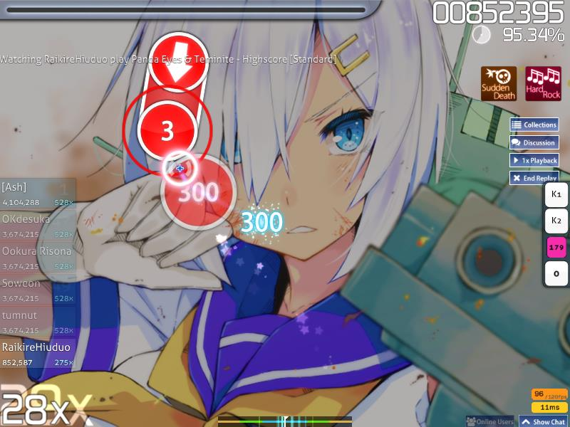

โปรดทราบว่านี่เป็นวิธีเดียวในตอนนี้ที่จะบันทึกรีเพลย์ซึ่งจะเล่นต่อแม้ healthbar ถูก drain จนว่างอย่างน้อยหนึ่งครั้ง

### Preview Gameplay

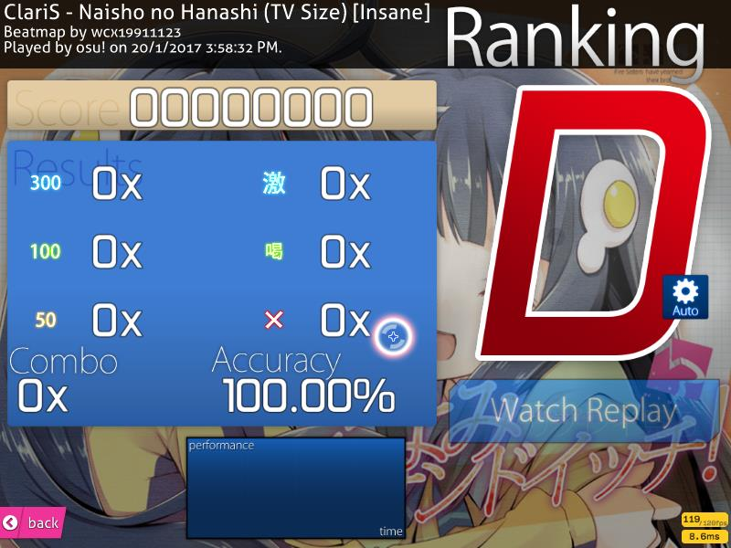

ขึ้นอยู่กับช่วงเวลาสุ่มที่เลือก มันอาจเริ่มที่ *ท้ายเพลง* โดยไม่มี hit object เลย ทำให้ไปยังหน้าผลลัพธ์โดยตรงด้วยคะแนน 0, คอมโบ 0, hit burst 0x, D Grade, ไม่มี performance graph และ accuracy 100.00%
เมื่อดูรีเพลย์ health drain จะทำงานตามปกติ ไม่มีการเคลื่อนที่ของเคอร์เซอร์ และ *ไม่มี miss* จึงได้ accuracy 100.00% จนถึงจุดที่ตั้งช่วงเวลา `Preview Gameplay` ให้ทำงาน ซึ่ง hit burst จะเริ่มทำงาน

เนื่องจาก Auto ไม่สามารถ fail ได้ หลอดชีวิตว่างจึงไม่มีผลกับ Auto
อย่างไรก็ตาม สำหรับ osu!taiko หาก Auto ไม่สามารถเติม healthbar ให้ถึง 50% หรือมากกว่าได้ รีเพลย์จะติดอยู่ใน *infinite loop*
