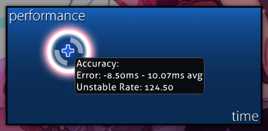

---
tags:
  - converted unstable rate
  - converted UR
  - cv UR
  - cv. UR
  - error
  - hit error
  - timing
  - UR
---

# Unstable rate

**Unstable rate** (***UR***) is a measurement of variation of hit errors<!-- TODO: link --> throughout a play. It is calculated as the [standard deviation](https://en.wikipedia.org/wiki/Standard_deviation) of hit errors, displayed in tenths of a millisecond. A lower UR indicates that the player's hits have more similar errors, while a higher UR indicates they are more spread apart.

Players specialising in high [accuracy](/wiki/Gameplay/Accuracy) often achieve URs that are significantly below what is required to get an [SS](/wiki/Gameplay/Grade). Unstable rate can be a particularly useful metric to help judge these scores in finer detail than regular [judgements](/wiki/Gameplay/Judgement).

Note that UR measures the consistency between hit errors, and not the amount of error. While low UR often comes as the result of accurate play, it is possible to get very low UR at the same time as very low accuracy. For example, a player could hit every [object](/wiki/Gameplay/Hit_object) late enough to get a [50](/wiki/Gameplay/Judgement/osu!), but with consistent errors.

## On the results screen



When hovering over the performance graph on the [results screen](/wiki/Client/Interface#results-screen), information about the play's average hit error and unstable rate is shown. This will only be displayed if the score was just performed, spectated, or replayed.

## With rate-changing mods

The hit errors used to calculate unstable rate are measured according to the time of the [beatmap](/wiki/Beatmap) during gameplay, not real-world time. This means that when using [mods](/wiki/Gameplay/Game_modifier) that change the beatmap's speed such as [Double Time](/wiki/Gameplay/Game_modifier/Double_Time) or [Half Time](/wiki/Gameplay/Game_modifier/Half_Time), the UR of the player's real-world inputs is effectively multiplied by that speed change.

When comparing UR values across plays with different mods, people often rely on the unofficial concept of **converted unstable rate** (***cv. UR***), defined as the UR with the speed change from mods divided out:

```
cv. UR for Double Time = UR / 1.5
cv. UR for Half Time   = UR / 0.75
```

### In lazer releases

As of version [2023.1130.0](https://osu.ppy.sh/home/changelog/lazer/2023.1130.0) of the [lazer release stream](/wiki/Client/Release_stream/Lazer), UR is measured using real-world time regardless of the mods used, eliminating the need for converted UR.
