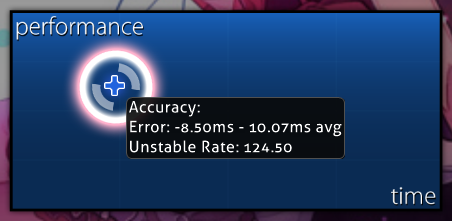

---
tags:
  - converted unstable rate
  - converted UR
  - cv UR
  - cv. UR
  - error
  - hit error
  - timing
  - UR
---

# Unstable rate

**Unstable Rate** adalah nilai yang mengukur variasi hit error di sepanjang permainan. Nilai ini dihitung dari [simpangan baku](https://id.wikipedia.org/wiki/Simpangan_baku) hit error dalam satuan milidetik, lalu dikalikan 10. Nilai UR yang lebih rendah menandakan ketukan pemain memiliki kesalahan yang serupa, sedangkan nilai UR yang lebih tinggi menandakan ketukan pemain lebih bervariasi.

Pemain yang berspesialisasi pada [akurasi](/wiki/Gameplay/Accuracy) tinggi umumnya mencapai nilai UR yang jauh di bawah batas yang diperlukan untuk mendapatkan nilai [SS](/wiki/Gameplay/Grade). Nilai Unstable Rate juga dapat menjadi tolak ukur yang berguna untuk menilai skor dengan lebih rinci dibandingkan menggunakan [judgements](/wiki/Gameplay/Judgement).

Perlu dicatat bahwa nilai ini mengukur konsistensi kesalahan ketukan, bukan jumlah kesalahan. Meskipun nilai UR yang rendah biasanya merupakan hasil dari permainan yang akurat, sangat mungkin untuk mendapatkan nilai UR yang sangat rendah sekaligus akurasi yang sangat rendah. Contohnya, seorang pemain bisa mengetuk setiap [objek](/wiki/Gameplay/Hit_object) cukup terlambat untuk mendapatkan [50](/wiki/Gameplay/Judgement/osu!), namun dengan kesalahan yang konsisten.

## Di layar hasil permainan



Saat kursor pemain melayang di atas grafik performa yang ada di [layar hasil](/wiki/Client/Interface#papan-peringkat-skor-daring), informasi tentang rata-rata kesalahan ketukan dan unstable rate akan ditampilkan. Informasi ini hanya akan ditayangkan jika skor tersebut baru dimainkan, disaksikan atau ditonton ulang.

## Dengan mod pengubah kecepatan

Nilai hit error yang digunakan untuk menghitung nilai unstable rate diukur berdasarkan waktu [beatmap](/wiki/Beatmap) selama permainan, bukan waktu di dunia nyata. Hal ini berarti saat pemain menggunakan [mod-mod](/wiki/Gameplay/Game_modifier) yang mengubah kecepatan beatmap seperti [Double Time](/wiki/Gameplay/Game_modifier/Double_Time) atau [Half Time](/wiki/Gameplay/Game_modifier/Half_Time), nilai UR pemain yang berdasarkan input dunia nyata secara efektif akan dikalikan dengan pengubah kecepatan tersebut.

Saat membandingkan nilai UR lintas permainan dengan menggunakan mod yang berbeda, komunitas sering kali menggunakan konsep tidak resmi yang disebut **converted unstable rate** (atau ***cv. UR***), yang didefinisikan sebagai nilai UR yang telah dibagi dengan faktor pengali kecepatan dari mod yang digunakan:

```
nilai cv. UR untuk Double Time = nilai UR / 1.5
nilai cv. UR untuk Half Time   = nilai UR / 0.75
```

### Di rilisan lazer

Sejak versi [2023.1130.0](https://osu.ppy.sh/home/changelog/lazer/2023.1130.0) untuk [osu!lazer](/wiki/Client/Release_stream/Lazer), nilai UR diukur menggunakan waktu di dunia nyata tanpa memandang mod apa pun yang digunakan, sehingga konsep converted UR tidak lagi diperlukan.
