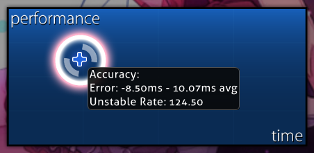

---
tags:
  - converted unstable rate
  - converted UR
  - cv UR
  - cv. UR
  - error
  - hit error
  - timing
  - UR
  - unstable rate terkonversi
  - UR terkonversi
  - kesalahan hit
---

# Unstable rate

**Unstable rate** (UR) adalah nilai yang mengukur variasi penyimpangan hit error di sepanjang permainan. Nilai ini dihitung dari [simpangan baku](https://id.wikipedia.org/wiki/Simpangan_baku) hit error dalam satuan milidetik, yang kemudian dikalikan 10. Nilai UR yang lebih rendah menandakan bahwa kesalahan yang dilakukan oleh pemain memiliki rentang waktu yang serupa, sedangkan nilai UR yang lebih tinggi menandakan bahwa kesalahan yang dilakukan oleh pemain memiliki rentang waktu yang lebih bervariasi.

Pemain yang terfokus pada [akurasi](/wiki/Gameplay/Accuracy) yang tinggi pada umumnya akan mendapatkan nilai UR yang jauh di bawah batas yang dibutuhkan untuk nilai [SS](/wiki/Gameplay/Grade). Nilai Unstable Rate juga bisa menjadi tolok ukur untuk menilai skor dengan lebih terperinci dibanding apabila menggunakan [penilaian skor](/wiki/Gameplay/Judgement).

Mohon diperhatikan bahwa nilai ini mengukur seberapa konsisten kesalahan yang ada, bukan jumlah kesalahan itu sendiri. Meskipun nilai UR yang rendah biasanya menandakan permainan yang akurat, sangat mungkin bagi pemain untuk mendapatkan nilai UR sekaligus akurasi yang sangat rendah. Contohnya, seorang pemain bisa saja berkali-kali mengenai semua [objek permainan](/wiki/Gameplay/Hit_object) dengan cukup terlambat untuk mendapatkan [50](/wiki/Gameplay/Judgement/osu!) di sepanjang permainan.

## Pada layar hasil permainan



Pada saat kursor pemain dilayangkan di atas grafik performa yang ada di [layar hasil](/wiki/Client/Interface#papan-peringkat-skor-daring), informasi tentang hit error rata-rata dan unstable rate akan ditampilkan. Informasi ini hanya akan muncul apabila skor ini baru dimainkan, ditonton langsung, atau ditonton ulang.

## Dengan mod pengubah kecepatan

Nilai hit error yang digunakan untuk menghitung nilai unstable rate diukur berdasarkan waktu [beatmap](/wiki/Beatmap) selama permainan, bukan waktu di dunia nyata. Hal ini berarti pada saat pemain menggunakan [mod](/wiki/Gameplay/Game_modifier) yang mengubah kecepatan beatmap seperti [Double Time](/wiki/Gameplay/Game_modifier/Double_Time) atau [Half Time](/wiki/Gameplay/Game_modifier/Half_Time), nilai UR pemain yang berdasarkan pada input di dunia nyata akan secara efektif dikalikan dengan pengubah kecepatan ini.

Pada saat membandingkan nilai UR antar permainan dengan mod yang berbeda, orang-orang sering kalinya menggunakan konsep tidak resmi yang disebut **unstable rate terkonversi** (atau **converted unstable rate**/***cv. UR***), yang didefinisikan sebagai nilai UR yang dibagi dengan faktor pengali kecepatan dari mod yang digunakan sebagai berikut:

```
nilai cv. UR untuk Double Time = nilai UR / 1.5
nilai cv. UR untuk Half Time   = nilai UR / 0.75
```

### Pada versi rilis lazer

Sejak [osu!lazer](/wiki/Client/Release_stream/Lazer) versi [2023.1130.0](https://osu.ppy.sh/home/changelog/lazer/2023.1130.0), UR terkonversi tidak lagi digunakan karena nilai UR yang ada diukur berdasarkan waktu sebenarnya di dunia nyata tanpa mempertimbangkan mod yang terpasang,
