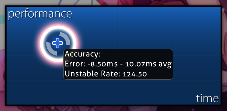

# Unstable rate

**Unstable rate** (***UR***) to miara zmienności błędów trafień (hit errors) podczas gry. Jest on obliczany jako [odchylenie standardowe](https://pl.wikipedia.org/wiki/Odchylenie_standardowe) błędów trafień w milisekundach, pomnożone przez 10. Niższe UR wskazuje, że trafienia gracza mają bardziej zbliżone do siebie błędy, podczas gdy wyższe UR oznacza, że są one bardziej rozproszone.

Gracze specjalizujący się w wysokiej [celności](/wiki/Gameplay/Accuracy) często osiągają wyniki UR, które są znacznie niższe niż te wymagane do uzyskania rangi [SS](/wiki/Gameplay/Grade). Unstable rate może być szczególnie przydatnym wskaźnikiem pomagającym ocenić takie wyniki z większą dokładnością niż zwykłe [oceny trafień](/wiki/Gameplay/Judgement).

Należy zauważyć, że UR mierzy spójność między błędami trafień, a nie samą wielkość błędu. Chociaż niskie UR jest często wynikiem bardzo celnej gry, możliwe jest uzyskanie bardzo niskiego UR przy jednoczesnej bardzo niskiej celności. Na przykład gracz mógłby trafiać każdy [obiekt](/wiki/Gameplay/Hit_object) na tyle późno, by otrzymywać ocenę [50](/wiki/Gameplay/Judgement/osu!), ale robić to z konsekwentnym, stałym błędem.

## Na ekranie wyników



Po najechaniu kursorem na wykres wydajności na [ekranie wyników](/wiki/Client/Interface#results-screen), wyświetlane są informacje o średnim błędzie trafienia oraz unstable rate danego przejścia. Informacje te pojawią się tylko wtedy, gdy wynik został właśnie osiągnięty, był oglądany w trybie obserwatora lub odtworzony z powtórki.

## Z modami zmieniającymi tempo

Błędy trafień używane do obliczania unstable rate są mierzone zgodnie z czasem [beatmapy](/wiki/Beatmap) podczas rozgrywki, a nie czasem rzeczywistym. Oznacza to, że przy użyciu [modów](/wiki/Gameplay/Game_modifier) zmieniających prędkość mapy, takich jak [Double Time](/wiki/Gameplay/Game_modifier/Double_Time) lub [Half Time](/wiki/Gameplay/Game_modifier/Half_Time), UR rzeczywistych kliknięć gracza jest w efekcie mnożone przez tę zmianę prędkości.

Porównując wartości UR między wynikami z różnymi modami, gracze często polegają na nieoficjalnej koncepcji **przekonwertowanego unstable rate** (***cv. UR***), definiowanego jako UR z wykluczoną zmianą prędkości wynikającą z modów:

```
cv. UR dla Double Time = UR / 1.5
cv. UR dla Half Time   = UR / 0.75
```

### W wersji lazer

Od wersji [2023.1130.0](https://osu.ppy.sh/home/changelog/lazer/2023.1130.0) wydania [lazer](/wiki/Client/Release_stream/Lazer), UR jest mierzone przy użyciu czasu rzeczywistego niezależnie od użytych modów, co eliminuje potrzebę stosowania przekonwertowanego UR (cv. UR).
