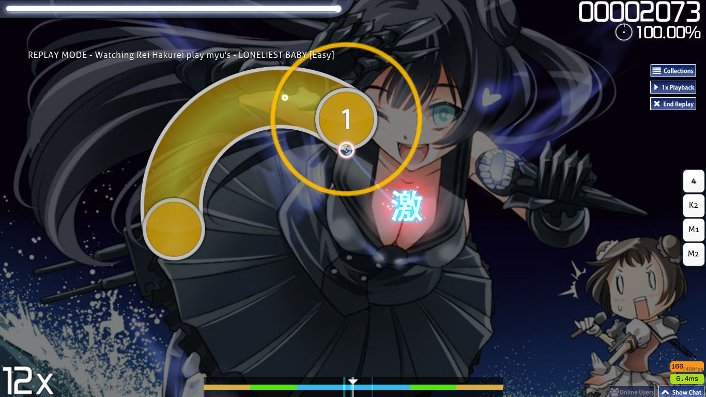

---
tags:
  - "300"
  - perfect
---

# Geki

*Lihat juga: [Katu](/wiki/Katu)*

**Geki (激)** atau *Elite Beat!* merupakan istilah dalam [penilaian](/wiki/Score) yang digunakan ketika pemain menyelesaikan suatu comboset dengan [akurasi](/wiki/Gameplay/Accuracy) sempurna.

Dengan mendapatkan Geki, health bar gain yang didapatkan cukup tinggi dibandingkan mengakhiri suatu comboset dengan 300 non-Geki.

Hal ini berasal dari permainan Nintendo DS Elite Beat Agents yang menjadi dasar [mode](/wiki/Game_Mode) [osu!standard](/wiki/Game_mode/osu!).

## Screenshots

Diberikan contoh dalam mendapatkan Geki/Elite Beat dalam Elite Beat Agents, Ouendan 2 dan osu! sendiri.

 

## Dalam mode yang lain

### osu!taiko

Ini hanya ditampilkan pada result screen untuk menunjukkan semua pukulan note besar yang berhasil didapatkan dengan sempurna.

### osu!catch

Ini menandakan bahwa comboset telah diselesaikan tanpa memecahkan combo yang sedang berjalan.

### osu!mania

Ini digunakan untuk menandakan **MAX** atau "320", dimana dalam mode ini nilai MAX merupakan dasar nilai tertinggi.
Tidak ada perbedaaan akurasi diantara 300 dan MAX pada mode osu!mania, karena itu penilaian ini memberikan nilai tambah dengan akurasi yang sama.

## Aspek permainan yang lain

### Storyboard (DS Games)

Ini memanggil storyboard terbaik dalam permainan. Biasanya ditunjukkan dengan semangat yang sangat kuat dalam melakukan hal tersebut.

### Storyboard (osu!)

Storyboard dalam osu! umumnya difokuskan untuk mode osu!standard.
Mendapatkan Geki akan beberapa hal terjadi:

- Fail Layer akan dinonaktifkan.
- Pass Layer akan diaktifkan.
- Memicu pemanggilan "Passing" apabila sebelumnya dalam keadaan Fail.

<!-- NOTE: for Indonesian translator, please use this as base of translation to EN one -->
