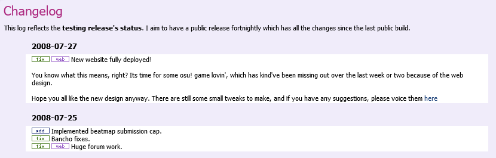

---
tags:
  - history
---

# Changelog

<!-- for the purpose of learning the history through the Wayback Machine (https://web.archive.org/), the changelog is available at different URLs:
  - http://osu.ppy.sh/?p=changelog
  - http://osu.ppy.sh/p/changelog
--->

The **[changelog](https://osu.ppy.sh/home/changelog)** is a page where the [osu! development team](/wiki/People/The_Team/Developers) details their day-by-day improvements, additions, and bug fixes to the game. All changes from prior releases are recorded here for archiving purposes.

The changelogs for the website and osu!(lazer) are generated automatically based on GitHub releases of those projects, while the rest are maintained manually.
## History

<!-- TODO(TicClick): wrap the images in infoboxes -->

The changelog has been started by peppy on September 11, 2007 in a dedicated forum thread titled "[Official Development Changelog](https://osu.ppy.sh/community/forums/topics/15)", where he would list notable changes and bug fixes, and sometimes share insights on upcoming plans.

")

In October, 2007, a web version of changelog [became available](https://osu.ppy.sh/community/forums/posts/2499) both through the website and the osu! updater.

On October 25, 2009, the changelog [became available via an RSS feed](https://osu.ppy.sh/community/forums/topics/19137).

")

On October 28, 2015, a graph with osu! versions distribution across the playerbase [was added to the changelog](https://web.archive.org/web/20151103161516/http://osu.ppy.sh:80/p/changelog), making the statistics open to the general public. At the same time, it became possible to filter the changelog by update stream.

## See also

In addition to the changes listed on the website, [peppy's blog](https://blog.ppy.sh/) may also be considered a form of changelog. Over the years, it has accumulated a vast collection of posts centered around osu!, its development, and ecosystem, including upcoming plans and developers' meeting notes.
