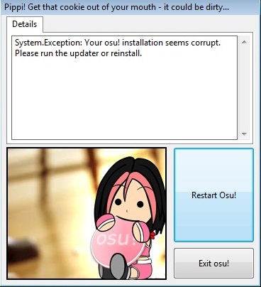

# Cookie

*Kunjungi juga: [Pedoman identitas visual](/wiki/Brand_identity_guidelines)*

**Cookie** adalah kata lain untuk logo osu! dan mengacu pada bentuknya. Cookie muncul berkali-kali di dalam klien gim. Itu bisa dilihat pada splash screen, menu utama, mode solo, dan sebelumnya di crash report lama seperti yang terlihat di bawah ini.

<!--TODO: Add images and links-->
