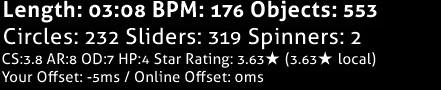
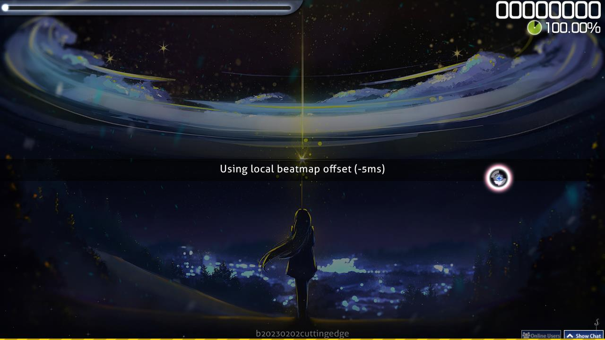

# Local song offset

*Pour le offset pendant le beatmapping, voir : [Offset](/wiki/Beatmapping/Offset)*

Le **Local song offset** est un décalage qui déplace l'apparence des [objets](/wiki/Hit_object) par rapport à l'audio des [beatmaps](/wiki/Beatmap) individuels. Cela peut être utile pour les joueurs qui ont des retards auditifs ou visuels. Le local song offset fonctionne avec le [décalage global](/wiki/Client/Options/Universal_offset) pour calculer un décalage total.

Au début du jeu, le local song offset peut être modifié en appuyant sur :

- `+` pour augmenter le décalage de 5 millisecondes
- `-` pour diminuer le décalage de 5 millisecondes
- `Alt` + `+` pour augmenter le décalage de 1 milliseconde
- `Alt` + `-` pour diminuer le décalage de 1 milliseconde

Si un local offset est défini, osu! affichera le local offset dans l'interface au-dessus du tableau d'affichage.

osu! vous informera également du local offset avant de commencer le jeu.

