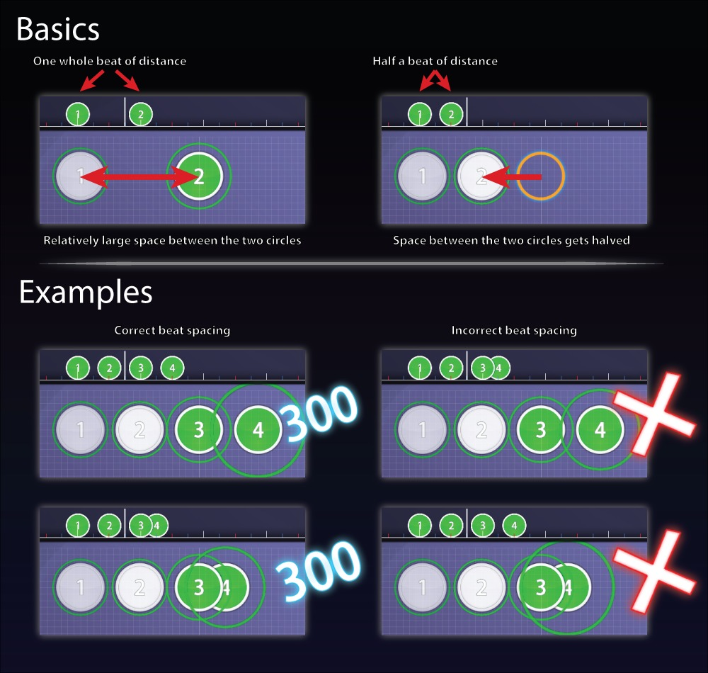
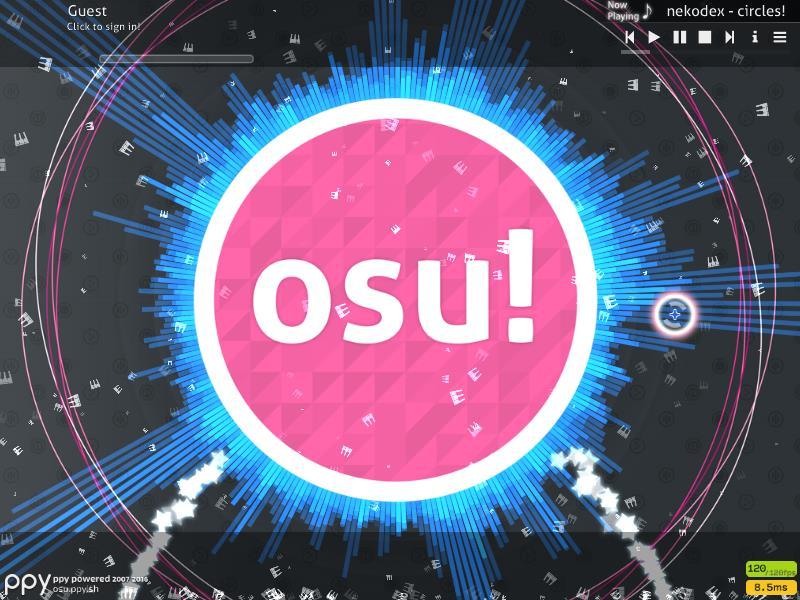
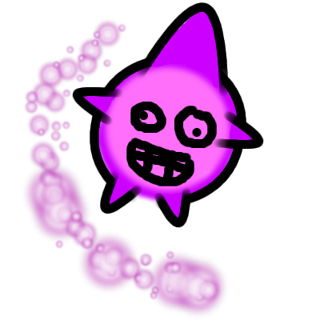

<!-- TODO: get rid of this ASAP. we have articles, redirects, and tags systems to replace this. -->

# Glossary

Throughout the years, the osu! community has adopted its own set of slang that may be confusing for newcomers. This page is a compilation of such terms for reference. Additions and edits are always welcome.

## A

### Abandoned Wasteland

A hidden sub-forum where the instructions to the moderators concerning it will: "Put stuff we do not really need in here." When a thread is or is said to be "wastelanded", it is moved there.

### Accuracy

A [game metric](/wiki/Accuracy) to measure the player's rhythmical accuracy. Sometimes shortened to *Acc*.

### AFK

*Short for "away from keyboard".*

A term used when an active user walks off to do something else while they are still signed in. osu! will mark users as "Idle" if they have been inactive for some time.

### Approach Circle

In [osu!standard](/wiki/Game_mode/osu!), the approach circle is the outermost circle that will enclose the hit circle, the start of a slider, or the centre of the spinner (for older skins). When the approach circle touches the outer border of the hit circle or slider you should click. For spinners (older skins), the approach circle will indicate the duration of that spinner.

### Authentic

Authentic denotes a beatmap that emulates in every aspect of a specific stage from the [DS games](#ds-games) (song, settings, object placement, etc.).

### Aspire

A beatmapping [contest](/wiki/Contests) where the creators are encouraged to fully ignore the [Ranking Criteria](/wiki/Ranking_Criteria). The resulting beatmaps tend to be cosmetically appealing displays of absolute madness, but are often nearly impossible for average players to play.

## B

### Bancho

*Related: [BanchoBot](/wiki/BanchoBot)*

The easily expandable server coded by peppy. Bancho replaces the need for a third-party [IRC](/wiki/Internet_Relay_Chat) (Internet Relay Chat) server in the management of all online content in osu!. Signing in with an osu! account in-game will automatically attempt to connect to Bancho until done successfully.

### Beat

A term that applies to the timeline in editor mode. It is a period of time that songs can be divided into based off of their BPM. A correctly timed beatmap will have each beat correspond to the song's rhythm and a whole beat should fall between two white lines on the [timeline](/wiki/Beatmap_Editor/Timelines).

For more information about the timeline, see [Beat Snap Divisor](/wiki/Beatmap_Editor/Beat_Snap_Divisor).

### Beat Spacing

A principle that applies to [osu!standard](/wiki/Game_mode/osu!). This states that the spacing of every [hit object](/wiki/Hit_Objects) (except for spinners) should be either closer, if closely placed on the timeline, or farther, if placed farther apart on the timeline.

This basically means:

- closer in time = closer in space
- farther in time = farther in space

Your beat spacing plays a crucial role when the player is playing your beatmap! Consistent beat spacing is a basic requirement to rank a beatmap because it provides the player with a more intuitive experience as the player will learn where to move their cursor along the screen, at a constant speed.

Placing an object closer than the beat spacing may trick the player into clicking on them too soon. On the other hand, placing them too far may force the player to move their cursor across the screen to click on them in time. A common exception to beat spacing is stacked hit circles.

To ensure consistent beat spacing, turn on the `Distance Snap` button on the right-hand side of the editor. You can choose a beat spacing value by holding `Alt` and sliding the selector at the top right until you reach the desired value. Note that the higher the value would allow a more difficult beatmap.

### Beatmapset

The collection of beatmaps that are packaged inside the `.osz` file. These beatmapsets are beatmaps that were created under the same mapper.

Beatmapsets will always have the same music, sounds (if mapped), and video (if any) or storyboard (if any). However, do note that some beatmaps from a beatmapset may specifically contain a certain sounds, background images, or storyboards that are separate from the others.

### Bit Rate

The number of bits per second that can be transmitted along a digital network. Almost every music file contains something called a "bit rate".

This means that a *higher bit rate* will generally mean *higher quality* (but bigger file size). Whereas, a *lower bit rate* will generally mean *lower quality* (but smaller file size).

Bit rates typically range from 96kbps (kilobits per second) to 320kbps. This is quite a wide range that music can use. However, the [ranking criteria](/wiki/Ranking_Criteria) explicitly states that all music files must range from **128kbps - 192kbps**.

You can usually check to see the audio file's bit rate by checking the file properties of that file. Another way to check is whether or not [AiMod](/wiki/Beatmap_Editor/AiMod) says that the audio file's bit rate is too big. If either appears to be true, this means that you will have to lower the bit rate. A few methods on re-encoding audio can be found at [Audio Editing](/wiki/Guides/Audio_Editing).

### BG

*Short for "background".*

Refers to the background image and/or video of a beatmap. Inside a beatmap folder, BG (sometimes stylized as *bg*) is usually the name for the background image.

### Blanket

A mapping term to describe when a slider covers the shape of another object. A guide to making them can be found [here](/wiki/Mapping_Techniques/Making_Good_Sliders#beat-blankets)

### BN

*Short for [Beatmap Nominator](/wiki/People/Beatmap_Nominators).*

Used to refer to the group itself or one of its members.

### BPM

*Main page: [Beats per minute](/wiki/Beatmapping/Beats_per_minute)*

*Short for "beats per minute".*

Represents the number of whole beats in a minute.

Higher-BPM music may be associated with a higher [approach rate](/wiki/Beatmapping/Approach_rate) value and vice versa.

### Break

A term used when a section of a beatmap has no objects. During this time, the drain in the life bar is temporarily halted. Breaks usually allow the player to rest their arm for a short while and reposition their input device.

Depending on the settings, when a break is initiated, letterboxes (the black horizontal bars on the top and bottom off the screen) may appear. In addition to this, a passing or failing graphic and sound will appear and play to indicate if the player is doing well or not, if there is enough time.

The use of break times in [osu!mania](/wiki/Game_mode/osu!mania) maps is heavily discouraged.

### BSS

*Short for [Beatmap Submission System](/wiki/Submission).*

When a [creator](#creator) has finished mapping their [beatmap](/wiki/Beatmap) and is ready to share their creation around the world, they must submit it using the BSS. When doing this, the BSS will automatically assign a forum thread and will generate a post with information about your beatmap. The forum thread it generates will help you get feedback from modders and other players who play your map. Lastly, the [difficulties](/wiki/Beatmap/Difficulty) of your beatmap will be given [BeatmapIDs and a BeatmapSetID](/wiki/Beatmap#identification) and can be commented on during replays.

For a complete rundown, check out the [Submission](/wiki/Submission) page.

## C

### Changelog

A page where peppy and the osu!dev team details their day-by-day improvements, additions and bug fixes.

To see the changelog, see the [Changelog Listing](https://osu.ppy.sh/home/changelog).

### Choke

A term used when the player almosts obtains a full combo while playing a beatmap, but combobreaks near the end.

On the contrary, a reverse choke is when the player combobreaks at the beginning but obtains a full combo for the rest of the beatmap.

### Collab

Short for [collaboration](/wiki/Beatmap/Beatmap_collaborations).

### Combo

Combo has two meanings:

1. A set of hit circles and sliders that comes one after another (also called a *comboset*).
2. The number representing the number of objects a player has hit consecutively without missing or [sliderbreaking](#sliderbreak) once.
   - This number is displayed in various places:
     - Bottom-left in [osu!standard](/wiki/Game_mode/osu!).
     - On the drums in [osu!taiko](/wiki/Game_mode/osu!taiko).
     - Above the fruit catcher in [osu!catch](/wiki/Game_mode/osu!catch).
     - Centre of the stage in [osu!mania](/wiki/Game_mode/osu!mania) (vertical height varies by skin).

The *max combo* is the player's highest achieved combo throughout their play.

### Combo Colour

A colour that that separates a comboset from another.

In osu!standard, all [combosets](#comboset) have a colour. A new combo is started when the colour of the hit object changes. The colours will keep repeating themselves depending on how many the mapper defined (or how many your skin's `skin.ini` file defines). There is a minimum of 2 and a maximum of 8 combo colours.

In osu!catch, each fruit is coloured in the order given. Droplets and end-slider fruit will always have the same colour as the start-fruit. However, bananas will always have a tint of yellow.

When editing a beatmap, one can change those colours and/or their order in the [Song Setup](/wiki/Beatmap_Editor/Song_Setup) section.

For skins, the skin properties for the combo colours is located on in the `[Colours]` section of the `skin.ini`. However, do note that the skin's defined combo colours is only used when the mapper does **not** define them.

### Combo Fire

The combo fire was a background gameplay feature from the ouendan game integrated in osu!. This would display a burning yellow flame after obtaining the first [combo milestone](#combo-milestone), 30. If the player obtains a combo of 500, the combo fire colour will change from yellow to blue. The combo fire will extinguish itself if the combo was broken but would still be reobtainable.

This feature was later disabled on 2013-03-05 due to performance concerns.

### Combo Milestone

A set of numbers that will shoot stars and display a comboburst (if enabled in the [options](/wiki/options)) after obtaining one of these milestones.

The combo milestones for osu!standard and osu!catch are 30, 60, 100, and multiples of 50 after 100. For osu!taiko, the combo milestones are multiples of 50. For osu!mania, the combo milestones are multiples of 100.

### Combo Multiplier Effect

The combo multiplier effect occurs in the osu!standard, osu!taiko, and osu!catch game modes. This occurs because said game modes use the player's current combo as a part of the score calculations. Meaning that a player would get a higher score, if they had gotten a full combo, than someone who played the same map with a broken combo.

However, if you obtain a combo of ~10,000, your score will begin to count backwards. This is a flaw with the 32-bit signed integer where (in computing) the max integer is 2,147,483,647. A new scoring system, [scoreV2](/wiki/Score#scorev2), is in the works to fix this.

### Combobreak

A term used when the player loses their combo during any part of playing a beatmap.

### Comboburst

A celebration of achieving a [combo milestone](#combo-milestone).

- For osu!standard and osu!catch, a character will *burst* out from either the left or right side of the window.
- For osu!taiko, a collection of flowers will *burst* behind pippidon.
- For osu!mania, a character will *burst* from the right side of the stage (or left side or both if specified in the `skin.ini`).

In addition to this, for osu!standard, osu!taiko, and osu!catch, stars will shoot out from either the left or right side of the playfield, for combos less than 100, then both sides for combos 100 or higher. For osu!mania, the stars will shoot out from the left and right sides of the stage.

Combobursts can be disabled in the options.

### Comboset

A group of combos that starts their count at 1 and goes up for each hit circle and/or slider until a spinner or a new comboset starts.

The last object in a comboset can help give the player a little health boost if they obtain a hit score of 300 ([Geki](#geki)).

In osu!catch, once a comboset is completed, the fruit will jump off of the plate.

### Cookie

*For cookie usage guidelines, see: [Brand identity guidelines](/wiki/Brand_identity_guidelines)*

Another word for the osu! logo. This has appeared many times in the osu! client. The cookie is seen in the main menu, solo mode, and previously in old crash reports as seen below.

### Creator

A creator refers to the user who uses the [beatmap editor](/wiki/Beatmap_Editor) to create a [beatmap](/wiki/Beatmap).

## D

### Downbeat

A musical term for the first beat of a measure.

This term was coined from orchestral conducting because when the baton moves in a downward motion, it depicts the first beat of the measure.

### Drain Time

The drain time, or *drain*, refers to the total duration of the beatmap that requires the player to be active. Drain time does not consider the breaks and unmapped parts throughout the beatmap.

Maps with very long drain times are typically referred to as [marathon](#marathon) maps and require endurance beyond the norm in order to complete successfully.

Maps must have at least 45 seconds of drain time be considered rankable.

### DS

*Short for "distance snapping".*

This term is usually seen during the modding process.

### DS Games

A collective term for *[Osu! Tatakae! Ouendan!](https://en.wikipedia.org/wiki/Osu!_Tatakae!_Ouendan)* (also called "Ouendan" or "Ouendan 1"), *[Moero! Nekketsu Rhythm Damashii Osu! Tatakae! Ouendan! 2](https://en.wikipedia.org/wiki/Moero!_Nekketsu_Rhythm_Damashii_Osu!_Tatakae!_Ouendan!_2)* (almost always called "Ouendan 2") and *[Elite Beat Agents](https://en.wikipedia.org/wiki/Elite_Beat_Agents)* (also called "EBA").

A set of rhythm games, developed by [iNiS](https://en.wikipedia.org/wiki/INiS) for the Nintendo DS handheld video game system, which share a lot of gameplay and presentation elements.

The osu!standard game mode was is mostly based off of those games.

## E

### EBA

EBA has two meanings:

- Elite Beat Agents, one of the DS games that osu! is based on.
  See [Elite Beat Agents - Wikipedia](https://en.wikipedia.org/wiki/Elite_Beat_Agents) for more details.
- The collective term for the playable characters in that game (referring to meaning above) (e.g. "The EBA" or "The Agents").

## F

### Fail

Fail has three meanings:

- The incompletion of a beatmap due to:
  - Not filling the health bar up to 80% when completing a beatmap (in [osu!taiko](/wiki/Game_mode/osu!taiko)).
  - Empty health bar ([osu!standard](/wiki/Game_mode/osu!), [osu!catch](/wiki/Game_mode/osu!catch), and [osu!mania](/wiki/Game_mode/osu!mania)).
- In multiplayer, an indicator underneath the player's name to show they have failed the beatmap.
- The player having less than 50% health during a break; where an indicator will display if you failed the section.
  - A fail indicator will be shown.
  - A failed storyboard animation will be played instead (if available).

### FC

*Short for "full combo".*

A term used when a player completes a beatmap while obtaining the maximum combo possible. This does not account accuracy as it is often used to mean clearing a beatmap without having any misses or [sliderbreaks](#sliderbreak).

Due to the [combo multiplier effect](#combo-multiplier-effect), full combos will give the most score in the osu!standard, osu!taiko, and osu!catch modes.

### Featured Artist

*Main page: [Featured Artists](/wiki/Featured_Artists)*

A featured artist is an artist who has officially licensed their music for use in osu!. Their music has been cleared by the osu! team and their songs are suitable for beatmapping. All tracks from featured artists include a pre-timed `.osz` file to help you focus on beatmapping.

## G

### Geki

Geki(激), or *Elite Beat!*, is a scoring term used when you complete a [comboset](#comboset) with the highest accuracy on every note.

### Grade

A grade, usually confused with "rank", is a letter-grade that represents the player's performance after playing a beatmap. It accompanies the total score at the result screen and appears in all lists where scores appear.

From lowest to highest, the possible grades are F, C, B, A, S, Silver S, SS, and Silver SS.

### Graveyard

A subforum for beatmaps that were abandoned. Graveyarded maps do not count towards a user's total upload limit. The owner may revive them by updating, which sends them back to being a Work in Progress. This requires having a free pending slot.

Beatmaps that are not updated or receive no posts from their owner for 28 days will be automatically sent to the Graveyard.

### Grid Snapping

Grid snapping refers to a button on the right hand side of the editor screen.

Enabling it will force every newly placed (or existing, but moved) object to snap along the intersections of the grid.

The base level of spacing between each sector of the grid can be adjusted by pressing `G` or by going to `View` then `Grid Level`. Grid snapping can help with aligning objects to each other and arranging them in patterns.

### Guest Difficulty

Guest difficulty, or *GD*, refers to any difficulty made by a creator for inclusion in another creator's set. Guest difficulties usually have the creator's username as the difficulty's name.

There are many reasons for guest difficulties to exist:

- Etiquette in the community can make it difficult for multiple creators to upload beatmaps of the same song around the same time.
  - The guest creator, interested in creating a beatmap that song, may choose to contribute a difficulty to an existing work in progress beatmapset instead.
- The guest creator may also decide, after-the-fact, upon playing the beatmap that they want to create a difficulty for it.
- The guest creator did not want to put in the effort in creating the difficulties on their own, but would rather just create one and give it to another creator.

On the other hand, it may be the creator who wants a few guest difficulties:

- To give the mapset a "community effort" feel.
- The creator did not want to create such difficulties by themselves

Guest difficulties are often requested by private messages in-game or via forum private messages. Guest difficulties can also be requested in the modding queues, especially those who are offering to do them.

More than one guest creator is allowed to contribute to a beatmapset, including creators from any one of the four game modes. If an additional game mode is to be featured in a beatmapset, that game mode must have at least two difficulties that follows the [Ranking Criteria](/wiki/Ranking_Criteria). Each guest creator is also allowed to create more than one difficulty to contribute to the beatmapset, as long as the number of difficulty versions created by the guest creator does not exceed the number of difficulty versions of the creator/uploader (this is to determine who should upload the beatmapset).

## H

### Hitsound

Hitsounds are the sounds that osu! plays in response to user input when completing one of the hit objects in the game. This is in contrast to the underlying music and sounds created by the user interface.

Hitsounds are used to provide an auditory feedback mechanism to the player to help them judge their timing. These are complementary to approach circles and spacing which are the visual mechanisms used to communicate timing information.

There are 4 types of hitsounds:

- *(normal)* (used when none of the below are used)
- whistle
- clap
- finish

These are added to make the hitsounds sound more expressive and let the player feel more like they are part of the music. osu! provides a wide array of hitsounds (eight in the stable release, since upgraded to twelve). Though, creators can go further add up to 24 more. Sliders also have ambient sound effects when they are being performed successfully, including a recurrent ticking sound which matches the beat.

### Hype

Unranked beatmaps gain exposure by receiving `Hype` posts on their discussion threads. These posts can only be made in the `General (All difficulties)` tab of a [beatmap discussion](/wiki/Beatmap_Discussion). A beatmap needs 5 hypes before it is elligible for nomination.

## I

### Ignore List

A blacklist of words (or users) that the player does not want to be displayed in the [chat console](/wiki/chat_console).

## J

### Juice stream

An osu!catch element that includes Drops and Droplets. Drops give a score of 100, equivalent to slider ticks in osu!standard, while Droplets give a score of 10, equivalent to the [slider tick](#slider-tick) in osu!standard.

Missing a Drop breaks the player's combo, but missing a Droplet does not.

The visual difference between Drops and Droplets is that a Drop is twice as big as Droplets are.

## K

### Katu

Katu(喝), or *Beat!*, is when you complete a particular combo without achieving the highest level of accuracy throughout that set.

This is different than a Geki(激) because the comboset was not done perfectly with 300s.

### Keys

In [osu!mania](/wiki/osu!mania), the number of keys can determine the beatmap's difficulty. The more keys you have, the more the player has to focus for each key column.

### Kiai

A term given for a "special" timing section to help emphasize a part of a beatmap. A player can tell if a part of a beatmap has a kiai timing section by seeing added visual effects such as flashing beats, flying stars, and fountains.

Keep in mind that overuse or misuse of kiai can be disorienting! Thus [creators](#creator) are advised to use it judiciously (or when it makes sense).

### Kudosu!

*For a guide on rewarding kudosu!, see: [Beatmap Discussion/Kudosu!](/wiki/Beatmap_Discussion#kudosu!)*

A form of reward obtained from modding beatmaps. The term "Kudosu" is named after a combination of the words "kudos" and "osu!".

Before awarding kudosu keep the following things in mind:

- Did the post help you in any way **to improve your map**?
- Did the modder post things **that AIMod cannot pick up**?
- Did the post show that the modder has **knowledge of modding**?
- Did the modder post things that generally **make sense to you and seem not too terribly picky?** If their post did seem picky, are you sure that the things pointed out **can improve your mapset anyways?**
- Even if you do **not** follow the modder's advice, did you not follow it because of **your personal choice only**, and not because **the modding seemed pointless to you?**
- Did you not already give the modder kudosu for a mod post on the same map **recently**, and if you did, has the map **vitally changed** between the two mod posts (adding a difficulty, remapping a difficulty)?
- Was this a **substantial mod post?** Did the mod post point out more than a couple of things to improve or fix your map?

If you can answer yes to all of these questions, **feel free to give the modder their well-earned kudosu!**

The creators of a beatmap can give a modder kudosu by simply going to the mod post and click the `Give Kudos` button that is located under the poster's information. Please be aware that beatmap nominators may revoke your kudosu if they deem that your post should not have been awarded kudosu!

## L

### Lead-in

A 3 second time period of silence that is sometimes automatically be inserted before the beginning of a beatmap. This only happens if the creator has placed objects right at or very close at the start of the song.

### Life Bar

The life bar, also known as the *health bar*, *HP bar*, *spirit bar*, or *ki bar*, is a bar at the top left of the playing screen for [osu!standard](/wiki/Game_mode/osu!), [osu!catch](/wiki/Game_mode/osu!catch), and [osu!taiko](/wiki/Game_mode/osu!taiko). For [osu!mania](/wiki/Game_mode/osu!mania), the life bar is rotated 90 degrees anti-clockwise and is placed next to the bottom-right of the stage.

In all modes, expect for osu!mania, there is a symbol moving along it indicating the player's life. If the bar is completely empty, the player fails the current beatmap (assuming no special game modifiers are enabled).

osu!standard and osu!catch will have health drain at a constant rate—known as *passive HP*—throughout the course of a beatmap, except during breaks.

For osu!standard, the bar is replenished by the player [tapping](#tap) hit circles, following sliders and slider ticks, and spinning spinners. The more accurate the tapping, the bigger the boost. The player also receives larger boosts if he achieves a [katu](#katu) or an [geki](#geki) at the end of a combo.

For osu!catch, this can be done by catching fruit and drops.

For all game modes (except osu!taiko), a sizeable part of the bar is also depleted in case of a miss.

### Local Song Offset

*For other uses, see [Offset (disambiguation)](/wiki/Disambiguation/Offset).*

An offset set for individual [beatmaps](/wiki/Beatmap), not the entire beatmapset itself. This is to offset the beatmap's offset alongside the global offset.

At the start of gameplay, you can change your local song offset by pressing:

- `+` to increase the offset by 5 milliseconds
- `-` to decrease the offset by 5 milliseconds
- `Alt` + `+` to increase the offset by 1 milliseconds
- `Alt` + `-` to decrease the offset by 1 milliseconds

If a local offset was defined, osu! will display the local offset in the interface, above the scoreboard. osu! will also notify you of the local offset before starting gameplay.

### Loved

A state of ranking for beatmaps that don't follow the [ranking criteria](/wiki/Ranking_Criteria) and are therefore unrankable, but are considered popular enough to deserve their own leaderboards. Loved beatmaps contribute to a user's total playcount, but does not contribute to their performance points.

### Looping

From the [ranking criteria](/wiki/Ranking_Criteria), the required [drain time](#drain-time) **must** be at least 30 seconds. If the audio is too short, it can be looped to add more drain time.

## M

### M4M

*Short for "mod for mod".*

A term describing when a modder agrees to mod another modder's beatmap in return for a mod on their own beatmap.

### Marathon

A type of [beatmap](/wiki/Beatmap) that can only be [approved](/wiki/Beatmap/Category#approved).

Marathon beatmaps are considered to be at least 6 minutes long and can only have one mapped difficulty. However, some marathon mapsets may contain a single [osu!taiko](/wiki/Game_mode/osu!taiko) variant as well.

Marathon beatmaps are often collaborative efforts, as mapping longer tracks is a draining endeavour when done solo.

Upon the creation of the marathon beatmap, one should name their beatmap version "Marathon" to bypass the [BSS](#bss) from preventing the pending status.

### MAT

*Short for "Modding Assistance Team".*

A group of users experienced in modding. MAT members were able to mark any beatmap they approve of with a bubble. This bubble would note that the beatmap as worthy of further consideration by the BAT. As of the 2013-04-23, all members of the MAT at that time were promoted as full members of the [BAT](/wiki/BAT), with the MAT team decommissioned.

### Mod Request

A term used when a creator is in need of help. This can be from fixing possible mistakes to requesting for [guest difficulties](#guest-difficulty). While, typically, the song is still playable, the only reason someone would scroll here is if (and only if) you know what you are (and will be) doing and willing to mod the map for them.

Keep in mind that the beatmap or beatmap may be incomplete, so be a considerate person and (if you had tried the beatmap) tell them what is wrong it.

### Modder

A term given to a user that gives comments or suggestions on another [creator's](#creator) beatmaps in the forums. Doing so is called *[modding](/wiki/modding)*, and the posts are referred to as *mods*.

Activities are shown either at [Works In Progress/Help](https://osu.ppy.sh/community/forums/10) (including the [Modding Queues](https://osu.ppy.sh/community/forums/60)) and/or [Pending Beatmaps](https://osu.ppy.sh/community/forums/6).

## N

### NC

NC has two meanings:

1. Short for *new combo*, a modding term to suggest that a beat needs to be the start of a new combo.
2. An abbreviation for the [Nightcore mod](/wiki/Game_modifier/Nightcore), a variant of the [Double Time mod](/wiki/Game_modifier/Double_Time) but increases the pitch of the music and adds in a consistent bass drum beat to the music.

### NM

NM has two meanings:

1. Short of *NoMod*, used to describe when a player does not enable any [game modifiers](/wiki/Game_modifier).
2. An abbreviation for Normal, used as a [difficulty](/wiki/Beatmap/Difficulty) name for [osu!mania](/wiki/Game_mode/osu!mania) beatmaps.

### Nuke

Any [beatmap](/wiki/Beatmap) that is considered to be disregarding the rules (or the mapper disregarding the [Code of Conduct](/wiki/Ranking_Criteria/Code_of_Conduct)) can be nuked. Nuked beatmaps are considered "closed" until significant changes are made and the status is manually removed by a member of the team.

Examples include but are not limited to:

- Not following the basics of the guidelines.
  - Contains really bad timing
  - Has objects placed randomly on the grid and/or timeline but are also extremely challenging or unconventional beatmaps (e.g. consisting of a single spinner).

The warning icon that accompanies nuked beatmaps is the radioactive symbol ().

## O

### Offset

A period of time between the beginning of a beatmap's song file and the instant the first beat of the rhythm is heard, from which the position of the first beat is calculated. This is measured in milliseconds (ms).

The offset is the first half of beatmap timing, where the other half is the [BPM](#bpm).

### Online Song Offset

An offset that is **already** applied to a beatmap after it was ranked. Adjusting your [local song offset](#local-song-offset) will only add more to this value.

### osu!

osu!—stylised with a lowercase "o"—has three meanings:

- The rhythm video game.
- The game mode (unofficially called *osu!standard* to prevent ambiguity).
- An informal greeting in the Japanese language, resulting from condensing the phrase "Ohayo gozaimasu!" (Good morning!)
  - Pronounced with a silent u ("OSS").
  - Close English equivalents include "Yo!" or "Hey!". To read more about its meaning in Japanese language and culture, see [Does anyone here speak/learn Japanese?](https://osu.ppy.sh/community/forums/posts/2686).

### osu!coin

- osu!academy introduces the osu!coins: [Introduction to osu!coins (April Fools' 2015)](https://www.youtube.com/watch?v=BImc5McuK1o)
- peppy announces the osu!coins: [osu!coins!](https://osu.ppy.sh/home/news/2015-03-31-osucoins)

The osu!coin was the in-game currency that was still "in development", as a 2015 April Fools joke.

After peppy realizes that the current rate of return would not allow him to purchase a private jet within his lifetime, the osu!coin was introduced as the new in-game currency. Every player will start off with 10 osu!coins and will be given 10 osu!coins per day. Existing users will get an additional two osu!coins right off the bat.

One osu!coin will give the player one play, while retrying a beatmap will consume one osu!coin. If the player obtains a combo that is a multiple of 100, they will obtain one osu!coin. If the player runs out of osu!coins, they may purchase more—out of their own will—with these exchange rates:

- 1USD = 1 osu!coin
- 10USD = 10 osu!coins
- 999USD = 1000 osu!coins (0.001% savings!)
- first unborn child = infinite osu!coins (unborn child will work for osu!)

The following day, peppy rolled back the implementation of osu!coins due to popular demand, and ended with [this remark](https://osu.ppy.sh/home/changelog/cuttingedge/20150401).

### osupixel

The representation of one screen pixel when osu! is running in 640x480 resolution. osupixels are one of the main coordinate systems used in osu!, and apply to hit circle placement and storyboard screen coordinates (these pixels are scaled over a 4:3 ratio to fit your screen).

In contrast, textures are scaled such that one texture pixel ([texel](https://en.wikipedia.org/wiki/Texel_%28graphics%29)) corresponds to one screen pixel at 1024x768 resolution.

### Ouendan

Ouendan has three meanings:

- In Japanese culture, a cheer squad which, similar to western cheerleaders, rallies a sports team on using drums, horns, banners and yells of encouragement.
- The pair of Japanese DS games that osu! is based on.
  This term may sometimes be used to refer specifically to the first of these games.
- A collective term for the playable characters in the aforementioned games, e.g. "The Ouendan".

### Overmapping

A term used when the hit objects or placement of hit objects are placed in a way that makes the difficulty of the map contrast the actual song.

This can be done by adding unnecessary jumps, slider speed-ups, or by mapping to an unknown beat in the music consistently (i.e. adding notes on blue ticks when the song is only using red ticks), in order to add difficulty.

There are two ways to avoid this:

1. Jumps, slider speed-ups, and other difficulty increasing techniques should only be used when they fit with the music.
   - If there is no sudden change that requires (or could greatly be supplemented with) then simply do not add them.
   - Insane beatmaps are not to show how hard you can make a beatmap, but rather how well you can make a map that is difficult but fun.
2. The map might not need an Insane difficulty.
   - If you feel that your map is too boring without adding a plethora of difficulty increasing techniques, then maybe your map does not need it.
   - Remember, mapsets do not require a Insane difficulty, so you will be just fine without one.

This topic was discussed in an episode of [osu!talk](/wiki/osu!talk) ([osu!talk special Over Mapping](https://www.youtube.com/watch?v=RepSYE3hN3A)) that overmapping actually has a positive effect in [osu!taiko](/wiki/osu!taiko) beatmaps because the drums plays an important role in a song.

## P

### Pass

Pass has two meanings:

- The completion of a [beatmap](/wiki/Beatmap) with or without the use of mods.
- The player having more than 50% health during a [break](#break).
  - An indicator will display if you passed the section.

### peppy

The online alias of Dean Herbert—stylised with a lowercase "p". He is the creator of the osu! project and its primary developer.

### Play Time

The total duration of a beatmap. This includes the lead-in time and the break time(s).

### pp

*Short for [Performance Points](/wiki/Performance_Points).*

The main ranking metric of the game.

### puush

A screen capturing and file uploading application developed by peppy. puush was a successor of sorts to upppy which is still commonly used to upload and share images in osu!

puush stopped accepting new registrations since 2018.

For more information about puush, see [puush / home](https://puush.me).

## Q

### QAT

*Short for [Quality Assurance Team](#quality-assurance-team).*

Used to refer to the group itself or one of its members.

### Quality Assurance Team

The group predating the [Nomination Assessment Team](/wiki/People/Nomination_Assessment_Team) that managed the Ranked beatmap category. They were responsible for handling beatmap disqualifications, managing the [Beatmap Nominators](/wiki/People/Beatmap_Nominators) and other miscellaneous work in the modding and mapping scene. On 6 May, 2019, the QAT was renamed and repurposed into the NAT.

## R

### Rank

Rank has three meanings:

1. Another word for a letter grade.
2. A player's standing in the online leaderboard (also known as "player ranking").
3. The verb "to rank". When someone seconds another moderator's nomination and include a submitted beatmap to the ranked beatmap list, making scores achieved by anyone playing it count towards each player's ranking.

### Ranking

Ranking, alternatively called *leaderboard*, is a list that sorts members of the osu! community according to certain criteria. This can also refer to one's position in such a list.

osu! currently has five rankings:

- [pp](#pp) rankings: the ranking most commonly referred to, based on the player's pp.
- Chart rankings: based on ranked score for beatmaps in a chart.
- Score rankings: based on the ranked score.
- Country rankings: based on the collective scores of players per country.
- [Kudosu](#kudosu) rankings: based on kudosu! count.

### Recalc

*Short for "Recalculate slider lengths".*

Recalc is a command under the `Timing` header of the editor screen.

Usage of this is suggested after a [BPM](#bpm) change is made, if the beatmap already has sliders. This command will automatically adjust the length of every slider in the beatmap to the new BPM. If used, it is important, especially if a large change in BPM has been made, to check every slider and adjust its length manually, where necessary.

### Resnap

A pair of commands under the `Timing` header of the [editor](/wiki/beatmap_editor) screen. One of which applies to the entire [beatmap](/wiki/Beatmap) and the other to the current timing section (if the beatmap has only one timing section, both commands are the same).

Usage is suggested when there has been a change in offset and/or BPM, after objects have been placed. This command will automatically reposition all objects on the timeline so that they fall on the closest beat division your snap divisor allows. If used, it is important, especially if a large change in BPM and/or offset has been made, to check every object and adjust its position on the [timeline](/wiki/Beatmap_Editor/Timelines) manually, where necessary.

### Restricted Mode

A state automatically applied to accounts that are suspected of breaking the [Terms of Service](https://osu.ppy.sh/legal/terms). Submitted scores of gameplay will be hidden from the leaderboards.

For more info, see [What is "restricted" mode, exactly?](/wiki/Help_Centre#restriction).

### RSI

*Short for "repetitive strain injury".*

A type of injury that affects the musculoskeletal and nervous system of the body. This can be caused by doing repetitive tasks in an awkward position which may include playing osu! for an extended amount of time.

## S

### Sample Set

The collection of sound effects that are heard during gameplay.

These are categorized under three names:

- Normal
- Soft
- Drum

Inside each categories has these four hitsounds:

- *(normal)* (the sound when none of the below is used)
- whistle
- clap
- final

However, there are other parts of a sample set that may include the slider tick sounds and the sound made when filling the spinner metre.

### Silence

An action taken against an user who spams the [chat console](/wiki/chat_console). Silences will stack on top of each other, adding more time for each one.

Silences lasts for 4 weeks before being reset, along with the time that gets added.

### Skin

A set of graphics and custom sample sets (audio clips) that can replace the default ones used by osu!. This will allow for a more customised user experience. Most of what you see and hear in osu! can be skinned.

To see the dedicated sub-forum for skins, see [Skinning](https://osu.ppy.sh/community/forums/15).

To see the list of skinnable elements, see [Skinning](/wiki/Skinning) (and its subpages).

### Skinner

A skinner refers to the user who releases downloadable skins on the forums.

### Sliderbreak

Sliderbreak has two meanings:

- In [osu!standard](/wiki/Game_mode/osu!):
  - Tapping the slider-start too early (this can cause the slider to shake).
  - Not collecting a slider tick (includes the hidden ones underneath the slider-start and slider-end).
  - Releasing the slider ball before it hits the slider-end.
    - This will not cause a miss, but instead will give the player a 100 with no combo increment.
- The case where the player does not obtain the max possible combo without missing an object.

### Slider Tick

A hit object that gives out 10 points. The amount of slider ticks used in a slider is dependent on the slider velocity, the [BPM](#bpm) and the inherited timing.

### Spectate

Spectate, or spec, is when someone watches another player playing a [beatmap](/wiki/Beatmap) in real time (with approx. 500ms delay). To spectate, open the extended chat and click on a grey user panel.

For this to work, you will need to have a copy of the exact same beatmap the player you wish to spectate is playing. However, if you have an [osu!supporter](/wiki/osu!supporter) tag, the beatmapset will be downloaded and processed for you.

### Spectator Aura

A mysterious phenomenon that could cause players to [choke](#choke) their [combo](#combo), or fail a beatmap from having a spectator(s) spectate their gameplay.

### Stacked

Stacked objects are hit objects that overlap each other in the playfield. The most common object that is stacked are hit circles.

Stacking hit circles (a clear violation of beat spacing) is, nevertheless, permitted if the hit circles are very close to each other in the timeline (half a beat or usually even less).

### Standard

*Main page: [osu!standard](/wiki/Game_mode/osu!)*

Standard refers to the game mode in osu! and has been used since it is the first game mode. This is sometimes stylized as *osu!standard* or osu! (without italics).

This term is used greatly within the osu! wiki to prevent ambiguity between osu! (the framework, game client, etc.) and the game mode itself.

### Star

Star has four meanings:

1. A stage in a beatmap's modding process where a moderator judges a beatmap to be on the right track but needing some improvements before approve with a bubble.
   - Examples include adjustments in timing, incorrect beat spacing in some areas, or creating additional difficulty versions.
   - Beatmaps receiving a star are denoted by a star graphic next to their thread's title.
   - A star may be removed by another mod if the beatmap is thought to be in need of more improvements.
2. Another term for "Star Rating".
   - The symbol that represents the difficulty of a beatmap.
3. Another term for "[Kudosu](#kudosu)".
   - These are given to beatmap modders and can be used to raise a beatmap above others.
4. Another term for "[Star Priority](#star-priority)".
   - These stars are given to [osu!supporters](/wiki/osu!support) and are used in [Feature Requests](https://osu.ppy.sh/community/forums/4).

### Star Priority

Star priority has two meanings:

1. A method of helping Beatmap Nominators to find beatmaps worthy of bubbling and later ranking.
   - The star priority of a beatmap is determined by how many mod posts that have gained kudosu in the beatmap's thread, the sum of kudosu stars the map set has received.
   - A kudosu star can be given by any user to any beatmap, though shooting a kudosu star comes at the price of one kudosu.
   - The conversion rate was formerly three kudosu for one kudosu star that increased the Star Priority by two.
   - The higher the star priority, the higher the beatmap's thread appears in the Works in Progress or Pending subforum.
   - At least 12 star priority is needed for a beatmap to be bubbled or ranked.
2. A method in determining whether a Feature Request is wanted by the community.
   - The higher the star priority, the faster it gets noticed.
   - Users that have supporter status active when voting will shoot a pink star () that increases Star Priority by 2 each, whilst a user without supporter will shoot a blue star () that is worth only 1 each. Users may be able to shoot multiple stars depending on how many votes they have left.

### Star Rating

The visual representation of a beatmap's [difficulty](/wiki/Beatmap/Difficulty) version. This rating is (theoretically) between 0 and 10 stars based off of an algorithm.

You can see a beatmap's difficulty when testing it in the editor. The star rating can be seen on the song selection screen or at its listing in the site.

### Storyboarder

A storyboarder refers to the user who makes storyboards for their own or someone else's [beatmap](/wiki/Beatmap). They may have used the editor's design section to [storyboard](/wiki/Storyboards), used a third party application, or have done [storyboard scripting](/wiki/storyboard_scripting) (or SBS).

### SV

*Short for "slider velocity".*

The speed in which the slider moves at in relation to the BPM. This term may sometimes be used during the modding process.

The slider velocity defines the movement speed of the slider ball. The lower the slider velocity, the slower the slider ball.

## T

### Tablet

An alternative input medium to the computer mouse.

A tablet consists of a flat surface on which one can point and/or drag using an attached stylus, if one is included. The image of the screen does not appear on the tablet, thus making it different in functionality from a touch screen.

### TAG

A type of beatmap that is designed for more than one person to play at the same time in [multiplayer](/wiki/multiplayer) mode, using the Tag Coop/Tag Team Vs Team Mode.

Each player is responsible for one comboset, where each hit object in that comboset is mapped to be extremely farther apart, making it nearly impossible to play by a single player. Therefore it becomes a challenge for elite players in terms of precision of jumping.

TAG difficulties are usually named TAG in a beatmap set. TAG2 maps are meant for 2 players, while TAG4 maps (the hardest) are meant for 4 players.

Note that TAG difficulties are unrankable because they are intentionally not designed for a single player. However, this has not stop users from trying.

### Tap

In [osu!standard](/wiki/Game_mode/osu!), tapping is a term that means "to press a button while the cursor is over a hit object". Tapping hit objects at the right moment, as indicated by the beatmap's music and the approach circle, is an essential part of osu! gameplay. There are a few different buttons one can use to tap:

- the left and right mouse buttons,
- the `Z` and `X` keys on the keyboard,
- using the buttons on the tablet/touchpad, or
- directly on a touchscreen/tablet

### Test Mode

A feature of the [beatmap editor](/wiki/beatmap_editor). This allows you to test your beatmap without having to submit anything. However, you are required to save the beatmap before continuing to test mode; creating issues if you need to rollback on your recent changes.

### Time Signature

A musical term that indicates how many beats are in each measure and what note value constitutes a single beat. osu! offers two alternative time signatures, which can be selected from the Timing menu: 4/4, which is the one most commonly used, and 3/4, which is selected when the rhythm of the song is of, or similar to, a waltz.

### Timing Section

Good timing of a beatmap is big a requirement for a beatmap to get ranked. Timing a beatmap consists of determining the offset and then the BPM of the song it uses.

When the tempo changes, you are required to add a new timing section to accompany the new tempo.

The timing process creates the timeline on which objects will be placed.

One of many reasons as to why your timing of a beatmap is important because osu! takes the given [BPM](#bpm) and offset to determine where the hit objects should go. If your timing is off, even by a little, then it is next to unrankable to map hit objects on the editor.

### Touchpad

A substitute for the computer mouse. Touchpads are most commonly found on laptop computers. The touchpad usually consists of a small rectangular area which one can drag one's finger to move the mouse cursor. Due to the way touchpads are designed, they do not work with a stylus or similar devices.

### Touchscreen

One of the input mediums used by the DS games that osu! is based on. osu! supports touchscreen functionality, but the hardware required is generally expensive for the average player. A computer whose entire screen functions as a touchscreen is called a Tablet PC. This is different than a tablet because a touchscreen has some kind of display while tablets do not.

### Touhosu!

*Feature Request forum thread: [Touhosu!](https://osu.ppy.sh/community/forums/topics/19307)*

A requested game mode that is the opposite of osu!catch. *Opposite* because instead of catching objects, you avoid them.

The name *Touhosu!* is a combination of *[Touhou Project](https://en.wikipedia.org/wiki/Touhou_Project)* (the shoot 'em up/bullet hell games) and osu!.

## U

### Universal Offset

The time delay between:

- The object graphics and sample set sounds associated with them.
- The point of the song where they should be heard.

The universal offset applies to all songs used in osu! and its value differs according to each system's specifications. After being determined, it does not need to be modified again. An incorrectly universal offset will cause timing problems in every beatmap played or edited. If everything sounds off to you while playing a few ranked [beatmaps](/wiki/Beatmap), try checking your universal offset. The universal offset settings is located in the [Options](/wiki/Options).

### upppy

A fast and easy-to-use uploading service coded by peppy. If you want to share a file with the osu! community, forget about depositing it on Rapidshare, Megaupload, ImageShack, etc., just put it on upppy and everyone is happy! :)

For more information about upppy, see [upppy!](https://up.ppy.sh) **(NSFW: there may be a few stray images that may contain R-18 work)**.

## V

### Version

Version has four meanings:

- The specific [beatmap](/wiki/Beatmap) of the [beatmapset](#beatmapset).
  - This term can be used in place of beatmap to prevent disambiguation.
- The version of a skin. (See [skin.ini](/wiki/Skinning/skin.ini#versions) for more details.)
- The release date of your osu! client.
- The build release of your osu! client (Stable, Stable (Fallback), Beta, and Cutting Edge).

## W

### WIP

*Short for "work in progress".*

There are various reasons to mark a beatmap as WIP:

- deemed incomplete by its creator
- incomplete difficulty versions
- only one difficulty versions or not enough difficulty versions
- pending correction
- suggestions on the timing
- needs feedback

WIP can be submitted through the [BSS](#bss) to the Beatmap Help [forum](/wiki/forum) to get comments, feedback, and help from mods and other users.

## Z

### z/x

z/x are the default keys on the keyboard to [tap](#tap) in osu!, a very popular alternative to the left and right mouse buttons.

During gameplay, while `Z` is pressed, the left mouse button will not work and vice versa. The same applies to the `X` key and the right mouse button and vice versa.

The keyboard tapping keys can be changed in the options menu.
