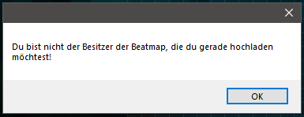

---
tags:
  - I can't submit my own beatmap!
  - beatmap submission system issues
  - Ich kann meine eigenen Beatmaps nicht einreichen!
  - Probleme mit dem Beatmap Submission System
---

# Wie man häufige Probleme mit dem BSS löst

Beim Einreichen einer Beatmap zeigt das **[Beatmap Submission System](/wiki/Beatmapping/Beatmap_submission)** (***BSS***) möglicherweise bestimmte Warnungen an und hindert dich daran, deine Beatmap hochzuladen. Dieser Artikel hilft dir dabei, diese Warnungen zu verstehen und die Probleme zu beheben.

## Du bist nicht der Besitzer der Beatmap, die du gerade hochladen möchtest!

::: Infobox

:::

Diese Warnung tritt beim Mapping vermutlich am meisten auf und wird oft durch einen falsch gesetzten Parameter in der [.osu-Datei](/wiki/Client/File_formats/osu_(file_format)), einen fehlerhaften Submission-Cache oder eine einfache Namensänderung verursacht. Mache Folgendes, um das Problem zu lösen:

1. Gehe zum Ordner der Beatmap.
   - Du kannst ihn leicht erreichen, indem du im [Beatmap-Editor](/wiki/Client/Beatmap_editor) `Datei` und dann `Songs-Ordner öffnen` anklickst.
2. Beende osu!. Dadurch wird sichergestellt, dass alle Änderungen korrekt übernommen werden.
3. Öffne die `.osu`-Dateien für die Schwierigkeitsstufen mit irgendeinem Texteditor (z. B. Notepad).
4. Stelle sicher, dass dein Benutzername bei `Creator` bereits richtig geschrieben wird. Ist dies nicht der Fall, schreibe deinen aktuellen Benutzernamen hin.
5. Setze `BeatmapID` auf `0`.
6. Setze `BeatmapSetID` auf `-1`.
7. Stelle sicher, dass der Name des Beatmap-Ordners nicht mit einer Zahlenfolge beginnt. Ansonsten ändere den Namen entsprechend ab.
   - Z. B. `1000 - Songname` sollte `ABCDE - Songname` sein.
8. Lösche alle Dateien im Ordner `SubmissionCache`. Standardmäßig befindet sich dieser im ausgeblendeten Verzeichnis `Data` des osu!-Installationsordners.
   - [Dieser Artikel](https://support.microsoft.com/de-de/windows/explorer-unter-windows-ef370130-1cca-9dc5-e0df-2f7416fe1cb1) erklärt, wie man den Ordner im Dateiexplorer öffnet.
9. Öffne osu! erneut und versuche, deine Beatmap hochzuladen.

Mittlerweile solltest du deine Beatmap hochladen können. Wenn du immer noch Probleme hast, folge diesen Schritten:

1. Exportiere die Beatmap mit Hilfe des Beatmap-Editors über `Datei` und dann `Paket exportieren`.
2. Verlasse den Beatmap-Editor und lösche danach die Beatmap in osu!.
3. Beende osu!.
4. Gehe zur exportierten Beatmap und extrahiere den Inhalt.
   - Alternativ kannst du die Datei auch direkt mit externen Archivierungstools wie [WinRAR](https://www.rarlab.com/) oder [7-Zip](https://www.7-zip.org/) öffnen.
5. Öffne die `.osu`-Dateien für die Schwierigkeitsstufen mit irgendeinem Texteditor (z. B. Notepad).
6. Gib irgendetwas als Nutzernamen bei `Creator` ein, aber nutze **nicht** deinen Benutzernamen.
7. Setze `BeatmapID` auf `0`.
8. Setze `BeatmapSetID` auf `-1`.
9. Sobald du fertig bist, packe die Dateien wieder in die `.osz`-Datei.
10. Importiere sie in osu! und versuche, sie erneut hochzuladen.

## Fehler während des Hochladens: Data too long for column "xxx" at row "xx"

Diese Warnung erscheint, wenn eine bestimmte Zeile in einer Datei für eine Schwierigkeitsstufe (`.osu`) zu viel Text enthält. Mit den folgenden Schritten kann sie behoben werden:

1. Gehe zum Ordner der Beatmap.
   - Du kannst ihn leicht erreichen, indem du im [Beatmap-Editor](/wiki/Client/Beatmap_editor) `Datei` und dann `Songs-Ordner öffnen` anklickst.
2. Öffne die `.osu`-Datei mit irgendeinem Texteditor. Damit du es einfacher hast, wird ein Editor mit einer Zeilenanzeige, wie z. B. [Visual Studio Code](https://code.visualstudio.com/), empfohlen.
3. Geh in der `.osu`-Datei zu der Zeile, die in der Warnung erwähnt wird.
4. Verkürze die Zeile durch eine geeignete Anpassung.
   - Wenn in dieser Zeile Metadaten (z. B. Namen von Schwierigkeitsstufen) enthalten sind, die direkt im Beatmap-Editor geändert werden können, kürze diese am besten im Dialog `Song Setup`.
   - Wenn diese Zeile auf externe Inhalte (z. B. Hintergrundbilder) referenziert, kürze den Namen der verlinkten Datei und übernehme ihn entsprechend im Texteditor.
5. Speichere alle von dir gemachten Änderungen und versuche, deine Beatmap hochzuladen.

Wenn die obigen Schritte nicht helfen oder dein Problem nicht auf diesen Artikel zutrifft, erstelle bitte im [Hilfeforum](https://osu.ppy.sh/community/forums/5) ein neues Thema mit Details zu deinem Problem, um weitere Hilfe zu suchen.
