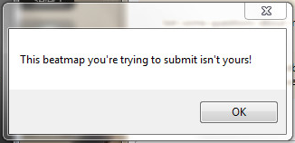

---
tags:
  - I can't submit my own beatmap!
  - beatmap submission system issues
---

# How to resolve common BSS issues

When submitting a beatmap, the **[Beatmap Submission System](/wiki/Beatmapping/Beatmap_submission)** (***BSS***) may occasionally prevent you from uploading your beatmap by displaying certain warnings. This article will help you to understand these warnings and guide you through fixing them.

## This beatmap you're trying to submit isn't yours!

::: Infobox

:::

This is perhaps the most frequent seen by mappers, and is often caused by an incorrectly set parameter in the [.osu file](/wiki/Client/File_formats/osu_(file_format)), a bugged submission cache, or just a simple name change. In order to resolve this warning, follow these steps:

1. Go to the beatmap's folder.
   - You can get there easily by going to `File` and then `Open Song Folder` in the [beatmap editor](/wiki/Client/Beatmap_editor).
2. Exit osu!. This is to make sure that all the changes are going to be applied properly.
3. Open the `.osu` difficulty files with any text editor (e.g. Notepad).
4. Make sure that your username is already written correctly in the `Creator` field. If it isn't, update this field with your current username.
5. Set the `BeatmapID` field to `0`.
6. Set the `BeatmapSetID` field to `-1`.
7. Make sure that the beatmap's folder name does not begin with a string of numbers. If it does, rename this folder accordingly.
   - For example, `1000 - Song Name` should be renamed into e.g. `ABCDE - Song Name`.
8. Delete all the files in your `SubmissionCache` folder. By default, this folder is hidden inside the `Data` directory of your osu! installation.
   - [This article](https://support.microsoft.com/en-au/windows/file-explorer-in-windows-ef370130-1cca-9dc5-e0df-2f7416fe1cb1) explains how to open this file from the file explorer.
9. Open osu! again and try to upload your beatmap.

You should be able to submit your beatmap by now. However, if you are still having issues, try following these steps:

1. Export the beatmap from inside the beatmap editor by going to `File` and then `Export Package`.
2. Exit the beatmap editor and delete the beatmap in osu!.
3. Exit osu!.
4. Go to the exported beatmap and extract its contents.
   - Alternatively, open this file directly using external archive utilites such as [WinRAR](https://www.rarlab.com/) or [7-Zip](https://www.7-zip.org/).
5. Open the `.osu` difficulty files with any text editor (e.g. Notepad).
6. Fill in the `Creator` field with anything you like, but do **not** use your username.
7. Set the `BeatmapID` field to `0`.
8. Set the `BeatmapSetID` field to `-1`.
9. Once you are done, pack all the files back into one `.osz` file.
10. Import this file into osu! and try to upload your beatmap.

## Error during upload: Data too long for column "xxx" at row "xx"

This warning occurs when a certain line in the `.osu` difficulty files contains too much text, and can be resolved by following these steps:

1. Go to the beatmap's folder.
   - You can get there easily by going to `File` and then `Open Song Folder` in the [beatmap editor](/wiki/Client/Beatmap_editor).
2. Open the `.osu` difficulty files with any text editor. For your convenience, it is recommended that you use an editor that includes line (column) indicators, e.g. [Visual Studio Code](https://code.visualstudio.com/).
3. Go to the line in the `.osu` difficulty files that's mentioned in the warning.
4. Shorten the contents of this line by making the necessary adjustments.
   - If this line concerns metadata matters that can be altered directly through the beatmap editor (e.g. difficulty names), shorten it from there directly through the `Song Setup` panel.
   - If this line concerns an external asset (e.g. background images), shorten the name of the asset in question and update this line accordingly in your text editor.
5. Save all the changes you made and try to upload your beatmap.

If the steps above don't resolve your issue, or if you're facing a different issue entirely, please create a new topic in the [Help forum](https://osu.ppy.sh/community/forums/5) with details on your issue so that others can help you.
